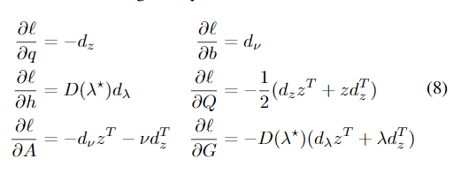

# OptNet: Differentiable Optimization as a Layer in Neural Networks

这篇论文定义了一个基于线性二次优化的新的神经网络层

这个层对应的优化问题如下

$z_{i+1} = argmin(frac{1}{2} z^T Q(z_i) z + q(z_i) z)$

符合约束$A(z_i)z = b(z_i)$与$G(z_i)z <= h(z_i)$

其中$Q,q,A,b,G,h$都是可以跟随输入$z$变化的值，论文提出了求解这个优化问题以及求出这个优化问题对应的梯度的快速方式。

## 核心思路与公式

核心思路是在反传的时候使用KKT condition，也就是假设优化问题已经得到了最优解，对KKT condition进行求微分得到各个元素之间的微分关系（论文公式6-8）

另外需要在GPU上实现完整的优化算法，作者使用了公式(9-10)（更多的公式建议查看github，qpth库）
