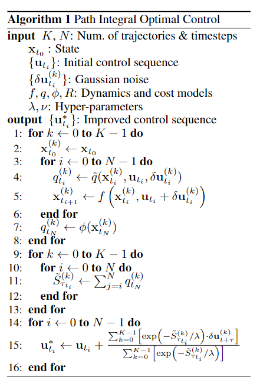
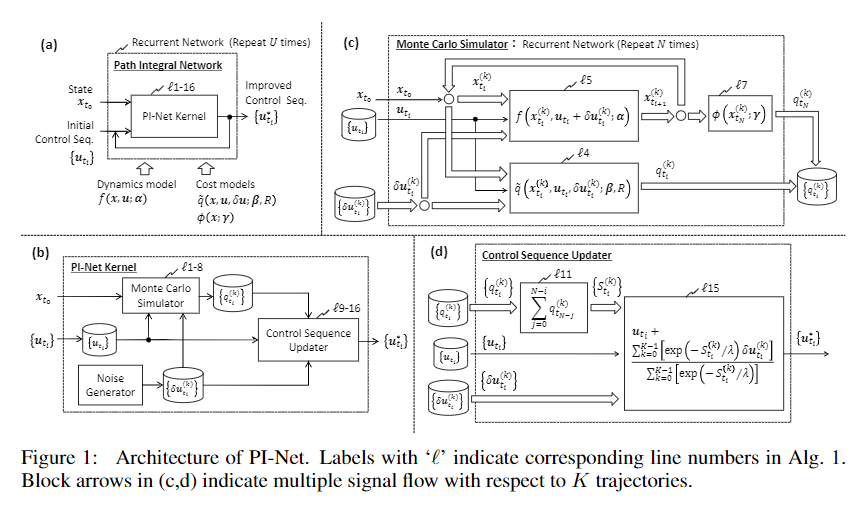

pdf_source: https://arxiv.org/pdf/1706.09597.pdf
short_title: Path Integral Networks
# Path Integral Networks: End-to-End Differentiable Optimal Control

这篇论文将路径积分控制用在了端到端的可微分最优控制中，Path Integral Control 可以参考[这篇](Aggressive_Driving_with_Model_Predictive_Path_Integral_Control.md)

## 基本Path Integral算法

类似于Path Integal 控制论文中给出的算法，注意系统在模型预测以及reward预测的时候使用的函数为神经网络层。由此可以引出以下的结构图

## 

在有专家输入参考的情况下，模型预测函数以及reward的预测函数可以端到端学习。