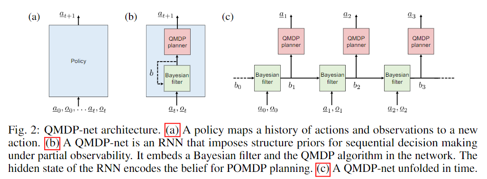
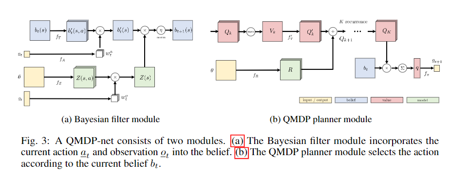

# QMDP-Net: Deep Learning for Planning underPartial Observability

这篇论文提出的QMDP网络，目的是当机器人只能观测到场景的一部分且不能确定自己的状态的时候，如果在不确定性中一边探索一边进行规划。

本文的图一说明了本文可以使用模仿学习，学会一些探索的方式，然后机器人能够新的迷宫中成功导航。

## 主要贡献与网络结构

宏观来看，一个Policy的输入是历史一系列的actions和observations，输出的是一个下一个action。而QMDP网络由两部分组成，一个是RNN结构的贝叶斯滤波器（用于编码信息），一个是QMDP planner网络。

### 滤波模块
滤波模块，将一个belief、行动以及观测映射到下一个belief $b_{t+1} = f(b_t|a_t, o_t)$。实际上会分两步，第一步考虑action，第二步考虑观测。

对于本文的一个$N*N$网格的导航任务，belief是一个N*N的张量，大致表达的是对机器人当前位置的置信度。

图中的$f_T$是一个带有|A|组滤波器的卷积，输出的$b_t^\prime$是不同运动条件下，物体对自身新的位置的一个估计。

理论上来说我们可以使用hard indexing取出当前行动对应的运动后的估计，但是这里论文采用了soft index，用全连接层将action映射到$f_A(a)$(形状为A的张量)中，再用求和(点乘，关于A这个维度求和)的形式执行soft indexing。

观测模型输出一个$N*N*O$的张量，其中每一个数代表的是网格当前点得到某一个测量值的概率。同样采用一个全连接映射以及soft indexing，得到一个N*N的根据观测得到的估计。

将运动与观测得到的估计使用element-wise multiplication融合

### planner 模块

使用Value-iteration层计算出一个N*N的价值图。这个层的算法是
1. 将初始$\theta$用一个卷积层映射到Reward图($N*N*A$)，初始化Q函数图
2. 对Q函数图的Action维作max pool $(1*1)$得到$V_k$
3. 卷积$V_k$代表state transition再加上reward图得到新的Q函数图
4. 迭代2、3多次，得到最终的Q函数

决策的时候，将Q函数$(N*N*A)$与$b_t (N*N)$相乘，并求和得到$q(a) (形状为A的张量)$再用全连接将这个q映射到action中。

### 模仿训练与使用

整个运算是可导，因而可以使用模仿学习同时训练滤波模块以及规划模块。

### 实验直觉

1. 可generalize到新环境
2. 用soft index以及可学习的transition有效的解决了不确定性问题
3. QMDP-net学习到的模型不正确，但是有用
4. 在N比较小的环境中得到的网络可以快速学习到N比较大的环境
5. 可以用CNN-LSTM结构替代本文的filter 模块，但是实验结果表明本文的效果更好(更多regularization)