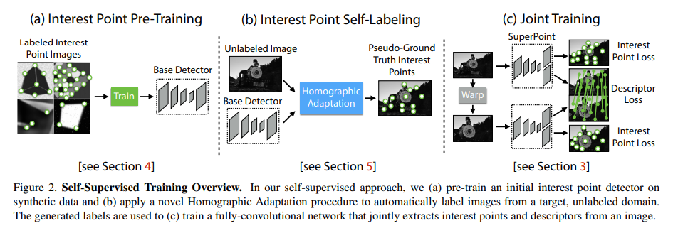
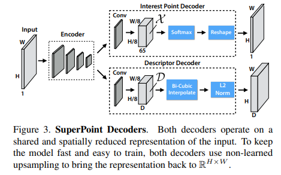

time: 20191022
pdf_source: https://arxiv.org/pdf/1712.07629.pdf
code_source: https://github.com/rpautrat/SuperPoint
short_title: SuperPoint
# SuperPoint: Self-Supervised Interest Point Detection and Description

这篇论文完成的任务是从一张图中使用神经网络提取出keypoints，这些keypoints的关键是要求对旋转，scale，平移鲁棒。

## Training procedure

训练过程需要三个阶段，第一个阶段，使用一些简单的几何图片,用一些没有歧义的图片和keypoint，进行初始训练。

第二阶段，使用一些没有label的真实图片，对同一张图，使用Homographic  transform(旋转平移等的组合),转换成一个batch的图.用前文的detector，生成keypoint，再转换为原图坐标系中。这个batch会在当前图形成一个keypoint的heatmap.
$$
\mathbf{x}=\mathcal{H}^{-1} f_{\theta}(\mathcal{H}(I))
$$
$$
\hat{F}\left(I ; f_{\theta}\right)=\frac{1}{N_{h}} \sum_{i=1}^{N_{h}} \mathcal{H}_{i}^{-1} f_{\theta}\left(\mathcal{H}_{i}(I)\right)
$$
第三阶段，使用joint training。进行训练

## 网络模型

第一阶段只使用上部分那一支，第三阶段会有descriptor部分。

Encoder类似于VGG,

Interest Point Decoder，65个Channels,意思是周边$8\times 8$个方块有keypoint的概率，还有一个是空类. 这里的$reshape$对应的是pytorch.nn.pixelshuffel操作，将channel的内容翻到feature map空间的区域。

如果ground truth里面$8\times 8$区域里面有不止一个点则随机选取一个作为该区域里面有效的ground truth。

这里使用cross-entropy,计算$\mathcal{L}_p$进行训练。

descriptor的训练，依靠的是同一张图，将图homographic transform到另一张图去，要求keypoint对应的位置描述相同。$s_{h w h^{\prime} w^{\prime}}$指代对应关系

$$
s_{h w h^{\prime} w^{\prime}}=\left\{\begin{array}{ll}{1,} & {\text { if } \| \widehat{\mathcal{H} \mathbf{p}_{h w}}-\mathbf{p}_{h^{\prime} w^{\prime}}|| \leq 8} \\ {0,} & {\text { otherwise }}\end{array}\right.
$$

$$
\begin{aligned} l_{d}\left(\mathbf{d}, \mathbf{d}^{\prime} ; s\right) &=\lambda_{d} * s * \max \left(0, m_{p}-\mathbf{d}^{T} \mathbf{d}^{\prime}\right) \\ &+(1-s) * \max \left(0, \mathbf{d}^{T} \mathbf{d}^{\prime}-m_{n}\right) \end{aligned}
$$

$$
\begin{aligned} \mathcal{L}_{d}\left(\mathcal{D}, \mathcal{D}^{\prime}, S\right) &=\\ \frac{1}{\left(H_{c} W_{c}\right)^{2}} &\sum_{h=1}^{H_{c}, W_{c} H_{c}, W_{c}} l_{d}\left(\mathbf{d}_{h w}, \mathbf{d}_{h^{\prime} w^{\prime}}^{\prime} ; s_{h w h^{\prime} w^{\prime}}\right) \end{aligned}
$$

$$
\begin{aligned} \mathcal{L}\left(\mathcal{X}, \mathcal{X}^{\prime}, \mathcal{D}, \mathcal{D}^{\prime} ; Y, Y^{\prime}, S\right) &=\\ \mathcal{L}_{p}(\mathcal{X}, Y)&+\mathcal{L}_{p}\left(\mathcal{X}^{\prime}, Y^{\prime}\right)+\lambda \mathcal{L}_{d}\left(\mathcal{D}, \mathcal{D}^{\prime}, S\right) \end{aligned}
$$
