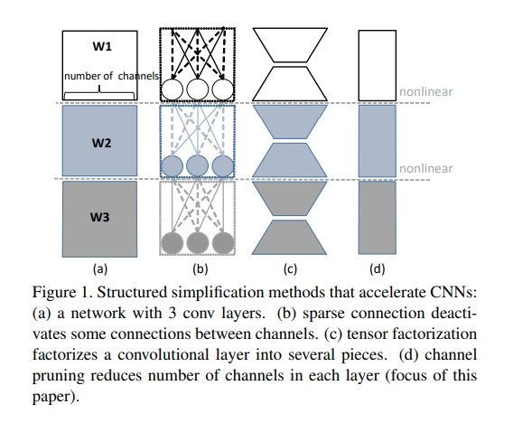
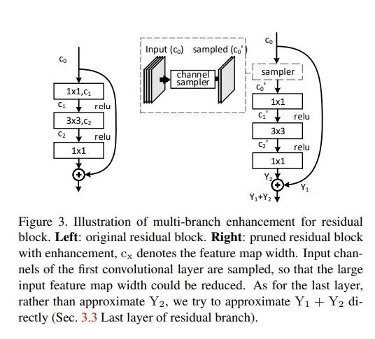

time: 20191028
pdf_source: http://openaccess.thecvf.com/content_ICCV_2017/papers/He_Channel_Pruning_for_ICCV_2017_paper.pdf
code_source: https://github.com/yihui-he/channel-pruning
# Channel Pruning for Accelerating Very Deep Neural Networks
这篇文章介绍了一种实现channel pruning的算法。其核心算法代码在该库的./lib/net.py -> R3方法中。

对pretrained的模型，要进行模型的修剪，本文提到有三种方法，第一种是sparse connection, 第二种是tensor factorization,第三种是channel pruning.

sparse connection由于引入了不规则的模型结构，会导致在GPU上的执行效率下降(尽管flops下降了)。tensor factorization本质上是对权重矩阵的分解，对于现代的Res-Connect效果不佳。channel pruning不改变结构，不改变并行运行情况，仅仅改变channel数量。三种方式的图示如下：

## 算法介绍

这个算法分为两步迭代，分别为channel selection 以及 reconstruction.第一步找到最有信息量的channel，修剪冗余的channel，这里使用的是Lasso regression, 第二步reconstruct with Linear least square.

令输入的feature map的channel数为$c$, 卷积核$W$的权重为 $n\times c \times k_h \times k_w$,卷积核每次卷积会在一个像素点上生成一个$N\times n$的输出矩阵$Y$,其中$N$为batch_num，这里暂时不考虑bias项。要将$c$修剪为$c'$.同时最小化reconstruction error，这个优化问题是

$$
\begin{array}{c}{\underset{\boldsymbol{\beta}, \mathbf{W}}{\arg \min } \frac{1}{2 N}\left\|\mathbf{Y}-\sum_{i=1}^{c} \beta_{i} \mathbf{X}_{\mathbf{i}} \mathbf{W}_{\mathbf{i}}^{\top}\right\|_{F}^{2}} \\ {\text { subject to }\|\boldsymbol{\beta}\|_{0} \leq c^{\prime}}\end{array}
$$

其中$||\cdot||_F$为二阶范数,$X_i$是一个$N\times k_h k_w$的矩阵裁剪自输入$X$,$\beta$是长度为$c$的矢量参数。

求解这个问题是NP难的,这里首先将问题用l1范数松弛为

$$
\begin{array}{l}{\underset{\boldsymbol{\beta}, \mathbf{W}}{\arg \min } \frac{1}{2 N}\left\|\mathrm{Y}-\sum_{i=1}^{c} \beta_{i} \mathrm{X}_{\mathrm{i}} \mathrm{W}_{\mathrm{i}}^{\top}\right\|_{F}^{2}+\lambda\|\boldsymbol{\beta}\|_{1}} \\ {\text { subject to }\|\boldsymbol{\beta}\|_{0} \leq c^{\prime}, \forall i\left\|\mathrm{W}_{\mathrm{i}}\right\|_{F}=1}\end{array}
$$

同时限制$||W_i||_F = 1$然后在以下两个步骤中迭代

### $\beta$ 子问题
首先锁定$W$,求解$\beta$作为channel selection问题,这变成了零范数的LASSO regression,代码中可以知道作者是使用sklearn的Lasso regression函数做的。

### $W$ 子问题

锁定$\beta$,问题变为$argmin_{W'} ||Y - X'(W')^T||^2_F$,这里的$X' = [\beta_1X_1, \beta_2 X_2 ...]$ ($N\times ck_hk_w$), $W'$形状为$n\times c k_hk_w$, $W' = [W_1, W_2...]$,之后再令$\beta_i \leftarrow \beta_i ||W_i||_F, W_i \leftarrow W_i/||W_i||_F$,这里本质上是一个线性回归。

### 优化过程

从已经训练好的模型中初始化W,$\lambda=0, ||\beta||_0 = c$.逐渐增加$\lambda$,对于每一个$\lambda$，迭代两个子问题的求解直到$||\beta||_0$稳定,逐渐增加$\lambda$直到满足$||\beta||_0 \leq c'$.后来又发现这样太慢，于是执行子问题(1)多次，直到$\beta$满足，然后仅执行一次子问题(2)

### 全模型修建

在修剪时，每一个层单独处理,需要注意的是最优化问题中的$Y$需要使用的是原模型的输出作为目标$Y$，输入$X$则是修剪后的模型的，这样可以避免误差的累积。

## 处理多分支模型

这里主要讨论ResNet.

这里一共有三个卷积层，由于ResNet需要保持不同层之间channel数的稳定，所以只有中间的bottlenect也就是$c1$的输入层可以如前文一样正常修剪。

### 最后一层的修剪
这里将优化目标从$Y_2$改为$Y_1 - Y_1'+Y_2$,这里$Y_1'$是前面层修剪后输出的feature map,

### 第一层的修剪

增加一个sampler层，正常减少$c_0$卷积层的输入channel数，注意这个sampler不改变short-connection路径上的$Y_1$
