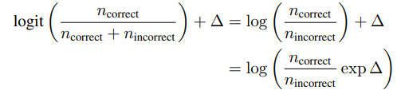

pdf_source: https://arxiv.org/pdf/1805.08974.pdf
# Do Better ImageNet Models Transfer Better?

这篇论文认真地测试了不同ImageNet Models的transfer learning能力。初步实验方式是在12个不同种类不同size的训练集中，用16个pretrained 网络分别进行fix-feature-extractor logistic regression、fine-tuning、re-train.
都用grid-search 寻找最优学习率等超参数。

# metrics in comparison

# 经验结论：

## 1. ImageNet 的准确率能预测logistic regression的准确率，两者有较强的正相关性，但是regularization setting会有影响。

Google使用相同的training setting时，结论前半句成立，在imageNet表现最好的Inception-ResNet v2 and NASNet Large稳坐前两名。但是从公开能获得的checkpoint中开始train的话,ResNet和DenseNet几乎总是最好的，且transfer and basic accuracy的相关性很差，进一步研究发现这个是因为regularization。

找到四个损害Inception Net transfer accuracy的操作，分别是

1. 在batchnorm层不使用scale parameter(不学习方差)
2. label smoothing(源自inception-v3,在训练时有一定概率不采取原label，而均匀随机选择另一个class作为ground truth)
3. dropout
4. 额外的分类输出(在早期层提前输出结果)

这些方法对top-1准确率提升不到1%，但是在transfer上造成损害，在相对log比例上来说相当于把最好的backbone换成最弱的backbone，这个不但能在transfer learning的结果上看到差别，在t-SNE的可视化结果中也可见到。

## 2. ImageNet准确率能预测fine-tunning的表现

regularizaion 还有training setting的效果在fine-tuning的结果上影响不大(有一定损伤，有些还没有损伤，根据图5，可以说是数据上不显著)。

但是这个相关性在不同dataset上有不同，在小的数据集上相关性最明显

## 3. ImageNet准确率能预测随机初始化时的表现

这个相关性相对小一些，而且更细致地看，数据集大小较小时相关性不显著，但是对于大数据集，相关性会很显著。

## 4. 选择更好的backbone模型性能提升比得上为transfer learning专门设计的特殊方法

结果表明pretrained model对transfer结果很重要，本文声称在目前使用的dataset中，它们通过更换并fine-tuning backbone超过了文中提到的N种transfer learning算法。

本文最后表示transfer tricks与更换backbone并不矛盾，甚至可以相互叠加，但是这个提升幅度值得关注

## 5. 对于分类更细致的如车分类以及飞行器分类，ImageNet Pretraining与随机初始化相比差距不大

其余大部分数据之中，fine_tune > pretrained > random是显著地

## 6. ImageNet加速收敛

## 7. 如何选择是否pretrained
结论： 数据最少是logistic regression可能是最好的(速度快，性能好)，大一些的dataset,fine-tuning最好，更大的数据集中，随机初始化的最终性能会逼近pretrained