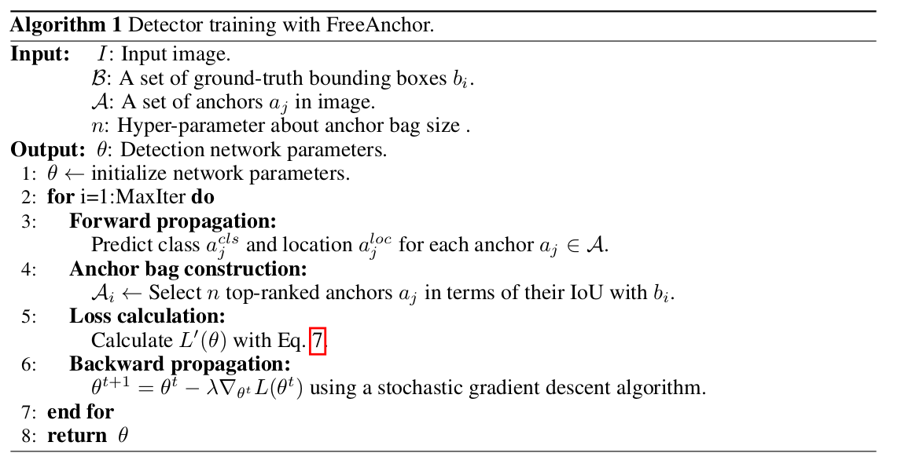
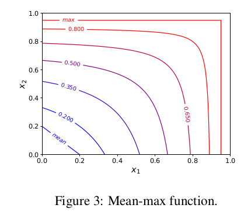

pdf_source: https://arxiv.org/pdf/1909.02466.pdf
code_source: https://github.com/zhangxiaosong18/FreeAnchor
short_title: FreeAnchor
# FreeAnchor: Learning to Match Anchors for Visual Object Detection

这篇论文来自于NIPS2019,介绍了新的方式来实现2D object detection中的matching.

总体思路来说，使用最大似然估计的框架在Object Detection的过程中，采用一个单一的loss，同时完成proposal与object的匹配以及回归训练，将中间matching步骤自动化了

# 核心算法

1. 网络正常前传给出一系列的anchor box,每一个anchor box有分类以及localization信息
2. 对每一个障碍物，选择与它IOU最大的n个anchor，带有一个threshold，如果一个anchor与多个物体匹配，
   则使这个anchor只与IOU最大那个物体匹配(是否有这个限制需要看具体代码实现)
3. 对当前的匹配分配计算一个Loss
4. 反传训练

# 基于最大似然估计的匹配Loss

先给出最终的公式
$$
\mathcal{L}^{\prime}(\theta)=-w_{1} \sum_{i} \log \left(\operatorname{Mean}-\max \left(X_{i}\right)\right)+w_{2} \sum_{j} F L_{-}\left(P\left\{a_{j} \in A_{-}\right\}\left(1-\mathcal{P}(\theta)_{j}^{b g}\right)\right)
$$

其中$X_{i}=\left\{\mathcal{P}(\theta)_{i j}^{c l s} \mathcal{P}(\theta)_{i j}^{l o c} | a_{j} \in A_{i}\right\}$ 代表每一个物体对应的anchor bag的Likelihood
，第二项则代表没有被选入anchor bag的anchor作为background的Focal Loss，Focal Loss源自与[这篇文章](https://arxiv.org/pdf/1708.02002.pdf),直觉就是对于把握已经很大的正确的点降低权重，
对难度较大的部分增加它们在cost中的权重。

## 第一项、Mean-max以及概率定义
Mean-max函数表达式为:

$$
\operatorname{Mean}-\max (X)=\frac{\sum_{x_{j} \in X} \frac{x_{j}}{1-x_{j}}}{\sum_{x_{j} \in X} \frac{1}{1-x_{j}}}
$$

其对应的函数图像为

直觉来说，就是当likelihood函数值较小，网络刚初始化的时候，函数结果近似于各个数的平均值，
当有部分likelihood函数较大，网络训练成熟之后，函数结果近似于各个数的max.

根据作者的设计

$P(\theta)^{cls}_{ij} = e^{-L(\theta)^{cls}_{ij}}$,
Loc同理，皆为对应基础cost函数值的负指数

## Background项定义

$P\left\{a_{j} \in A_{-}\right\} = 1-\max _{i} P\left\{a_{j} \rightarrow b_{i}\right\}$
指proposal框$a_j$不与所有物体重合的概率
其中
$$
P\left\{a_{j} \rightarrow b_{i}\right\}=\text { Saturated linear }\left(I o U_{i j}^{l o c}, t, \max _{j}\left(I o U_{i j}^{l o c}\right)\right)
$$

$$
\text { Saturated linear }\left(x, t_{1}, t_{2}\right)=\left\{\begin{array}{ll}{0,} & {x \leq t_{1}} \\ {\frac{x-t_{1}}{t_{2}-t_{1}},} & {t_{1}<x<t_{2}} \\ {1,} & {x \geq t_{2}}\end{array}\right.
$$