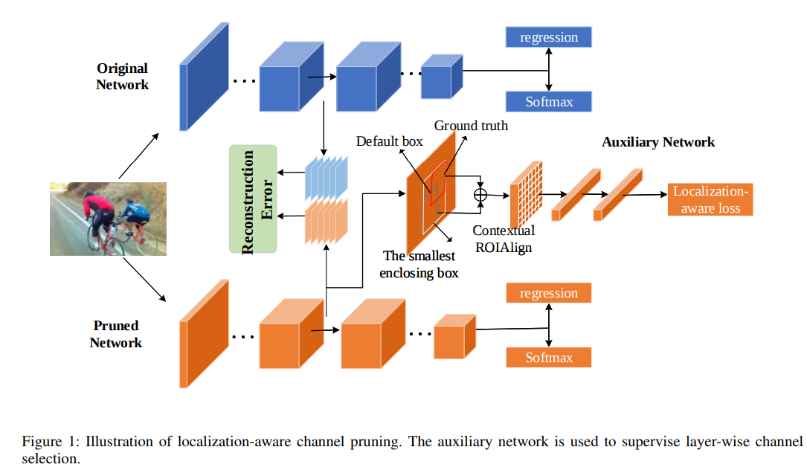
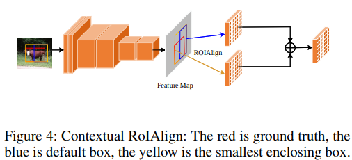
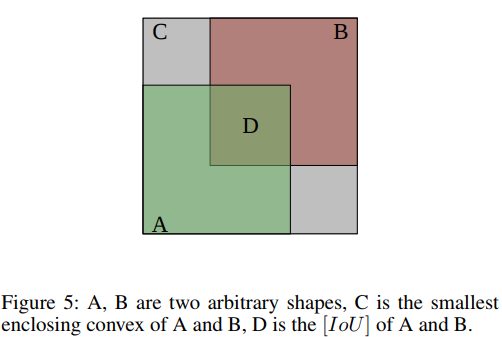
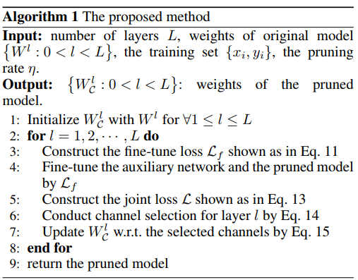

time: 20191129
pdf_source: https://arxiv.org/pdf/1911.02237.pdf
short_title: Localization-aware Channel Pruning
# Localization-aware Channel Pruning for Object Detection

这篇论文尝试解决的是针对2D物体检测的[channel pruning](Channel_Pruning_for_Accelerating_Very_Deep_Neural_Networks.md)问题.localization-aware的动机起源于[DCP.pdf](https://arxiv.org/pdf/1810.11809.pdf),[原channel prunning的问题](Channel_Pruning_for_Accelerating_Very_Deep_Neural_Networks.md)的做法是选择channel并线性重建，减少输出的l2变化，问题划归为lasso regression.但是channel中有很多是冗余的，输出也是冗余的，完整的复原并不一定是最有效的，DCP那篇则是基于这个问题对分类问题进行优化，本文则是基于这个问题，在object detection(主要基于SSD算法)中，针对位置输出进行优化。过程中提出了 contextual ROIAlign层.

本文建议在使用这篇文章之前先补充[DCP.pdf](https://arxiv.org/pdf/1810.11809.pdf)

## 总体pipeline

## Contextual ROIAlign Layer

default bounding box不一定包含足够的语义信息，所以需要更大的框框.

$$
    \mathcal{F_O} = ROIAlign(\mathcal{F_B}) + ROIAlign(\mathcal{F_C})
$$

其中$A, B$分别为GroudTruth/Proposal box, $C$与$A, B$的关系如图

## Channel Pruning Loss

作者的思路是形成一个为目标检测任务的loss，从而可以用这个附加网络的梯度辅助模型修剪。

这里用$G$指代[Generalized IoU](http://openaccess.thecvf.com/content_CVPR_2019/papers/Rezatofighi_Generalized_Intersection_Over_Union_A_Metric_and_a_Loss_for_CVPR_2019_paper.pdf)

$$
\begin{aligned}
    GIoU_{AB} &= IoU_{AB} - \frac{C-U}{C} \\
    U &= A + B - IoU_{AB}
\end{aligned}
$$

接着定义$E$为交叉熵，$\mathcal{L_{ac}}$为附加网络的分类损失,$\mathcal{L_{ar}}$为附加网路的定位损失。

$$
\begin{aligned}
    \mathcal{L}_{ac} &= \sum_i E_i \\
    \mathcal{L}_{ar} &= \sum_i m(1 - G_i) \\
    \mathcal{L_a} = \mathcal{L}_{ac} + \mathcal{L}_{ar} 
\end{aligned}
$$
其中$m$为权重参数。

## Localization-aware Channel Pruning

总体算法概述

第三行$\mathcal{L_f} = \mathcal{L_a} + \mathcal{L_c} + \mathcal{L_r}$指代截止到现在修剪后的loss，
第四行指对附加网络和修剪到第i层的model进行训练
第五行:
$$
\begin{aligned}
    \mathcal{L_{re}} &= \frac{1}{2Q} ||F - X * W_C||^2_2 \\ 
    \mathcal{L}(W_C) &= \mathcal{L}_{re}(W_C) + \alpha\mathcal{L_a}(W_C) \\
    ||C||_0 &\le K
\end{aligned}
$$
$\mathcal{L}_{re}$ 为重建误差
第六行指，求出$\mathcal{L}$关于当前层W的梯度。
$$
S_k = \sum^H_{i=1} \sum^W_{j=1} ||\frac{\partial\mathcal{L}}{\partial W_{k,i,j}}||^2_2
$$
指代第$k$输出channel的梯度均方和，只保留梯度最大的几个channel
第七行指$W_C = W_C - \gamma\frac{\partial\mathcal{L}}{\partial W_C}$
