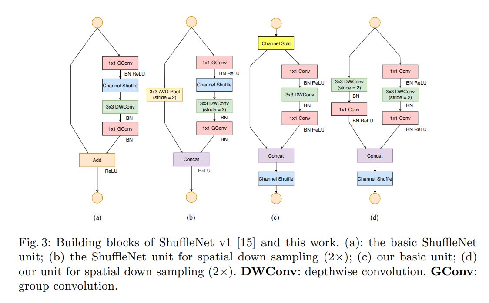

code_source: https://github.com/pytorch/vision/blob/master/torchvision/models/shufflenetv2.py
pdf_source: https://arxiv.org/abs/1807.11164
short_title: ShuffleNet V2
# ShuffleNet V2: Practical Guidelines for Efficient CNN Architecture Design

这篇文章不仅引进了ShuffleNet V2,更重要的是提供了大量优化网络结构、加速运算、提升效率的网络搭建建议。

## 为什么FLOPs指标还不充分

FLOPs指的是网络运算过程中需要执行的乘加步骤次数。

众所周知，大量网络如MobileNet,采用group convolution 与 depth-wise convolution,与dense convolution网络相比，几何级地降低了每一层的FLOPs.但是FLOPs并不是一个对运算速度与运算复杂度最直接的估量指标，它只是一个近似。不同的网络，尽管有相似的FLOPs，其速度也会有很大不同。

FLOPs与实际延迟之间一大差别在于没有考虑Memory access cost(MAC),第二大区别在于平行运算度(degree of parallelism).同时相同的运算结果会因平台而异，[前文](https://arxiv.org/pdf/1405.3866.pdf)提出的通过matrix decomposition降维加速，理论上来说能有更低的FLOPs,但是在GPU上的执行速度却更慢，原因是某一个版本的CUDNN为$3\times 3$卷积特殊优化过。

因此提出建议应该用速度而非FLOPs进行讨论，并且需要说明平台。

本文的贡献就是先提出了设计高效网络的一些建议，并提出shuffleNet V2

## 实用建议

### 建议一,使用等channel宽度以减少MAC

$1 \times 1$卷积的FLOPs为$B = hwc_1c_2$,假设内存足够大，MAC为$MAC=hw(c_1+c_2)+c_1c_2$进一步推得

$$MAC \ge 2\sqrt{hwB} + \frac{B}{hw}$$

因此对于相等的FLOPs以及相同的feature map大小，输入输出channel数一致时，MAC最小。尽管这只是理论值，但是实验可以证明这一点(本文对不同的$1\times 1$卷积的c1,c2配比进行了实验对比，证明了这点)。

### 建议二，过多的group convolution提升了MAC

理论分析
$$
\begin{aligned} \mathrm{MAC} &=h w\left(c_{1}+c_{2}\right)+\frac{c_{1} c_{2}}{g} \\ &=h w c_{1}+\frac{B g}{c_{1}}+\frac{B}{h w} \end{aligned}
$$
MAC与$g$ the number of groups 正相关。

在同等FLOPs的情况下，group number越大速度越慢，但是值得注意的是为了保证同等FLOPs,增大group number时channel数也会提升。效果在GPU上比较明显。

### 建议三，网络的碎片化降低了并行度

这里指的是一个block里面并行的卷积与pooling层，这些平行但不并行的运算会多次触发GPU的启动与同步。碎片化运行在GPU上影响较大，在CPU上影响不大

### 建议四，ReLU,元素间相加等element-wise operators同样不可忽略

删除ResNet中的ReLU与shortcut会看到约20%的加速，尽管它们很必要，但是却是事实上影响速度的。

## ShuffleNet V2:

基本单元结构及其与ShuffleNet V1的比较如图

直觉：

1. 用$1\times 1$卷积替代Group Convolution+[channel shuffle](https://blog.csdn.net/u011974639/article/details/79200559)
2. 使用Concat + Channel Shuffle替代Add
3. downsampling时不使用avg pooling

Channel split就是简单地torch.split(dim=1)

连续出现的Concat, Channel Shuffle, Channel Split可以放在一起作为一个统一的element-wise operation。

