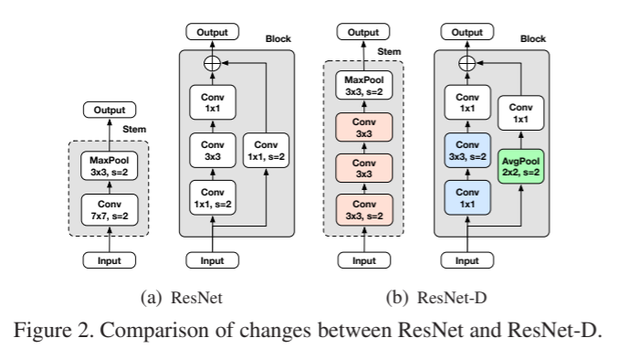
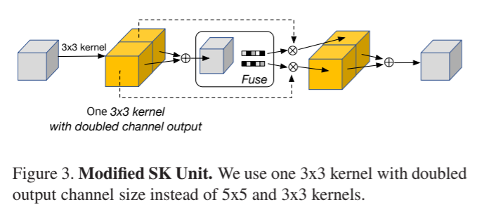
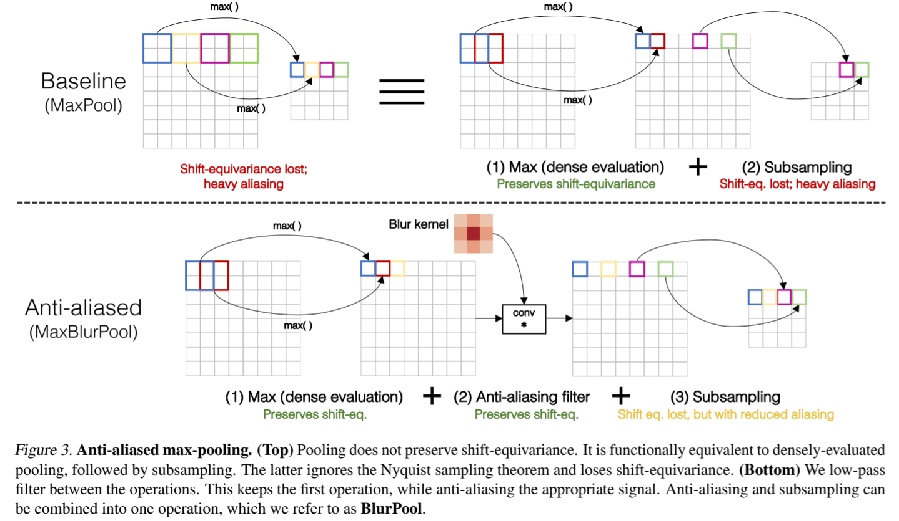
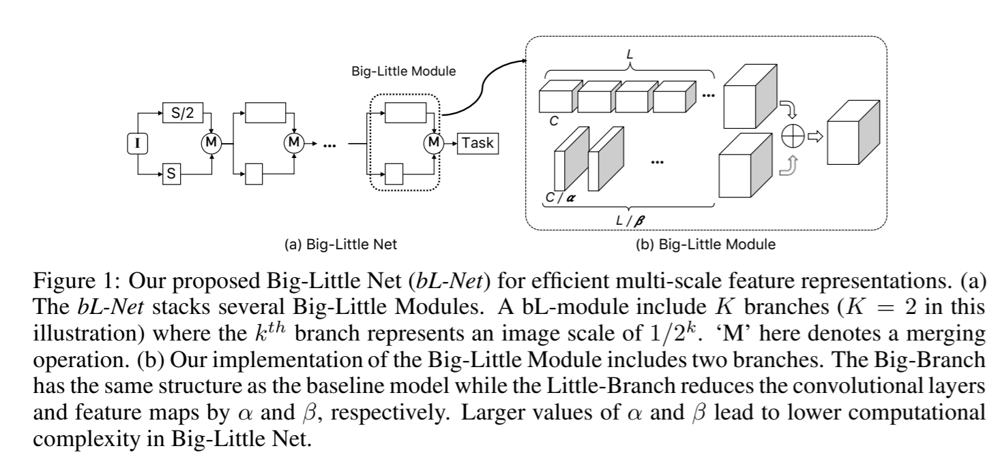
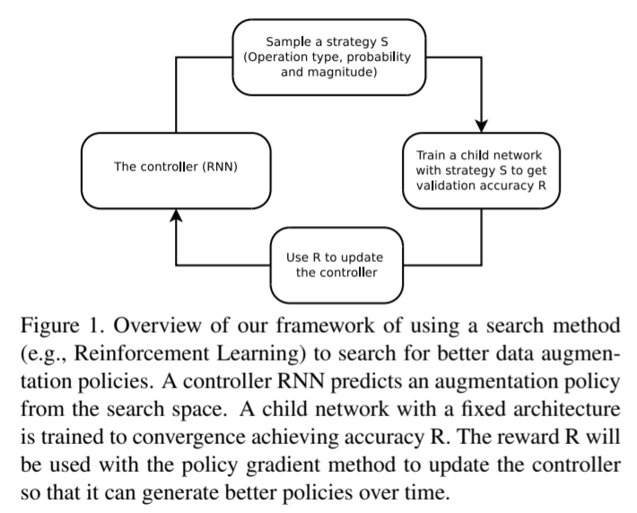
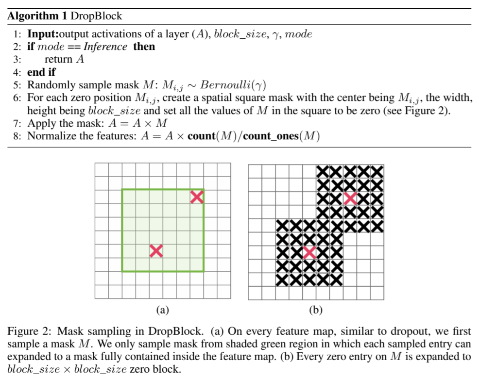

pdf_source: https://arxiv.org/pdf/2001.06268v1.pdf
code_source: https://github.com/clovaai/assembled-cnn
short_title: Assembled Techniques for CNN
time: 20200122
# Compounding the Performance Improvements of Assembled Techniques in a Convolutional Neural Network

This paper is essentially a summary for a bag of training techniques for training CNN.

## Neural Network Model

### ResNet-D

### Channel-Attention  (SE & SK)

Squeeze and Excitation (SE) module has been introduced by [this paper](../Building_Blocks/Squeeze-and-Excitation_Networks.md)

Selective Kernel can be described in:

A light-weight SK implementation in pytorch can be found [here](https://github.com/pppLang/SKNet)

### Anti-Alias Downsampling

AA Downsampling is first proposed in [this paper.pdf](https://arxiv.org/pdf/1904.11486.pdf).

This is also called Blur-Pool implemented in keras [here](https://github.com/csvance/blur-pool-keras)

### Big Little Network (BL)

Big Little Network is first proposed in [This paper.pdf](https://arxiv.org/pdf/1807.03848.pdf)

## Regularization

### AutoAugment

Auto Augmentation is proposed in [This paper.pdf](https://arxiv.org/pdf/1805.09501.pdf) which applies reinforcement learning to train a agent to do image augmentation.

Tensorflow open source code can be found [here](https://github.com/tensorflow/tpu/blob/master/models/official/efficientnet/autoaugment.py)
### Mixup

Mix up has been introduced in [Bag of Freebies](../other_categories/object_detection_2D/BoFDetection.md)

### DropBlock

Dropblock is first proposed in [This paper.pdf](https://arxiv.org/pdf/1810.12890.pdf)

dropblock has been implemented in Pytorch [here](https://github.com/miguelvr/dropblock)

### Label Smoothing

label smoothing 源自inception-v3,在训练时有一定概率不采取原label，而均匀随机选择另一个class作为ground truth.

The paper indeed shows that almost all methods induce improvement in ImageNet results and transfer learning result