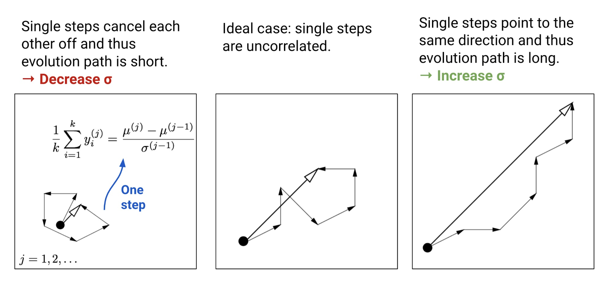
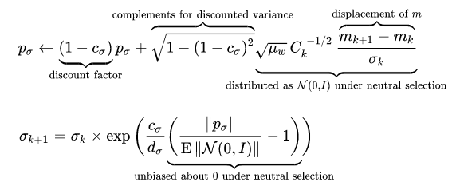

time: 20210826

# Covariance matrix adaptation evolution strategy: CMA-ES 

[wiki](https://www.wikiwand.com/en/CMA-ES) [blog](https://blog.csdn.net/weixin_39478524/article/details/109368216#t6)

CMA-ES是一种进化算法，也就是一种黑箱优化算法。

## Background

### 进化算法

基于种群的算法基本思路:

- 产生初始采样种群, $D=\left\{\left(x_{i}, f\left(x_{i}\right)\right)\right\}, x_{i} \sim p_{\theta}(x)$
- 评估种群的适应度
- 选择最优子集来更新参数$\theta$.

### 简单高斯进化策略

种群的概率分布$p_\theta(x)$被建模为一个$n$维的高斯分布，

$$
\theta=(\mu, \sigma), p_{\theta}(x) \sim \mathcal{N}\left(\mu, \sigma^{2} I\right)=\mu+\sigma \mathcal{N}(0, I)
$$

基本算法:

- 产生初始化参数$\theta=\theta_0$
- 从高斯分布中采集后代种群 $D^{(t+1)}=\left\{x_{i}^{(t+1)} \mid x_{i}^{(t+1)}=\mu^{(t)}+\sigma^{(t)} y_{i}^{(t+1)}\right.$ where $\left.y_{i}^{(t+1)} \sim \mathcal{N}(x \mid 0, \mathbf{I}), i=1, \ldots, \Lambda\right\}$
- 选择适应度最好的$k$个样本， 重新计算新的均值和方差
  - $D_{\text {elite }}^{(t+1)}=\left\{x_{i}^{(t+1)} \mid x_{i}^{(t+1)} \in D^{(t+1)}, i=1, \ldots, \lambda, \lambda \leq \Lambda\right\}$
  - $\mu^{(t+1)}=\operatorname{avg}\left(D_{\text {elite }}^{(t+1)}\right)=\frac{1}{\lambda} \sum_{i=1}^{\wedge} x_{i}^{(t+1)}$
  - $\sigma^{(t+1)^{2}}=\operatorname{var}\left(D_{\text {elite }}^{(t+1)}\right)=\frac{1}{\lambda} \sum_{i=1}^{\lambda}\left(x_{i}^{(t+1)}-\mu^{(t)}\right)^{2}$

## 协方差自适应进化策略 CMA-ES

CMA-ES有两个关键的新概念:
- 使用一个协方差矩阵$C$跟踪两个样本之间的依赖关系。这个协方差矩阵会是一个对角矩阵，且可以由一组标准正交基和一组特征值$\lambda$完全定义
- 使用$\sigma$控制更新步长。
- 均值的更新方向是最大化上一次成功的candidates的概率值；协方差的更新方向是最大化上一次更新的搜索方向。可以理解为是natural gradient descent. 另外还会对过去的数个搜索方向中，用PCA提取其主方向。
- 记录两个path. search path 主要是存储连续步长之间的相关性, 是为了计算好的相关性矩阵，第二个evolution path是为了控制步长。

采样方法:
$$
\begin{aligned}
x_{i} & \sim \mathcal{N}\left(m_{k}, \sigma_{k}^{2} C_{k}\right) \\
& \sim m_{k}+\sigma_{k} \times \mathcal{N}\left(0, C_{k}\right)
\end{aligned}
$$

为每一个样本计算适应度函数$f(x_{i:\lambda})$, 并排序选择前$\mu$个。

均值更新:
$$
\mu^{(t+1)}=\mu^{(t)}+\alpha_{\mu} \frac{1}{\lambda} \sum_{i=1}^{\lambda}\left(x_{i}^{(t+1)}-\mu^{(t)}\right)
$$

步长的直觉如下:

维护一个演化路径(evolution path) $p_{\sigma}$, 

这里的$m$是均值。

 

$$
\begin{array}{l}
p_{c} \leftarrow \underbrace{\left(1-c_{c}\right)}_{\text {discount factor }} p_{c}+\underbrace{\mathbf{1}_{[0, \alpha \sqrt{n}]}\left(\left\|p_{\sigma}\right\|\right)}_{\text {indicator function }} \overbrace{\sqrt{1-\left(1-c_{c}\right)^{2}}}^{\text { complements for discounted variance } \sqrt{\mu_{w}} \frac{m_{k+1}-m_{k}}{\sigma_{k}}}_{\text {distributed as } \mathcal{N}\left(0, C_{k}\right) \text { under neutral selection }}\\
C_{k+1}=\underbrace{\left(1-c_{1}-c_{\mu}+c_{s}\right)}_{\text {discount factor }} C_{k}+c_{1} \underbrace{p_{c} p_{c}^{T}}_{\text {rank one matrix }}+\underbrace{\sum_{i=1}^{\mu} w_{i} \frac{x_{i: \lambda}-m_{k}}{\sigma_{k}}\left(\frac{x_{i: \lambda}-m_{k}}{\sigma_{k}}\right)^{T}}_{\operatorname{rank} \min (\mu, n) \text { matrix }}
\end{array}
$$