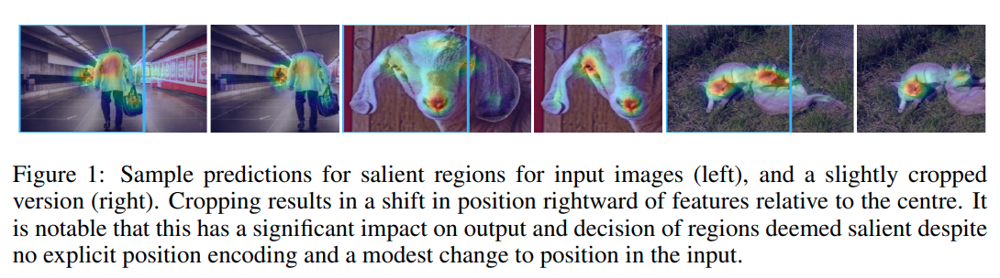
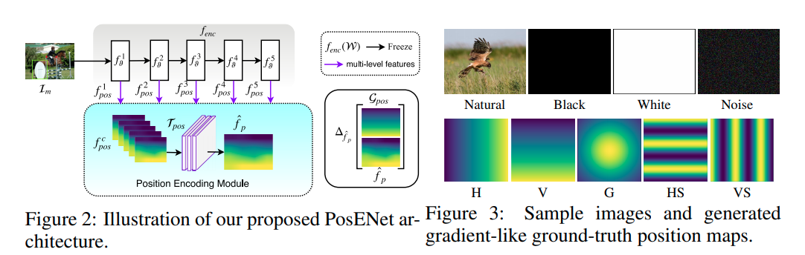
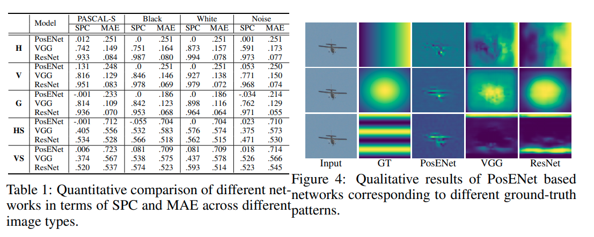
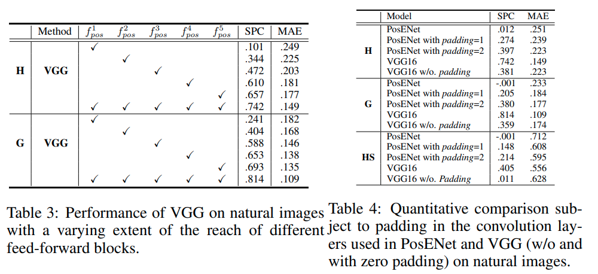
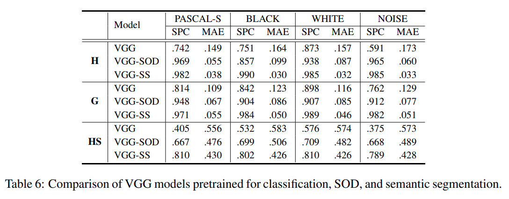

time: 20200107
pdf_source: https://openreview.net/pdf?id=rJeB36NKvB
short_title: Position Information in CNN
# How much Position Information Do Convolutional Neural Networks Encode? 

这篇论文讨论的是关于CNN如何存储绝对位置信息的。这篇文章最终结论是CNN通过zero-padding得到边界信息，并且通过大感受野的神经元将绝对位置信息传递。本文更值得一读的是面对CNN时其中连贯的逻辑推理思路以及实验设计。作者使用实验连续地说明几个问题，首先是从segmentation实验中，motivated得知CNN似乎确实对绝对位置有感知能力,其次设计了一个random test说明目前常见的CNN确实有绝对位置推理能力，再接着设计多组对比实验以及abelation study,发现了越深的feature map对绝对位置感知力越强，同时发现padding的有无对整个网络绝对位置感知能力的巨大影响。

## Motivation

图中发现的是salient detection对cropped的图片inference结果与原图有差别，如果CNN仅依赖像素特征不应有如此大的差别，这里推测物体位置也会影响detection结果，也就是CNN有存储空间位置的能力。

## Random Test

random test的任务:
1. 将图片送入freezed 的$f_{enc}$网络输出multi-scale feature maps
2. 对multi-scale feature maps送入一个小的网络中，输出position maps

position maps的groud truth结果为预先定义的，与图片内容无关的条纹图，这些条纹图上点的像素值仅与其位置相关。作者在training 与validation的时候使用完全不同内容的图片，理论上来说，由于位置信息与输入图片完全没有相关性，因而如果CNN能存储位置信息，就大概率能在test set上复现这些条纹

实验结果与作者预计相似，发现的情况是浅层的posEnet无法还原位置信息，而VGG和Resnet有相当的存储位置信息的能力，在test set上仍然可以复现位置条纹图。

## Abelation Study

接着作者进行了几个简单的对比实验。得到的经验结论是:feature map越深，位置信息还原越好;kernel_size越大，位置信息还原越好。这里作者点出这两点指向同一个结论就是绝对位置的感知与感受野正相关。

上图右侧表格代表作者的另一个实验，在去除VGG的 padding层后，会发现其对绝对位置的感受能力近乎减半，而对浅层网络附加padding的结果发现绝对位置感知能力与padding的数量有很强的正相关性。

作者进而点出，很有可能是zero-padding在网络中提供了一个图片内容的边界信息，经过CNN复杂的处理以及多层的感受野传递后，在深层的网络中存储了图片中各个区域的绝对位置信息。

## Pretrained on other tasks

作者进一步指出，直觉来讲，salient object detection与semantic segmentation会比分类问题需要更多的位置信息，因而在这两个任务上pretrained的网络会提供更多的位置信息。

上图对比指出，在其他任务上fine-tuned的VGG backbone相比于在imagenet上pretrained的会显著地多存储像素的绝对坐标信息。