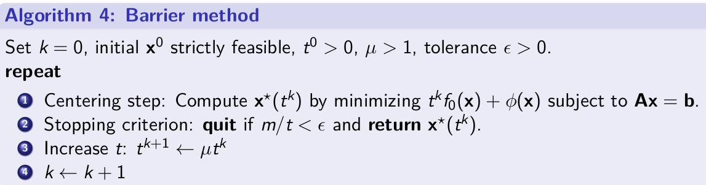
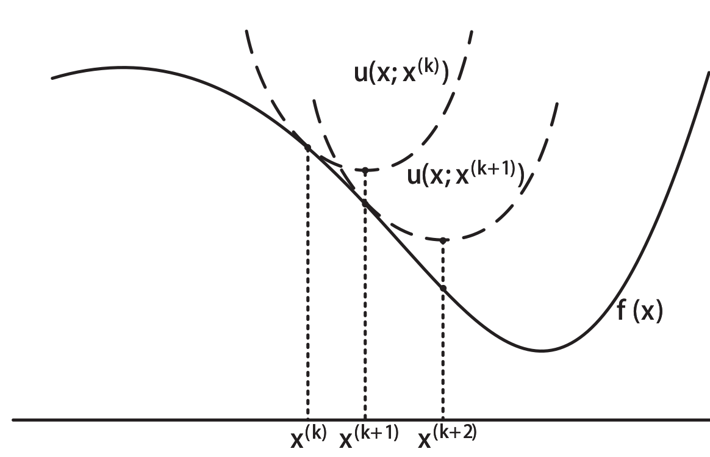
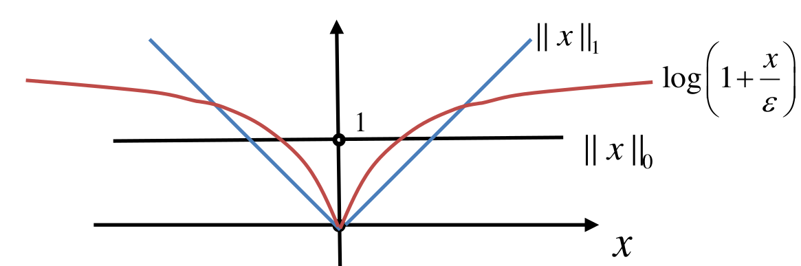
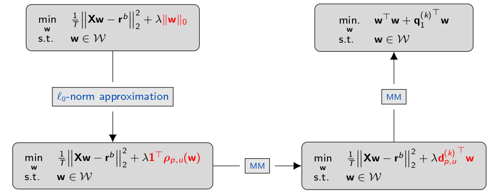

# Convex Optimization

[boyd's book](https://web.stanford.edu/~boyd/cvxbook/bv_cvxbook.pdf)

本文主要收集在凸优化课程中记下的基础概念与结论。

- [Convex Optimization](#convex-optimization)
  - [凸函数与凸集](#凸函数与凸集)
    - [基本定义与重要判定](#基本定义与重要判定)
    - [常见而重要的凹凸函数函数](#常见而重要的凹凸函数函数)
    - [保留凸特性的常见操作](#保留凸特性的常见操作)
  - [凸优化问题](#凸优化问题)
    - [将 $L_1$, $L_{\infty}$转换为凸优化问题](#将-l_1-l_infty转换为凸优化问题)
  - [对偶与KKT条件](#对偶与kkt条件)
    - [对偶函数](#对偶函数)
    - [强弱对偶性](#强弱对偶性)
    - [KKT 条件](#kkt-条件)
  - [CVX库](#cvx库)
  - [最优化算法](#最优化算法)
    - [牛顿法](#牛顿法)
    - [内点法](#内点法)
    - [Block Coordinate Descent (BCD)](#block-coordinate-descent-bcd)
  - [Majorization-Minimization Algorithm (MM Algo.)](#majorization-minimization-algorithm-mm-algo)
    - [寻找 surrogate function的技巧](#寻找-surrogate-function的技巧)
      - [Convexity:](#convexity)
      - [Taylor, upper bound with quadratic terms](#taylor-upper-bound-with-quadratic-terms)
      - [二次矩阵式 (Lecturer 的成果)](#二次矩阵式-lecturer-的成果)
  - [Geometric programming](#geometric-programming)
  - [滤波器设计](#滤波器设计)
    - [切比雪夫滤波器设计](#切比雪夫滤波器设计)
    - [magnitude 优化问题](#magnitude-优化问题)
    - [Log-切比雪夫 幅值设计](#log-切比雪夫-幅值设计)
  - [Markowitz Modern Portfolio Theory](#markowitz-modern-portfolio-theory)
    - [基础问题一: mean-variance portfolio (MVP)](#基础问题一-mean-variance-portfolio-mvp)
    - [基础问题二: Global minimum variance portfolio](#基础问题二-global-minimum-variance-portfolio)
    - [困难问题: Maximum Sharpe ratio portfolio (MSRP)](#困难问题-maximum-sharpe-ratio-portfolio-msrp)
      - [二分求解](#二分求解)
      - [Dinkelbach Transform](#dinkelbach-transform)
      - [Charnes-Cooper Transform / Schaible transform](#charnes-cooper-transform--schaible-transform)
  - [Constrained Problem Optimized for Sparsity](#constrained-problem-optimized-for-sparsity)
    - [Iterative Reweighted l1-Norm Heuristic](#iterative-reweighted-l1-norm-heuristic)
      - [直觉:](#直觉)
      - [理论分析](#理论分析)
  - [Sparse Index Tracking](#sparse-index-tracking)
    - [Sparse Regression](#sparse-regression)

## 凸函数与凸集

### 基本定义与重要判定
- 凸函数要求函数上，任意两点间的函数值的线性插值要不小于线性插值的函数值. 
 $$
 \forall \theta\in[0,1] \quad f(\theta x + (1-\theta)y) \le \theta f(x) + (1-\theta) f(y)
 $$
- 凸集要求集合内两点连线上的任意点都在该集合内

凸函数的一个充分条件是二次导不小于零，严格来说是对各变量的Hessian Matrix为半正定.

### 常见而重要的凹凸函数函数

- 线性函数同时为凹、凸函数
- 所有的 norm (满足三角形不等式)都是凸函数
- 二次函数 $f(x) = x^TPx + 2q^Tx + r$, if $P \ge 0$ 是凸函数.
- 几何平均 $f(x) = (\Pi^n_{i=1} x_i)^{1/n}$ 是凹函数
- log-sum-exp $f(x) = \log{\sum_i e^{x_i}}$为凸函数
- quadratic over linear $f(x,y) = x^2 / y$为凸函数
- log-det $f(X) = logdet(X)$为凹函数 (证明比较取巧，取定义域内任意两点，证明直线上插值比例为变量的函数都为凹函数，则整个函数为凹函数)
- 矩阵的最大特征值 $f(X) = \lambda_{max}(X) = \underset{||y||_2=1}{max}y^TXy$为凸函数 (由最大值性质)
  
### 保留凸特性的常见操作

- 凸函数的非负权重求和
- 与线性函数的嵌套 $f(Ax + b)$
- 多个凸函数的point-wise maximum.
- 凸函数中部分变量的maximum $g(x) = \underset{y\in \mathcal{A}}{sup}f(x, y)$

## 凸优化问题

$$
\begin{array}{lll}
\underset{x}{\operatorname{minimize}} & f_{0}(x) \\
\text { subject to } & f_{i}(x) \leq 0 & i=1, \ldots, m \\
& h_{i}(x)=0 & i=1, \ldots, p
\end{array}
$$

要求:

- $f_0(x)$为凸函数
- $f_i(x)$为凸函数
- $h_i(x)$为线性函数，也就是只允许$Ax = b$

主要性质:

    凸优化的局部最优等于全局最优，且唯一.

### 将 $L_1$, $L_{\infty}$转换为凸优化问题

$L_{\infty}$问题可以如此转换:
$$
\begin{array}{ll}
\underset{x}{\operatorname{minimize}} & \|x\|_{\infty} \\
\text { subject to } & G x \leq h \\
& A x=b
\end{array}
$$
变成
$$
\begin{array}{ll}
\underset{t, x}{\operatorname{minimize}} & t \\
\text { subject to } & -t \mathbf{1} \leq x \leq t \mathbf{1} \\
& G x \leq h \\
& A x=b
\end{array}
$$

$L_1$:
$$
\begin{array}{ll}
\underset{x}{\operatorname{minimize}} & \|x\|_{1} \\
\text { subject to } & G x \leq h \\
& A x=b
\end{array}
$$

$$
\begin{array}{ll}
\underset{t, x}{\operatorname{minimize}} & \sum_{i} t_{i} \\
\text { subject to } & -t \leq x \leq t \\
& G x \leq h \\
& A x=b
\end{array}
$$

## 对偶与KKT条件

对于一般最优化问题:
$$
\begin{array}{lll}
\underset{x}{\operatorname{minimize}} & f_{0}(x) \\
\text { subject to } & f_{i}(x) \leq 0 & i=1, \ldots, m \\
& h_{i}(x)=0 & i=1, \ldots, p
\end{array}
$$

Lagrangian为:

$$L(x, \lambda, v) = f_0(x) + \sum_i \lambda_i f_i(x) + \sum_i v_ih_i(x)$$

### 对偶函数

$$g(\lambda, v) = \underset{x\in D}{inf} L(x, \lambda, v)$$

无论原来的问题是否是凸优化问题，对偶函数$g$一定为凹函数 (线性函数的inf下界组合)，因而最大化$g$经常是一个凸优化问题.

同时$g(\lambda, v) \le p^*$, 对偶函数可以表征原最优化问题的优化下界。

对偶问题就是通过计算$g$的最大值(同时有约束 $\lambda \ge 0$)，来分析原问题的最优下界。

### 强弱对偶性

对偶问题得到的最优解 $d^* \le p^*$. 对于强对偶问题，则有$d^* = p^*$

最简单常用的的判断原问题为强对偶的条件:

- 原问题是凸优化问题
- 且将不等式$\le$约束改为更强的$<$约束，仍存在可行域.

线性不等式约束不需要满足第二条条件。这两点在大多数现实凸优化问题中都成立，大多数的凸优化问题都是强对偶的。

### KKT 条件

- 主可行性, $f_i(x) \le 0$, $h_i(x) = 0$
- 对偶可行性, $\lambda \ge 0$
- Complementary slackness $\lambda_i^*f_i(x^*) = 0$
- 拉格朗日函数对每一个变量的导数(或者说梯度矢量)为零:

$$\nabla f_0(x) + \sum\lambda_i \nabla f_i(x) + \sum v_i \nabla h_i(x) = 0$$

主要性质:

- KKT条件是任何一个可导的最优化问题的必要条件，也即是说最优解一定满足KKT条件
- KKT条件对凸优化问题来说是最优解的充要条件，也即是说可以用KKT条件求出来的解也一定是全局最优解。

计算与解题:

利用KKT条件直接求解的时候经常会遇到分类讨论，主要问题在于$\lambda_i$是否为零，物理意义上来说就是解是在边界上还是可行域内。可以用这一个反推回各种情况下对系统参数的要求。

同时记录常用的矩阵求导结果

$$||Y - AX||^2_2 \underset{\text{grad w.r.t x}}{\rightarrow} 2(A^TA)X - 2A^TY $$

## CVX库

python中可以使用cvxpy库对凸优化问题进行建模与求解。理论上来说cvxpy库可以接受比较复杂的问题描述，然后库会尝试将问题转换为标准凸优化问题并调用求解器求解. 老师的建议是用来快速验证一个问题是不是凸优化问题.

## 最优化算法

以最小化为例子

### 牛顿法

承接梯度下降法, 牛顿法通过二阶导辅助确定步长:

$$
\Delta \mathbf{x}_{\mathrm{nt}}=-\nabla^{2} f(\mathbf{x})^{-1} \nabla f(\mathbf{x})
$$

### 内点法

对于不等式约束，可以理解为阶跃到无穷的一个损失项，使用Log惩罚函数软化此约束:

$$
\underset{\mathbf{x}}{\operatorname{minimize}} \quad f_{0}(\mathbf{x})-(1 / t) \sum_{i=1}^{m} \log \left(-f_{i}(\mathbf{x})\right)
$$

- 当t很小的时候，最优化几乎只优化不等式约束。
- 当t很大的时候，最优化几乎只优化原目标函数，但是在边界附近接近于阶跃。

直接来说，当t很大的时候，函数不好优化，因而需要迭代优化.

作业一道题就是要求使用barrier method 处理Lasso regression.

### Block Coordinate Descent (BCD)

$$
\mathbf{x}_{i}^{k+1}=\arg \min _{\mathbf{x}_{i} \in \mathcal{X}_{i}} f\left(\mathbf{x}_{1}^{k+1}, \ldots, \mathbf{x}_{i-1}^{k+1}, \mathbf{x}_{i}, \mathbf{x}_{i+1}^{k} \ldots, \mathbf{x}_{N+1}^{k}\right)
$$

固定一部分解，每一步只对其中一部分解进行最优化迭代。

## Majorization-Minimization Algorithm (MM Algo.)

对于通用优化问题

$$
\begin{array}{lll}
\underset{x}{\operatorname{minimize}} & f_{0}(x) \\
\text { subject to } & f_{i}(x) \leq 0 & i=1, \ldots, m \\
& h_{i}(x)=0 & i=1, \ldots, p
\end{array}
$$

迭代的优化一个surrogate function.

$$x^{k+1} = \underset{x\in\mathcal{X}}{\text{argmin}} u(x, x^k)$$

要求:

- $u$在$f(x^k)$处相等且相切
- $u(x, y) \ge f(x)$

作业有一道编码题要求使用MM求解

Expectation-Maximization EM 算法属于 MM.

### 寻找 surrogate function的技巧

#### Convexity:
凸函数:
$$
    \kappa(\sum_i \alpha_it_i) \le \sum_i\alpha_i\kappa(t_i)
$$
例子:
$$
\begin{aligned}
\kappa\left(\mathbf{w}^{T} \mathbf{x}\right) &=\kappa\left(\mathbf{w}^{T}\left(\mathbf{x}-\mathbf{x}^{k}\right)+\mathbf{w}^{T} \mathbf{x}^{k}\right) \\
&=\kappa\left(\sum_{i} \alpha_{i}\left(\frac{w_{i}\left(x_{i}-x_{i}^{k}\right)}{\alpha_{i}}+\mathbf{w}^{T} \mathbf{x}^{k}\right)\right) \\
& \leq \sum_{i} \alpha_{i} \kappa\left(\frac{w_{i}\left(x_{i}-x_{i}^{k}\right)}{\alpha_{i}}+\mathbf{w}^{T} \mathbf{x}^{k}\right)
\\
& \leq \sum_{i} \frac{w_{i} x_{i}^{k}}{\mathbf{w}^{T} \mathbf{x}^{k}} \kappa\left(\frac{\mathbf{w}^{T} \mathbf{x}^{k}}{x_{i}^{k}} x_{i}\right)
\end{aligned}
$$
其中$\alpha_i = \frac{w_ix_i^k}{w^Tx^k}, \sum_i \alpha_i=1$

#### Taylor, upper bound with quadratic terms

$$
\begin{aligned}
    \kappa(\mathbf{x}) &\leq \kappa\left(\mathbf{x}^{k}\right)+\nabla \kappa\left(\mathbf{x}^{k}\right)^{T}\left(\mathbf{x}-\mathbf{x}^{k}\right)+\frac{1}{2}\left(\mathbf{x}-\mathbf{x}^{k}\right)^{T} \mathbf{M}\left(\mathbf{x}-\mathbf{x}^{k}\right) \\
    M - \nabla^2\kappa(x) &\ge 0
\end{aligned}
$$
这个$M$可以用$\lambda_{max}$也可以用

#### 二次矩阵式 (Lecturer 的成果)

对于对称矩阵$L$, 有对称矩阵 $M \ge L$,使得

$$
    w^T L w \le w^T M w + 2 w^{(k)T}(L-M)w - w^{(k)T}(L-M)w^{(k)}
$$

其中$M$往往可取$\lambda_{max}(L) I$

## Geometric programming

概念定义

- monomial: $c x_1^{a_1}x_2^{a_2}...$, 要求 $c > 0$
- Posynomial: $\sum c_k x_1^{a_{1k}}x_2^{a_{2k}}...$

GP 定义:
$$
\begin{array}{lll}
\underset{x}{\operatorname{minimize}} & f_{0}(x) \\
\text { subject to } & f_{i}(x) \leq 1 & i=1, \ldots, m \\
& h_{i}(x)=1 & i=1, \ldots, p
\end{array}
$$
其中 $f_i$ 为posynomials, $g_i$为 monomials.

问题来源:

- 最大化容器体积
- 约束所有墙(地面与侧边墙体)的表面积
- 约束长宽比,高宽比等
$$
\begin{array}{ll}
\text { maximize } & h w d \\
\text { subject to } & 2(h w+h d) \leq A_{\text {wall }}, \quad w d \leq A_{\text {floor }} \\
& \alpha \leq h / w \leq \beta, \quad \gamma \leq w / d \leq \delta
\end{array}
$$

求解方案:

将所有变量$x$ 用 $e^{\tilde{x}}$替换, 对目标函数，约束取$log$

$$
\begin{array}{lll}
\underset{x}{\operatorname{minimize}} & \log{ f_{0}(e^{\tilde{x}})} \\
\text { subject to } & \text{log}f_{i}(e^{\tilde{x}}) \leq 0 & i=1, \ldots, m \\
& \text{log} h_{i}(e^{\tilde{x}})=0 & i=1, \ldots, p
\end{array}
$$

目标函数都变为 log-exp-sum 的形式，因而为凸函数.

## 滤波器设计

### 切比雪夫滤波器设计

问题定义: 设计滤波器的线性参数 $\vec h$使得结果的滤波器与目标滤波器在目标频率范围内最大偏差最小化
$$
\underset{\vec h}{\text{minimize}} \underset{\omega \in [0, \pi]}{max} |H(\omega) - H_{des}(\omega)|
$$

由于滤波器的特性是一个虚数函数，因而 "| |"符号并不是绝对值而是模长,对$\omega$离散采样,使用epigraph转换问题，最终可以得到这个SOCP
$$
\begin{array}{ll}
\underset{t, \mathbf{h}}{\operatorname{minimize}} & t \\
\text { subject to } & \left\|\mathbf{A}_{k} \mathbf{h}-\mathbf{b}_{k}\right\| \leq t \quad k=1, \cdots, m
\end{array}
$$

$$
\begin{aligned}
\mathbf{h} &=\left[\begin{array}{cccc}
h_{0} & \cdots & h_{n-1}
\end{array}\right]^{T} & \\
\mathbf{A}_{k} &=\left[\begin{array}{ccc}
1 & \cos \omega_{k} & \cdots & \cos (n-1) \omega_{k} \\
0 & -\sin \omega_{k} & \cdots & -\sin (n-1) \omega_{k}
\end{array}\right] \\
\mathbf{b}_{k} &=\left[\begin{array}{c}
\operatorname{Re} H_{\operatorname{des}}\left(\omega_{k}\right) \\
\operatorname{Im} H_{\operatorname{des}}\left(\omega_{k}\right)
\end{array}\right] &\left(\text { note: } \mathbf{A}_{k} \mathbf{h}=\left[\begin{array}{c}
\operatorname{Re} H\left(\omega_{k}\right) \\
\operatorname{Im} H\left(\omega_{k}\right)
\end{array}\right]\right)
\end{aligned}
$$

### magnitude 优化问题

约束是 $L(\omega) < |H(\omega)| < U(\omega)$。 显然左侧的大于号是非凸的。这里使用自相关系数的概念。自相关系数 $r_t = \sum_\tau h_\tau h_{\tau + t}$ 自相关系数的傅里叶变换结果$R(\omega) = \sum_\tau e^{-j\omega\tau}r_\tau = |H(\omega)|^2$ (功率谱函数)，可以观察到, $R$与$r$是线性关系. 将原来的约束转换为 $L(\omega)^2 \le R(\omega) \le U(\omega)^2$, 这个不等式对$r$是线性，凸的。因而幅值优化问题一般解决方法是将问题转换为关于$r$的函数，然后用spectral factorization将$r$重新转换为$h$

### Log-切比雪夫 幅值设计

优化问题专注于幅值的分贝值，优化是要求最小化与目标谱的偏差
$$\text{minimize} \underset{\omega \in [0,\pi]}{max} |20\log_{10}|H(\omega)| - 20 \log_{10}D(\omega)|$$

其中$D$指的是目标的函数的幅值函数.

解决方案:

- 引入新变量 $t$, epigraph重写max函数
- 将问题转换为功率谱函数问题 $-t< 10\log_{10}R(\omega) - 10\log_{10}D^2(\omega) < t$.注意 $R$是关于$r$线性的.
- 利用对数与指数的单调性，不等式两边同时取$10^x$,换元$\tilde{t} = 10^t$, 同时将优化问题从优化$t$直接改为优化$\tilde{t}$

$$
    1/\tilde{t} \le R(\omega) / D^2(\omega) \le \tilde{t}
$$

反比例函数与线性函数都满足凸优化条件，问题划归为凸优化问题.

## Markowitz Modern Portfolio Theory 

这个[金融学问题](https://www.wikiwand.com/zh/%E7%8E%B0%E4%BB%A3%E6%8A%95%E8%B5%84%E7%BB%84%E5%90%88%E7%90%86%E8%AE%BA)是一个讨论投资决策的简单模型。其将每一项投资的报酬理解为一个高斯分布;不同的投资组成的联合分布是一个(可能)有相关性的多元高斯分布;投资者的决策，也就是投资组合是资产的加权组合;投资组合的报酬也将会是一个高斯分布. 投资者的决策将会是最大化投资组合的期望收入，同时希望减少投资报酬的不确定性.

### 基础问题一: mean-variance portfolio (MVP)

$$
\begin{aligned}
    \underset{w}{maximize} \quad &w^T\mu - \lambda w^T \Sigma w \\
    \text{subject to} \quad&1^T w = 1
\end{aligned}
$$
使用KKT可以直接得到结果。
$$
\begin{aligned}
    w_{MVP} &= \frac{1}{\lambda} \Sigma^{-1} (\mu + v \cdot 1)\\
    v &= \frac{2\lambda - 1^T\Sigma^{-1}\mu}{1^T\Sigma^{-1}\cdot 1}
\end{aligned}
$$
拓展思考，进一步考虑到$\mu$以及$\Sigma$都是从数据样本的均值与方差中估计出来的，因而这个优化问题可以理解为对样本数据的 $l_2$-regularized的回归问题.

通过添加一些新的简单约束，可以在不影响凸优化性质的基础上使结果更鲁棒.

### 基础问题二: Global minimum variance portfolio

$$
\begin{aligned}
    \underset{w}{\text{minimize}} \quad &w^T\Sigma w\\
    \text{subject to} \quad & w^T\mu \ge \beta\\
    &1^T w = 1
\end{aligned}
$$
同样可以通过KKT条件直接得到结果
$$
    w_{GMVP} = \frac{1}{1^T\Sigma^{-1}\cdot 1} \Sigma^{-1} \cdot 1
$$

### 困难问题: Maximum Sharpe ratio portfolio (MSRP)

$$
\begin{aligned}
    \underset{w}{\text{maximize}} \quad &\frac{w^T\mu - r_f}{\sqrt{w^T\Sigma w}} \\
    \text{subject to}\quad & 1^T w = 1
\end{aligned}
$$

这个问题并不是凸优化问题，但是可以被归纳为 concave-convex single-ratio fractional programming. 也就是最大化一个 分子为非负凹函数;分母为非负凸函数的函数. 其一般形式为
$$
    \underset{w}{\text{maximize}} \quad \frac{f(x)}{g(x)}
$$
这里介绍了三种解法

#### 二分求解

写成epigraph形式，
$$
\begin{aligned}
    \underset{x, t}{\text{maximize}} \quad &t \\
    \text{subject to} \quad & t \le \frac{f(x)}{g(x)}    
\end{aligned}
$$

如果将$t$设为常量，这个问题会变成一个凸优化问题，而且是可行性问题.

$$
\begin{aligned}
    \underset{x}{\text{maximize}} \quad & 0 \\
    \text{subject to} \quad & tg(x) \le f(x)
\end{aligned}
$$

使用二分法不断收敛$t$的取值范围，找到最大的存在解的$t$,对应的优化结果为目的结果。

#### Dinkelbach Transform

将问题转换为

$$
\begin{aligned}
    \underset{x}{\text{maximize}} \quad & f(x) - yg(x) \\
\end{aligned}
$$

其中新变量$y$会被迭代地更新，$y^{(k)} = \frac{f(x^{(k)})}{g(x^{(k)})}$

Dinkelbach证明了 $y^{(k)}$是单调递增的，且结果最终会收敛到 concave-convex FP的最优解.

#### Charnes-Cooper Transform / Schaible transform

对于线性的$f(x), g(x)$, 分母都大于零的情况. 可以采用Charnes-Cooper转换。

线性FP:
$$
\begin{aligned}
    \underset{x}{\text{maximize}} \quad & \frac{c^Tx + \alpha}{d^Tx+\beta} \\
    \text{subject to} \quad & Ax \le b
\end{aligned}
$$
换元 $y = \frac{x}{d^Tx+\beta}$, $t = \frac{1}{d^Tx + \beta}$
问题可以变为
$$
\begin{aligned}
    \underset{y,t}{\text{maximize}} \quad & c^Ty + \alpha t \\
    \text{subject to} \quad & Ay \le bt\\
    & d^Ty + \beta t = 1\\
    &t \ge 0
\end{aligned}
$$
问题变成了一个Linear programming.

Shaible Transform是以上运算的推广，通用地来说， 可以设$y=\frac{x}{g(x)}$, $t = \frac{1}{g(x)}$, 约束问题变为
$$
\begin{aligned}
    \underset{y,t}{\text{maximize}} \quad & tf(\frac{y}{t}) \\
    \text{subject to} \quad & tg(y/t) \le 1\\
    &t \ge 0 \\
    & y/t \in \mathcal{X}  \quad \text{也就说$y/t$要满足原来的约束}
\end{aligned}
$$
这三种方法都可以用于求解原来的MSRP问题.

## Constrained Problem Optimized for Sparsity

### Iterative Reweighted l1-Norm Heuristic

- set $w=1$ repeat:
  - $\text{minimize}_x ||Diag(w)x||_1$ subject to constrained.
  - $w_i = 1 / (\epsilon  + |x_i|)$
- Convergence

#### 直觉:
- 第一次迭代为直接优化$l_1$-norm
- 之后每次迭代
  - 如果$x_i$比较小，惩罚权重比较大，驱使它更小
  - 如果$x_i$比较大，惩罚权重比较小，且梯度也不大，允许它变得更大.

#### 理论分析

使用$\log$而不是$||x||_1$来对$||x||_0$进行拟合.

优化问题变为

$$\begin{array}{ll}\underset{\mathbf{x}}{\operatorname{minimize}} & \sum_{i=1}^{n} \log \left(1+x_{i} / \varepsilon\right) \\ \text { subject to } & \mathbf{x} \in \mathscr{C}, \quad \mathbf{x} \geq \mathbf{0}\end{array}$$

对于这个问题， 思路是使用 MM算法，代理函数选择切线拟合:

$$
\sum^n_{i=1}\log(1 + x_i / \varepsilon) \approx \sum^n_{i=1} \log(1  + x_i^{(k)} / \varepsilon) + \sum_{i=1}^n \frac{x_i - x_i^{(k)}}{\varepsilon + x_i^{(k)}}
$$

问题最终变为求解一个带约束的线性目标函数

$$
\begin{aligned}
    &\underset{x}{\text{minimize}} \quad \sum^n_{i=1}w_ix_i\\
    &\text{subject to} \quad x\in\mathscr{C}, \quad x \ge 0
\end{aligned}
$$
其中$w_i = 1 / (\varepsilon + x_i^{(k)})$

## Sparse Index Tracking

SIT的意思是金融上用少数个股票的股价线性加权拟合股指(恒生指数，上证指数等), 主要难点在于这是个一个稀疏问题，我们只能选择其中一部分的股票进行拟合。这个选择过程严谨来说是一个 NP难的问题。

### Sparse Regression

$$
    \underset{w}{\text{minimize}} \quad ||r - Xw||_2 + \lambda ||w||_0
$$

lecture中给出了使用MM算法进行求解的方案.

类似于前文，定义对$l_0$-norm的近似
$$
    \rho_{p,\gamma}(w) = \frac{\log{1 + |w|/p}}{\log(1 + \gamma/p)}
$$
$\gamma$值越小，则在逼近零的小区间内近似越准,但是在较大的区间内则不太准，因而是一个超参数.且这个函数对$w\ge0$是一个凹函数.

新的优化目标函数:

$$
    \underset{w}{\text{minimize}} \quad \frac{1}{T}||Xw-r^b||_2 + \lambda 1^T \rho_{p,u}(w)
$$

这个函数还不是凸函数，这里采用[MM]算法进行处理,与前一章一致，使用当前点的切线作为代理函数
$$
\approx \frac{1}{\log{1+\gamma/p}} \left\{\log(1  + w_i^{(k)} / \varepsilon) + \frac{w_i - w_i^{(k)}}{\varepsilon + w_i^{(k)}}\right\}
$$

在[MM]中需要迭代多次求解的目标函数:
$$
\underset{w}{\text{minimize}} \quad \frac{1}{T}||Xw-r^b||_2 + \lambda d_{p,u}^{(k)T}(w)
$$
$$
\begin{array}{ll}
        \text { subject to } & \left.\begin{array}{l}
        \mathbf{w}^{\top} \mathbf{1}=1 \\
        \mathbf{0} \leq \mathbf{w} \leq \mathbf{1},
        \end{array}\right\} \mathcal{W}
        \end{array} 
$$

这个函数是一个QP,仍需要迭代。

对这个QP使用[MM],令$L = \frac{1}{T}X^TX, M=\lambda_{max}(L) I$以及公式$w^T L w \le w^T M w + 2 w^{(k)T}(L-M)w - w^{(k)T}(L-M)w^{(k)}$
$$
\begin{array}{l}
\mathbf{w}^{\top} \mathbf{L}_{1} \mathbf{w}+\left(\lambda \mathbf{d}_{p, u}^{(k)}-\frac{2}{T} \mathbf{X}^{\top} \mathbf{r}^{b}\right)^{\top} \mathbf{w} \\
\leq \mathbf{w}^{\top} \mathbf{M}_{1} \mathbf{w}+2 \mathbf{w}^{(k)^{\top}}\left(\mathbf{L}_{1}-\mathbf{M}_{1}\right) \mathbf{w}-\mathbf{w}^{(k)^{\top}}\left(\mathbf{L}_{1}-\mathbf{M}_{1}\right) \mathbf{w}^{(k)} \\
\quad+\left(\lambda \mathbf{d}_{p, u}^{(k)}-\frac{2}{T} \mathbf{X}^{\top} \mathbf{r}^{b}\right)^{\top} \mathbf{w} \\
=\lambda_{\max }^{\left(\mathbf{L}_{1}\right)} \mathbf{w}^{\top} \mathbf{w}+\left(2\left(\mathbf{L}_{1}-\lambda_{\max }^{\left(\mathbf{L}_{1}\right)} \mathbf{I}\right) \mathbf{w}^{(k)}+\lambda \mathbf{d}_{p, u}^{(k)}-\frac{2}{T} \mathbf{X}^{\top} \mathbf{r}^{b}\right)^{\top} \mathbf{w}+\text { const. }
\end{array}
$$

目标函数变为:
$$
\underset{w}{\text{minimize}} \quad w^Tw + q_1^{(k)T}w
$$
$$
\begin{array}{ll}
        \text { subject to } & \left.\begin{array}{l}
        \mathbf{w}^{\top} \mathbf{1}=1 \\
        \mathbf{0} \leq \mathbf{w} \leq \mathbf{1},
        \end{array}\right\} \mathcal{W}
        \end{array} 
$$
其中 
$$
\mathbf{q}_{1}^{(k)}=\frac{1}{\lambda_{\max }^{\left(\mathbf{L}_{1}\right)}}\left(2\left(\mathbf{L}_{1}-\lambda_{\max }^{\left(\mathbf{L}_{1}\right)} \mathbf{I}\right) \mathbf{w}^{(k)}+\lambda \mathbf{d}_{p, u}^{(k)}-\frac{2}{T} \mathbf{X}^{\top} \mathbf{r}^{b}\right)
$$

对这个问题可以用KKT直接求出最优解. $\mathcal{L}=w^Tw + q^Tw + \mu(w^T1 -1) - \sum h_iw + \sum h'(w-1)$. 会求出

  $$h' = 0$$
  $$w_i = \left\{\begin{array}{l}-\frac{q_i+\mu}{2}\\ 0\end{array}\right.$$
  $$h_i = \left\{\begin{array}{ll}0 & w_i \neq 0 \\ -q_i - v & w_i=0\end{array} \right.$$
  从$h_i > 0$,得到对$w_i$的判别条件 
  $$\left\{\begin{array}{lll}v_i + q_i < 0 & w_i=0 & h_i = -v_i - q_i\\v_i + q_i > 0 & w_i=-\frac{q_i+\mu}{2} & h_i = 0 \end{array}\right.$$
  从等式约束，得到$\mu = - \frac{2 + \sum_{i | w_i > 0}q_i}{\text{num}\_\text{positive}}$

[MM]:#majorization-minimization-algorithm-mm-algo
