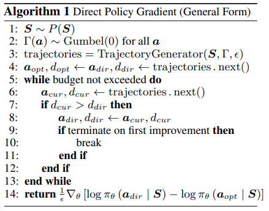
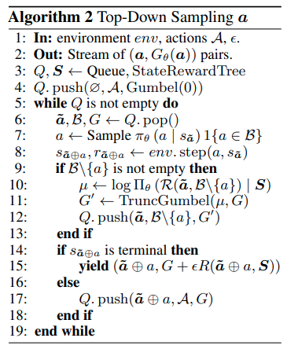

time: 20201016
pdf_source: https://arxiv.org/pdf/1906.06062.pdf
code_source: https://github.com/GuyLor/Direct-Policy-Gradients

# Direct Loss Minimization

本文集中分析几篇与direct loss minimization相关的文章。其最终反应的直观解释是在task-based loss或者reward的引导下让网络向更高的输出权重靠拢。

通常优化问题的目标是找到$w^*$, 使得$w^* = \underset{w}{argmin}E[L(y, y_w(x))]$,也就是目标输出与基于权重的输出差距最小. 当$L$相对于$y$是不可导的时候，无法反传。

与得到task-related loss直接回传不同,它的思路是根据task-related loss以及网络本身的输出$w_0$，搜索出可能更好的一组输出$w_1$, 然后学习算法的训练函数则是引导模型的输出远离$w_0$, 靠近$w_1$.

## 核心 Motivation 与奠基: Direct Loss Minimization for Structured Prediction

[pdf](https://papers.nips.cc/paper/4069-direct-loss-minimization-for-structured-prediction.pdf)

这篇2010的NIPS从两个角度引入了 direct loss minimization.

-  Perceptron Training Algorithm
-  Structural SVM

Perceptron的算法本站在[此处](../other_categories/object_detection_2D/AP_loss.md)由简介.本文重述为

$$
w^{t+1} = w^{t} + \phi(x_t, y_i) - \phi(x_t, y_{w^t}(x_t))
$$

其中$w$为线性权重，$\phi$为特征矢量.这个基础的更新法则是与Loss无关的.

Structural SVM的广义优化问题为:

$$
w^* = \underset{w}{argmin} E[\underset{\bar y \in\mathcal{Y}}{max}(L(y, \bar y) - w^T (\phi(x, y) - \phi(x, \bar y))) ]
$$

一个解法是先计算出hinge loss里面$max$内的$y$的取值 $y^t_{hinge}$. 权重更新可以写为

$$
    w^{t+1} = w^t + \eta^t(\phi(x_t, y_t) - \phi(x_t, y_{hinge}^t))
$$

作者进一步加入了参数$\epsilon$

$$
\begin{array}{c}
w^{t+1}=w^{t}+\eta^{t}\left(\phi\left(x_{t}, y_{w^{t}}\left(x_{t}\right)\right)-\phi\left(x_{t}, y_{\text {direct }}^{t}\right)\right) \\
y_{\text {direct }}^{t}=\underset{\tilde{y} \in \mathcal{Y}}{\operatorname{argmax}}\left(w^{t}\right)^{\top} \phi\left(x_{t}, \tilde{y}\right)+\epsilon^{t} L(y, \tilde{y})
\end{array}
$$

作者主要结果就是证明了，当$\epsilon$逼近零的时候，更新方向逼近于$\nabla_w E[y, y_m(x)]$

也就是说, $\nabla_w E[L(y, y_m(x))] = \underset{\epsilon \rightarrow 0}{lim}\frac{1}{\epsilon} E[\phi(x, y_{direct}) - \phi(x, y_m(x))]$

其中 $y_{direct} = \underset{\bar y \in \mathcal{Y}}{argmax} w^T\phi(x, \bar y)+ \epsilon L(y, \bar y)$

## Training Deep Neural Networks via Direct Loss Minimization

[pdf](https://arxiv.org/pdf/1511.06411.pdf)

这篇paper是[AP-Loss]的引文之一. 提出了使用 Direct Loss minimization，用AP作为引导训练分类网络。

取前文的优化问题的处理，设置Task Loss $L = L_{AP}$。$y_w$是网络直接的输出 logits. 梯度
$$
\begin{aligned}
& \nabla_{w} \mathbb{E}\left[L\left(y, y_{w}\right)\right] \\
=& \pm \lim _{\epsilon \rightarrow 0} \frac{1}{\epsilon} \mathbb{E}\left[\nabla_{w} F\left(x, y_{\text {direct }}, w\right)-\nabla_{w} F\left(x, y_{w}, w\right)\right]
\end{aligned}
$$

重点难点在于计算$y_{direct} = \underset{\hat y \in\mathcal{Y}}{argmax} F(x, \hat y, w) + \epsilon L_{AP}(y, \hat y)$

其技巧并不通用(目前情况来说显著地比不上[AP-Loss]的算法)。不在本站展开.

## Direct Policy Gradients: Direct Optimization of Policies in Discrete Action Spaces

[pdf](https://arxiv.org/pdf/1906.06062.pdf) [code](https://github.com/GuyLor/Direct-Policy-Gradients)

这篇NIPS2020 paper则将Direct Loss minimization用到了policy gradient上，处理离散的action spaces。巧妙的地方在于使得A*的剪枝-加速搜索的方法应用到了强化学习中。

由于需要对行动进行采样，又进一步引入了 [Gumbel-reparametrization](../Building_Blocks/GumbelSoftmax.md)

### Policy Gradient

$$
\begin{aligned}
\nabla_{\theta} J\left(\pi_{\theta}\right) &=\nabla_{\theta} \underset{\tau \sim \pi_{\theta}}{\mathrm{E}}[R(\tau)] \\
&=\nabla_{\theta} \int_{\tau} P(\tau \mid \theta) R(\tau) \\
&=\int_{\tau} \nabla_{\theta} P(\tau \mid \theta) R(\tau) \\
&=\int_{\tau} P(\tau \mid \theta) \nabla_{\theta} \log P(\tau \mid \theta) R(\tau) \\
&=\underset{\tau \sim \pi_{\theta}}{\mathrm{E}}\left[\nabla_{\theta} \log P(\tau \mid \theta) R(\tau)\right] \\
&=\underset{\tau \sim \pi_{\theta}}{\mathrm{E}}\left[\nabla_{\theta}(\log \rho_0(s_0) + \sum_{t=0}^T(\log P(s_{t+1}|s_t, a_t) + \log \pi_\theta(a_t| s_t))) R(\tau)\right] \\
\therefore \nabla_{\theta} J\left(\pi_{\theta}\right) &=\underset{\tau \sim \pi_{\theta}}{\mathrm{E}}\left[\sum_{t=0}^{T} \nabla_{\theta} \log \pi_{\theta}\left(a_{t} \mid s_{t}\right) R(\tau)\right]
\end{aligned}
$$

### Direct Policy Gradient

与基础的policy gradient直接从$\pi_\theta$采样不同，本文的输出action定义为

$$
\begin{aligned}
    a^*(\epsilon) &= \underset{a}{argmax}D_\theta(a; \Gamma, S, \epsilon) \\ 
    D_\theta(a; \Gamma, S, \epsilon) &= \log \Pi_\theta(a|S) + \Gamma(a) + \epsilon R(a, S)
\end{aligned}
$$
其中 $\Gamma$是gumbel随机采样值

设action $a$的采样是基于二元函数$D_\theta(S, \epsilon)$， 进而修改得到梯度结果
$$
\nabla_{\theta} \underset{\tau \sim \pi_{\theta}}{\mathrm{E}}[R(\tau)] =
\frac{1}{\epsilon} \mathbb{E}_{\boldsymbol{S} \sim P, \Gamma}\left[\nabla_{\theta} \log \Pi_{\theta}\left(\boldsymbol{a}^{*}(\epsilon) \mid \boldsymbol{S}\right)-\nabla_{\theta} \log \Pi_{\theta}\left(\boldsymbol{a}^{*}(0) \mid \boldsymbol{S}\right)\right]
$$

其中$a^*(0)$是不考虑梯度结果,网络模型原来的输出采样出来的结果，这里文章称之为$a_{opt}$. $a^*(\epsilon)$是带有reward时推理的结果，与direct loss minimization 范式对照，这里称之为$a_{direct}$

搜索算法:

作者进一步考虑到可以使用 heuristic function $H = G_\theta(R) + \epsilon(reward\_so\_far + bound\_reward\_togo)$ 在搜索最佳的$d_{direct}$的过程中使用 A*修剪掉expected results比较低的部分，加快搜索进度.

[aLRP Loss]:../other_categories/object_detection_2D/aLRPLoss.md
[AP-Loss]:../other_categories/object_detection_2D/AP_loss.md