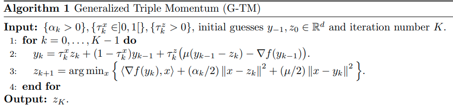

time: 20201029
short_title: First Order Optimizers

# Firt Order Optimizers: Reviews and Updates

这篇内容会专注于一阶优化器的直觉与算法介绍，并从凸优化引入相关的基础概念

- [Firt Order Optimizers: Reviews and Updates](#firt-order-optimizers-reviews-and-updates)
  - [论文中经常出现的基础概念:](#论文中经常出现的基础概念)
  - [Gradient-Descent and Basic Variants](#gradient-descent-and-basic-variants)
    - [梯度下降算法](#梯度下降算法)
    - [Proximal Gradient Method](#proximal-gradient-method)
    - [Projected Gradient Descent](#projected-gradient-descent)
    - [Nesterov Accelerated Gradient Descent](#nesterov-accelerated-gradient-descent)
  - [Triple Momentum Gradient Descent](#triple-momentum-gradient-descent)
    - [个人分析](#个人分析)
  - [Boosting First-Order Methods by Shifting Objective: New Schemes with Faster Worst Case Rates](#boosting-first-order-methods-by-shifting-objective-new-schemes-with-faster-worst-case-rates)
    - [Generalized Triple Momentum](#generalized-triple-momentum)

## 论文中经常出现的基础概念:

Lipschitz Continuity & L-Smooth 指:

$$
    (\nabla f(x) - \nabla f(y))^T \le L ||x-y||
$$
直觉来说是二阶导有上限$L$

$\mu$-strongly convex 指:
$$
    (\nabla f(x) - \nabla f(y))^T (x-y) \ge m ||x-y||^2
$$
直觉来说是二阶导有正下限$m$. 在凸优化问题中，连续函数二阶导为非负数，这里强凸函数的定义则是要求二阶导为正数. 文章中会出现 "L-smooth and $\mu$-strongly convex"的说法，直觉地来说指函数的二阶导在正数区间$[\mu, L]$.

co-coercivity 矫顽性可以由convexity 与 L-smooth一同推导, 其数学表述为

$$
\frac{1}{2L} ||\nabla f(x) - \nabla f(y)||^2 \le f(x) - f(y) - \langle\nabla(y), x-y\rangle
$$

## Gradient-Descent and Basic Variants

关于梯度下降相关算法，有一个比较好的[博客](https://jlmelville.github.io/mize/nesterov.html)

### 梯度下降算法

$$
x_{k+1} = x_{k} - \alpha \nabla f(x_{k})
$$

从surrogate function的角度来解析，在每一步$x_k$上，可以理解构造一个与原函数在$x=x_k$相切且二阶导为$1/\alpha$的二次函数$y = \frac{1}{2\alpha}(x-x_k)^2 + \nabla f(x_k)(x-x_k) + f(x_k)$, 每一步$x$会更新到这个二次代理函数的最小值上. 这要求整个函数可导，如果不可导，则需要使用 subgradient descent.

subgradient 函数 $g$定义为任意梯度函数(subgradient oracle)，使得 $f(y) \ge f(x) + \langle g(x), y-x\rangle$

### Proximal Gradient Method

如果凸函数其中有一个部分不可导，但是处理比较简单，那么可以使用proximal optimization algorithms, 将函数分解为$f(x) = g(x) + h(x)$, 其中$h(x)$不一定可导.

可以理解为分两步:

- 将$g(x)$用当前位置的$x_k$的函数值构造一个与原函数相切(曲率不必一致的)的函数$g(x_k) + \nabla g(x_k)^T(u-x_k) + \frac{\mu}{2} ||u-x_k||_2^2$，
- 把$h(x)$直接与新二次代理函数的求和求global minimum.
 $$x^+ = \underset{u}{\text{argmin}}(h(u) + g(x_k) + \nabla g(x_k)^T (u-x_k) + \frac{\mu}{2} ||u-x_k||_2^2) = \underset{u}{\text{argmin}}(h(u) + \nabla g(x_k)^Tu + \frac{\mu}{2}||u-x_k||^2_2)$$

重点:

- 如果$h(x)$为L2-norm L1-norm, 这些常见的regularizer, 那么最后的求优化是一个典型的二次函数 + 二次函数或者 二次函数 + $l_1$,都是有closed-form solution的。
- 如果记$x_k^*$为二次代理函数的极值点 $x_k - \frac{\nabla g(x_k)}{\mu}$, 将$\nabla g(x_k)$代入上文的最优化公式， 那么最后的求解函数常常会写成 proximal mapping (prox-operator), $\text{prox}_h^\mu(x_k^*) = \underset{u}{\text{argmin}}(h(u) + \frac{\mu}{2}||u-x_k^*||_2^2)$.说明最终的结果既需要考虑$g$的局部最优点，也需要考虑$h(x)$.

特殊情况中，$h$可以是一个 indicator function,指定函数的定义域, 如果$x$在定义域$C$内则$h(x) = 0$,否则$h(x) = \infty$. 这样的情况下 $prox_h$函数变成了在有限定义域内寻找最优解的问题，得到的结果是最优解在边界上的投影。因而[wiki](https://www.wikiwand.com/en/Proximal_gradient_method)说 prox函数是projection操作的推广。

### Projected Gradient Descent

如果使用梯度下降的时候要求$x$在定义域$C$中，那么一个projected梯度下降的做法是，首先进行无约束梯度下降，然后将结果投影到边界上. 记为$x_{k+1} = \pi_C(x_k - \alpha_k\nabla f(x_k))$, 其中$\pi_C$为欧几里得投影，可以写成

$$
x_{k+1}  = \underset{x\in C}{\text{argmin}}||x_k - \alpha_k \nabla f(x_k) - x||_2^2
$$
展开后变为

$$
x_{k+1} = \underset{x\in C}{\text{argmin}}\{\langle x,\nabla f(x_k) \rangle + \frac{1}{\alpha_k}\frac{||x-x_k||^2_2}{2} \}
$$

General Projected Gradient Descent 则会允许不同的距离量变为:
$$x_{k+1}=\arg \min _{x \in C}\left\{\left\langle x, \nabla f\left(x_{k}\right)\right\rangle+\frac{1}{\alpha_{k}} d\left(x, x_{k}\right)\right\}$$

常用的距离量 Bregman Divergence
$$
    D_f(x, y) = f(x) - f(y) - \langle \nabla f(y), x-y\rangle
$$
由$f(x) = \sum x\log x$可以产出 KL divergence.

mirror gradient descent常常用来分析

### Nesterov Accelerated Gradient Descent

Nesterov Acceleration有很多个不同的版本。

Nesterov 在 1983年的paper:

$$
\begin{aligned}
    y_t = x_t + \frac{t}{t+3}(x^{t} - x^{t-1}) \\
    x_{t+1} = y_t - \eta_t \nabla f(y^t) \\
\end{aligned}
$$
其中 $\frac{t}{t+3}$可被泛化为一般超参数$\beta$. 可以理解为$y_t$为沿着之前的更新方向look-ahead的目的位置, 然后在look-ahead的位置进行梯度更新. [这篇Medium博客](https://towardsdatascience.com/learning-parameters-part-2-a190bef2d12)提供了基于"look-ahead"的阐述.

[pytorch的版本](https://pytorch.org/docs/stable/optim.html)采用的是更着重于momentum的算法描述，对标的是momentum gradient descent.

$$
\begin{aligned}
    v_{t+1} &= \mu \cdot v_t + g_{t+1} \\
    p_{t+1} &= p_t - lr \cdot v_{t+1}    
\end{aligned}
$$

## Triple Momentum Gradient Descent

[pdf](http://www.optimization-online.org/DB_FILE/2017/03/5908.pdf)

这篇paper提出了一个基于四个参数的 triple momentum (TM)框架.

这个框架下的优化器算法:

$$
\begin{aligned}
    \xi_{k+1} &= (1+\beta) \xi_k  - \beta \xi_{k-1} - \alpha \nabla f(y_k)\\
    y_k &= (1 + \gamma)\xi_k - \gamma\xi_{k-1}\\
    x_k &= (1 + \delta)\xi_k - \delta\xi_{k-1}
\end{aligned}
$$
| Method            |            Parameters             |
| :---------------- | :-------------------------------: |
| Gradient descent  |        $(\alpha, 0, 0, 0)$        |
| Momentum Gradient |      $(\alpha, \beta, 0, 0)$      |
| Nesterov AG       |    $(\alpha, \beta, \beta, 0)$    |
| General TM Algo.  | $(\alpha, \beta, \gamma, \delta)$ |

直觉上来说，如果$\delta=0$, 则 $x_k = \xi_k$, 代入后就能得到前面提到的几个算法公司.

作者给出了参数, 如果一直需要优化的函数是 $L-\text{smooth}, \mu-\text{strongly convex}$的则令$\kappa = L / \mu, \rho = 1 - 1 / \sqrt{\kappa}$, 设定一下参数，
$$
(\alpha, \beta, \gamma, \delta) = (\frac{1+\rho}{L}, \frac{\rho^2}{2-\rho}, \frac{\rho^2}{(1+\rho)(2-\rho)}, \frac{\rho^2}{1 - \rho^2})
$$

### 个人分析
这个paper是有小问题的，对前面TM框架进行分析，可以通过用$x, y$表达$(\xi_k - \xi_{k-1})$可以消去$\xi$.同时$\gamma, \delta$中有一个参数是多余的.这个公式最终可以化为

$$
    x_{k+1} - y_{k+1} = \beta(x_k - y_k) - \alpha (\delta - \gamma) \nabla f(y_k)
$$

这里引出了下一篇paper提到的参数冗余问题。

## Boosting First-Order Methods by Shifting Objective: New Schemes with Faster Worst Case Rates

[pdf](https://arxiv.org/pdf/2005.12061.pdf)

对于原来的目标函数，可以转而求解一个新的shifted objective.

$$
\underset{x\in\mathcal{R}^d}{\text{min}}h(x) = \frac{1}{n}\sum^n_{i=1}h_i(x), \quad \text{where}\quad \ h_i(x) = f_i(x) - f_i(x^*) - 
\left\langle\nabla f_{i}\left(x^{\star}\right), x-x^{\star}\right\rangle -
 \frac{\mu}{2}||x - x^*||^2
$$
可以简单理解为原函数与最值点附近的下界二次函数的残差.容易证明

- h(x)是一个凸函数
- h(x)的极值点与$\sum f(x)$相同，进而可以说$h(x)$的最优值点与$f(x)$的相同。
- h(x)$(L-\mu)$-smooth
- 矫顽性:$\forall x, y \in \mathbb{R}^{d}, h(x)-h(y)-\langle\nabla h(y), x-y\rangle \geq \frac{1}{2(L-\mu)}\|\nabla h(x)-\nabla h(y)\|^{2}$

### Generalized Triple Momentum 

其中$z_{k+1}$的表达式等价于
$$
z_{k+1} = \text{argmin}_x\left\{ (\mu/2) ||x - y_k^*||_2^2 + (\alpha_k / 2)||x - z_k||_2^2\right\}
$$
其中$y_k^*$为二次surrogate function $g(y_k) + \nabla g(y_k)^T(u-y_k) + \frac{\mu}{2} ||u-y_k||_2^2$的最优解$y_k-\frac{\nabla f(y_k)}{\mu}$. 可得$z_{k+1} = \frac{\mu y_k^* + \alpha z_k}{\mu  + \alpha} = z_k - \frac{\mu}{\mu+\alpha}(y_k^* - z_k)$, 在一定程度上可以表达梯度下降算法. 

而当$\tau_k^z = 0$时，可以简单地将这两条式子化为 Nesterov的标准形式。

进一步地观察$y_k$的表达式的第二项,将$z_{k}$代入,得到
$\frac{2\mu + \alpha}{\mu + \alpha}[\mu(y_{k-1} - z_{k-1}) - \nabla f(y_{k-1})]$, 由于强凸性, 第二项与$y_{k-1} - z_{k-1}$符号相反,这是用于补偿strongly-convex函数的二阶导的,当我们用曲率为$\mu$的更为扁平的二次代理函数求解时，我们会高估合适的梯度下降步长的大小，因而带着动量往前的$y_k$ 在预测look-ahead 时会减去之前高估的一部分步长.

参考参数$\alpha=\sqrt{L\mu} - \mu, \tau_x=\frac{2\sqrt{\kappa}-1}{\kappa}, \tau_z = \frac{\sqrt{\kappa} - 1}{L(\sqrt{\kappa} - 1)}$

文章更严谨且通用地用李雅普诺夫函数 $T_{k}=h\left(y_{k-1}\right)-\frac{1}{2(L-\mu)}\left\|\nabla h\left(y_{k-1}\right)\right\|^{2}+\frac{\lambda}{2}\left\|z_{k}-x^{\star}\right\|^{2},$ where $\lambda>0$ 进行了证明， 说明其收敛速度上限比较小。

作者之后将这个算法附加在多个一阶算法上(SVRG, SAGA)。由于个人认知有限，暂还没有能力分析这些算法及其应用. 