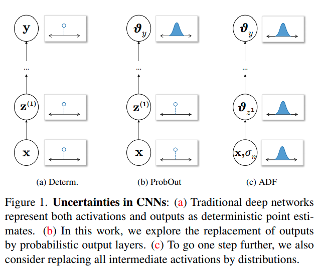
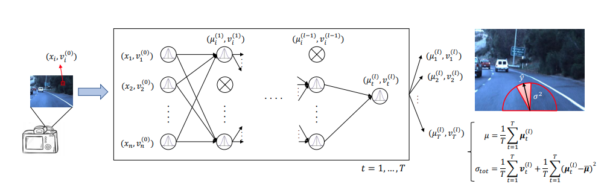

time: 20200407
pdf_source: https://arxiv.org/pdf/1907.06890.pdf

# Uncertainty Propagation in Neural Network

本文主要讨论不确定性在神经网络中的传播的一个方法。

在Bayesian Neural Network中，有两个流派，第一个是把每一个weight建模为一个高斯分布，另一个是把输入与激活建模为概率分布，而weight只是常数。

这里分享一篇在Robotics中应用第二种BNN的paper，在这之前分享本文的主要数学前置，

## Lightweight Probabilistic Deep Networks

[pdf](https://arxiv.org/pdf/1805.11327.pdf)

本文直接介绍ADF，将中间所有的激活层都理解为概率分布.

对于一个标准的神经网络前向传递，可以用概率解读，写为:

$$\begin{aligned}
p\left(\mathbf{z}^{(0: l)}\right) &=p\left(\mathbf{z}^{(0)}\right) \prod_{i=1}^{l} p\left(\mathbf{z}^{(i)} | \mathbf{z}^{(i-1)}\right) \\
p\left(\mathbf{z}^{(i)} | \mathbf{z}^{(i-1)}\right) &=\delta\left[\mathbf{z}^{(i)}-\mathbf{f}^{(i)}\left(\mathbf{z}^{(i-1)}\right)\right]
\end{aligned}$$

我们开始假设，网络的输入层有噪音，可以用element-wise的高斯分布建模(注意这里将输入噪音设定为各个元素独立的无味的误差, aleatoric uncertaint)。

$$p\left(\mathbf{z}^{(0)}\right)=\prod_{j} \mathcal{N}\left(z_{j}^{(0)} | x_{j}, \sigma_{n}^{2}\right)$$

高斯分布在网络传播中，尤其是非线性层传播后显然不再是高斯分布。作者指出，为了更好的建模传播后的均值与方差，要求用一个与实际分布的[KL divergence]尽可能小的分布，[这篇paper](https://tminka.github.io/papers/ep/minka-thesis.pdf)指出这等价于让概率分布的矩相等，在高斯假设下，就是均值与方差相等(高斯只有两个参数，只能控制前两阶的矩)。

对于卷积层以及普通全连接层，本质上来说它们都是线性层，方差与均值的计算是解耦的。

$$\mathbb{E}[\mathbf{f}(\mathbf{z})]=W \boldsymbol{\mu}_{z}+\mathbf{b} $$
$$\mathbb{V}[\mathbf{f}(\mathbf{z})]=(W \circ W) \boldsymbol{v}_{z}$$

$\circ$指element-wise相乘，在implementation时，可以发现运算规则与原来的Forward是一致的，用不同的weight和bias就可以了。

对于ReLU,[这篇paper](http://www.cs.toronto.edu/~hinton/absps/nlgbn.pdf)证明了:

$$\begin{aligned}
\mu_{\text {relu }}(\mu, v) &=\mu \cdot \Phi\left(\frac{\mu}{\sigma}\right)+\sigma \cdot \phi\left(\frac{\mu}{\sigma}\right) \\
v_{\text {relu }}(\mu, v) &=(\mu+v) \cdot \Phi\left(\frac{\mu}{\sigma}\right)+\mu \sigma \cdot \phi\left(\frac{\mu}{\sigma}\right)-\mu_{\text {relu }}^{2}(\mu, v)
\end{aligned}$$
其中 $\sigma = \sqrt{v}$ 且$\Phi$是标准正太的累计函数,$\phi$是标准正态函数密度函数

对于MaxPooling,[这篇paper](https://arxiv.org/pdf/1511.06306.pdf)指出,对于两个高斯函数:

$$\begin{aligned}
E[Y] &=\mu_{X_{i}} \Phi(\alpha)+\mu_{X_{j}} \Phi(-\alpha)+\theta \phi(\alpha) \\
\operatorname{Var}[Y] &=\left(\sigma_{X_{i}}^{2}+\mu_{X_{i}}^{2}\right) \Phi(\alpha)+\left(\sigma_{X_{j}}^{2}+\mu_{X_{j}}^{2}\right) \Phi(-\alpha)+\left(\mu_{X_{i}}+\mu_{X_{j}}\right) \theta \phi(\alpha)-E[Y]^{2}
\end{aligned}$$

$$\alpha=\frac{\left(\mu_{X_{i}}-\mu_{X_{j}}\right)}{\theta}, \theta=\sqrt{\sigma_{X_{i}}^{2}+\sigma_{X_{j}}^{2}}$$

迭代将所有需要处理的元素逐个Max运算。顺序是有相关的，但是本文建议为了提速可以尽可能并行，先水平再竖直方向，直接分开计算。

## A General Framework for Uncertainty Estimation in Deep Learning

本文在end-to-end learning上综合两种bayesian uncertainty,第一个是由输入数据不确定性向后传播的结果。第二个是$T$次采样Dropout,得到$T$个不同的结果如图融合。

[KL divergence]:https://www.wikiwand.com/en/Kullback%E2%80%93Leibler_divergence