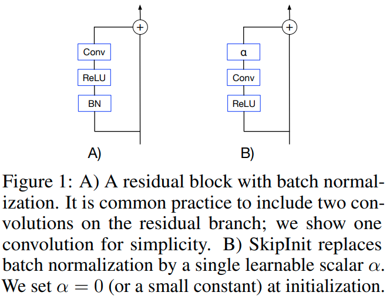
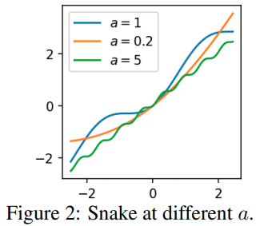
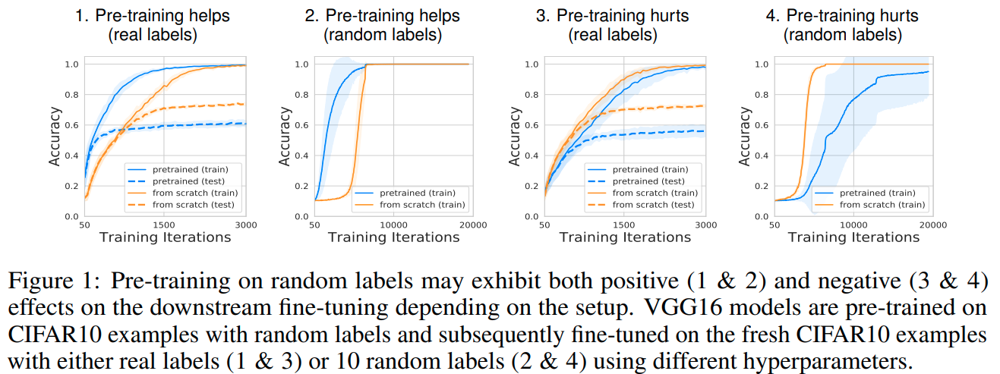

time: 20201114
short_title: NIPS 2020 for Experimental NN

# NIPS 2020 for Experimental NN

本文收集几篇NIPS2020中大实验室中通过实验研究神经网络相关性质的文章。相关实验不一定有严格的理论推理或是实用性的创新，但是可以了解相当有意义的经验结论.

- [NIPS 2020 for Experimental NN](#nips-2020-for-experimental-nn)
  - [Batch Normalization Biases Residual Blocks Towards the Identity Function in Deep Networks](#batch-normalization-biases-residual-blocks-towards-the-identity-function-in-deep-networks)
  - [Neural Networks Fail to Learn Periodic Functions and How to Fix It](#neural-networks-fail-to-learn-periodic-functions-and-how-to-fix-it)
    - [与SIREN 对比](#与siren-对比)
  - [On Warm-Starting Neural Network Training](#on-warm-starting-neural-network-training)
  - [Rational Neural Network](#rational-neural-network)
  - [What do Neural Network Learn when Trained with Random Labels](#what-do-neural-network-learn-when-trained-with-random-labels)
    - [对于高斯输入的Alignment](#对于高斯输入的alignment)
    - [实验](#实验)
  - [An Analysis of SVD for Deep Rotation Estimation](#an-analysis-of-svd-for-deep-rotation-estimation)
  - [Is normalization indispensable for training deep neural networks](#is-normalization-indispensable-for-training-deep-neural-networks)

##  Batch Normalization Biases Residual Blocks Towards the Identity Function in Deep Networks

[pdf](https://arxiv.org/pdf/2002.10444.pdf)

这篇DeepMind的paper 探索了BatchNorm与ResNet之间的一些关系。

不难证明的数学结论:

- resnet的variance公式, $Var(x_i^{l+1}) = Var(x_i^l) + Var(f^l_i(x^l))$
- 对于没有batchnorm的网络，其variance为 $Var(x_i^{l+1}) = 2 * Var(x_i^l) = 2^l$ (两个相互独立的高斯分布输出 variance为两者的直接加和), 初始variance会随着resnet深度发散。如果对加和输出scale down $1 / \sqrt{2}$, 则可以保持variance不变。
- 对于输出前有batchnorm的网络，其variance 为 $Var(x_i^{l+1}) = Var(x_i^l) + 1 \approx l$.

可以发现的是，随着网络层数$l$的增大，主干网络与残差分支之间的variance 比例会越来越大，残差分支上的batchnorm会压制其数值。因而从数学上可以发现随着resnet深度的提升，网络会趋近于identity function。这会使得网络初始化后更容易训练。

作者提出了SkipInit 模仿了batchnorm的特性

实验上证明了其variance特性，以及skipinit同样能让深度的网络更容易训练了。

接着作者从实验的角度分析了两个BN相关的结论.

- BN允许网络使用更大的学习率，实验中发现BN网络的最大稳定学习率比skipinit更大。但是如果batchsize比较小的话，网络的性能也并不会因此受益。如果固定下训练的epoch数(固定训练FLOPS，改变batch_size会改变迭代次数;如果固定的是Steps则在大batch的情况下训练运算量也会大幅提升), 那么最优的结果其实还是使用小batch size 小learning rate.因此作者认为BN允许网络使用更大的学习率只是让学习率参数相对更容易调了，而并不会提升网络最终的性能.
- BN会提供一个regularization。实验发现这是事实存在的;通过skipInit + dropout或者其他regularization手段，可以在低batch的情况下得到比BN更好的结果(BN在低batch size的情况下发挥不好).

总结起来

- BN会让ResNet更像identity function来使得深网络更可训练。这可以用skipInit模拟。
- BN让网络用更大的学习率训练，且在大batch情况下更为明显。但是这并不是提升最优性能的根本原因。
- BN让网络获得一个内在的regularization. 在大batch的情况下得到很好的performance. 而作者指出使用skipinit + 合适的regularization可以在小batch的情况同时让网络trainable、regularized、且well performing.

## Neural Networks Fail to Learn Periodic Functions and How to Fix It
[pdf](https://arxiv.org/pdf/2006.08195.pdf)

本文指出使用"ReLU"是输出分段线性函数是无法拟合周期函数的, 作者提出使用$x + sin^2(x)$作为激活函数，这个函数可以扩展为$x + \frac{1}{a}sin^2(ax)$

由图片，作者称这个为 Snake activation.

实验来说这个函数可以在经典问题上得到与ReLU等激活函数一致的性能。但是这个函数有更强的延拓性。使用有限的函数拟合$y = sin(x)$函数，如果使用ReLU或者Tanh，则当输入函数超出训练范围时，ReLU与Tanh理所应当地不能复现目标函数周期性的特点，而作者提出的函数$x + sin^2(x)$可以。

作者证明了，对于由ReLU组成的(多层)前馈网络，当输入强度(norm)无限逼近无穷大时，函数的输出值会逼近于输入的线性插值. 对于Tanh网络，函数输出值则会逼近于常数.

$$\underset{z\rightarrow\infty}{lim} ||f_{ReLU}(zu) - zW_u u - b_u||_2 = 0$$
$$\underset{z\rightarrow\infty}{lim} ||f_{tanh}(zu) - v_u||_2 = 0$$

直觉上来说，ReLU网络的输出最终是分段线性插值，因而当无穷外拓的时候，最终会收敛于一个线性函数. Tanh当无穷外拓的时候，由于激活函数的值的限制，第一次激活后的输出值会趋近于常数, 多层运算的结果也都会趋近于一个常数。

然后作者引入了一个超越 万能近似(universal approximation, UA)的性质, 万能延拓(universal extrapolation, UE). UA在神经网络领域指的是:已知定义在有界区间的任意连续函数$f(x)$, 一个单隐藏层的神经网络，在宽度趋近于无穷大的时候，总可以找到一组权重$w_N$, 使得网络的输出在有界范围内处处逼近这一函数.

本文UE的则是: 已知定义在无穷范围内的任意周期函数$f(x)$.一个以$x+sin^2(x)$为激活函数的单隐藏层神经网络，在宽度趋近于无穷大时，总可以找到一组权重$w_N$,使得网络的输出在整个定义域内逼近这一个函数$f(x)$. 且如果目标函数是连续的，那么可以做到处处逼近.

UE是比UA更强的结论，显然UE可以包含UA.

作者的证明思路是首先使用傅里叶变换，证明了使用$sin(x)$作为激活函数，两层网络可以拟合任意周期函数。然后又证明了两个$x + sin^2(x)$激活的神经元可以表达一个$sin(x)$ 或 $cos(x)$函数. 两者结合就证明了$UE$. 

在初始化问题上，由于 Snake 激活函数在零附近近似于identity matrix. 要让variance expectation为 1， 作者给出的初始化方案为 $Uniform(-\sqrt{3/d}, +\sqrt{3/d}). 作者在考虑多两项高阶量的情况下也给出了对应$Var=1$时的解析解，性能会有一定的提升，但是作者也指出实用上没有必要.

在a的选择上，如果问题没有显然的周期性，则$a = 0.5$没有问题，如果问题有显然的周期性，则可以设置$a \in [5, 50]$. 作者也讨论了把$a$设置为可学习的参数的可能性.性能也是没有问题的.

已经有这个函数的 [tensorflow addon implementation on github](https://github.com/tensorflow/addons/issues/1939)

### 与SIREN 对比

[SIREN](https://arxiv.org/pdf/2006.09661.pdf) SIREN的问题在于它是有界的, 缺少了$x$ 这一项。 Snake Activation的作者也进一步提到了$x + sin^2(x)$比$x + sin(x)$好的地方在于高次项出现在$x^2$处，拟合上更有利。

## On Warm-Starting Neural Network Training
[pdf](https://arxiv.org/pdf/1910.08475.pdf)

这篇paper讨论的问题与[catestrophic forgetting](https://arxiv.org/pdf/1612.00796.pdf)的有一定区别。本文的话题是对一个部署在生产环境的机器学习模型，在线持续有新的数据产生，数据集会持续更新，在这个情况下需要快速地对新数据或者新数据集进行学习。但是部署环境中往往会发现，如果用之前现有的模型作为基础进行训练，也就是 warm-starting。 对于凸优化问题，warm-starting 一直是一个重要的技巧且非常有用，但是对于深度学习网络来说，出来的模型性能会比较差，且training 集上性能显现不出来，反而是generalization能力在下降。因而时至今日很多相关的问题中我们都会在每个迭代循环将模型初始化重新训练。

在第一个实验中，作者使用ResNet, MLP, Logistic regression分别在CIFAR, SVHN上 直接Train所有数据 / 先train 前50%, 再train 所有数据。 发现 ResNet与MLP的性能不论采用SGD 还是ADAM， 第二次实验都比第一个实验差几个点，在比较困难的CiFAR上更为明显。而Logistic Regression的性能差则不大，因为它理应是一个凸优化设置。可以简单得到几个初步的结论:

- 数据集越困难，warm starting带来的性能下降越明显
- 凸优化问题LR几乎不受warm-start影响。
- 我们常常认为基于部分data的warm starting可以给网络一个更好的 prior, 且应当是有用的，这也符合transfer learning的逻辑。但是实验结果与这个预期并不相符。

而现成的调参工具可以处理这个问题吗? 作者网格搜索了 batch_size, learning rate, 等参数，发现是能找到性能与原来模型相当的参数，但是其训练时长往往也要很长才能实现，没有比重新训练模型节省运算量。作者指出这背后其实很可能是忘掉了原来的参数特性，几乎是重新训练了。为了证实这一点，作者计算这些性能好的模型在二次训练前后的权重的相关性，发现性能好的模型前后权重几乎没有相关性。且相关性越大，性能越差，也就是网络越差越好。但是Logistic Regression则不会有这样的情况。

作者再做了一组实验，就是第一轮训练多少次就会开始损害generalization呢? 作者在CIFAR-10上用ResNet进行实验，数据显示第一轮大约20个epochs之后，最终的性能就已经开始显著往下降了，

作者采用L2 regularization, confidence-penalized training, adversarial training去规范化两个阶段的训练流程，这些规范化方法是有效的，但是远不能完全消灭 warm-starting带来的性能下降。

作者最终提出 Shrink, Perturb, Repeat 的算法。每当新数据加入到数据集时，对模型中所有参数修正为 
$$\theta_i^t \leftarrow \lambda\theta_i^{t-1} + p^t$$

其中$p^t \sim \mathcal{N}(0, \sigma^2)$ 且 $0 < \lambda < 1$.

直觉:

- 将所有权重缩小一定比例几乎会保留ReLU分类模型的所有记忆，对于复杂的带有BatchNorm的ResNet,$\lambda$去到低于$0.1$后才开始损失准确率，对于简单的带有bias的MLP，权重缩小到$\lambda < 0.6$时才开始损伤准确率。
- Warm-starting一大问题在于新数据的gradients会远远大于旧数据的gradient, 使用shrinking缩小输出置信度，加上一点扰动后就可以进一步均衡模型对不同数据的梯度。

实验上$\sigma=0.01, \lambda=0.6$就可以得到好的性能。

从数值更新上，这其实很接近于$\theta_i \leftarrow \lambda(\theta_i + \eta\frac{\partial L}{\partial \theta_i}) + p$, 在一定情况下很接近于$L_2$ regularization. 在实际实验中，作者发现 shrink-and-perturb 能在静态数据集中同样地实现与$L_2$相似的regularization,但是$L_2$ 并不能解决warm start问题

## Rational Neural Network
[pdf](https://arxiv.org/pdf/2004.01902.pdf) [code](https://github.com/NBoulle/RationalNets)

这篇paper提出使用分式多项式作为激活函数
$$
    F(x) = \frac{P(x)}{Q(x)} = \frac{\sum^{r_P}_{i=0} a_ix^i}{\sum^{r_Q}_{j=0}b_jx^j}
$$

这其实并非完全首创，本文证明了一些相关的性质，并且提出了使用它的方法。本文提出的思路是$r_P = 3, r_Q=2$，因而一共是7个参数，同时当x趋向于极限的时候，激活函数会趋向于正比例函数($y=kx$)

理论分析结论(本文的主要切入角度是对拟合能力的探索,也即是使用多少参数能让输出函数尽可能拟合目标函数):
- 要拟合一个ReLU Network需要的Rational Network参数量 比 用ReLU Network拟合Rational Network的参数量要指数级的少.
- 要拟合一个连续函数，需要的Rational Network的参数量比用ReLU Network的参数量要指数级地少。

背景知识，其证明方法类似于 [Why Deep Neural Networks for Function Approximation?](https://arxiv.org/pdf/1610.04161.pdf). 这篇文章证明了深层ReLU神经网络拟合一个连续函数所需要的参数量比浅层网络的参数量要指数级地少.

## What do Neural Network Learn when Trained with Random Labels

[pdf](https://arxiv.org/pdf/2006.10455.pdf)

这篇paper研究了使用随机标签训练神经网络之后，网络究竟学到了什么，对transfer learning究竟有什么用。

它探讨了一个现象，也就是在一定超参的情况下，即使使用随机变量进行训练，网络还是有可能能加速收敛(尽管 genralization的性能比较差)

作者解释并印证了一个重要的现象，也就是即使没有label，训练的过程中底层网络的权重也会对输入数据的统计特征进行复刻(Alignment, defined as same eigenvectors)，反应在权重矩阵的二阶特性上。如果我们模仿数据的这个性质逐层初始化网络，我们也可以实现对网路的加速训练。

### 对于高斯输入的Alignment

假设$d$维输入$x$从$\mathcal{N}(0, \Sigma_x)$高斯中采样，目标标签为随机值，且初始权重从高斯中提取，那么最后得到的$d$维权重满足 $\mathbb{E}[\boldsymbol{w}]=0$, 且$\Sigma_\omega=\mathbb{E}[\omega\cdot\omega^T]$ 的特征值与$\Sigma_x$的特征值一致。 作者证明了这个结果与数据量，网络是全连接还是conv，学习率与优化器等都无关。

### 实验
实验用真实数据集真实图片随机标签以及真实标签进行训练，作者在实验上同样能在第一层卷积层上证明实验的现象。背后的直觉是说最底层的$3\times 3$方块与真实标签几乎没有相关性，因而统计上真实标签训练对于第一层也相当于就是随机标签的结果。 实验中 misalignment远低于随机标签的结果, throughout training process.

接着作者对浅层网络的权重在初始化的时候先用随机sample的结果进行采样(也就是不是用训练的权重，而是采样的权重)，发现同样能提升网络的训练速度。说明网络被随机标签预训练后能提升速度主要是因为对数据二阶特性的alignment.

对于更深的网络，作者指出，可以一层一层地初始化，也即是先使用采样的方法得到第一层网络的权重，然后把它作为输入采样第二层的权重。能得到与pre-train同样的加速.

## An Analysis of SVD for Deep Rotation Estimation

[pdf](https://arxiv.org/pdf/2006.14616.pdf)

这篇paper分析了 SVD用于深度学习中旋转的估计的特性。

与[keypointnet](../Building_Blocks/Discovery_of_Latent_3D_Keypoints_via_End-to-end_Geometric_Reasoning.md) 对旋转的推理过程相似，网络输出$9$维的数值输出，堆砌为矩阵$M$

$M$的SVD分解结果为$U\Sigma V^T$, 则在旋转集$SO(3)$上的投影为 $SVDO^+(M) = U\Sigma'V^T$,其中$\Sigma' = diag(1, ..., 1, det(UV^T))$

损失函数
$$L(M,R) = ||SVDO^+(M) - R||_F^2$$
,旋转矩阵差的二范数实质上等于两个旋转的差(也是一个旋转矩阵)的主旋转角度.

作者通过分析这一损失函数对SVD的反传结果证明了这种表示方法是在最小二乘或是高斯概率噪声两种表述下都是最优的，SVD的反传比较复杂. [Derivative of SVD]

## Is normalization indispensable for training deep neural networks
[pdf](https://proceedings.neurips.cc//paper/2020/file/9b8619251a19057cff70779273e95aa6-Paper.pdf) [code](https://github.com/hukkai/rescaling)

这篇paper提出的内容是可以通过rescaling 处理可以在不使用batchnorm的情况下维持网络的variance.

这篇paper同时通过实验和数学下了一个判断，认为在深度网络中 Dead ReLU 是由系统的variance引起的，挑选好的初始化也没用，训练后还是会有很多的 dead relu，更多的论证在附录但尚未放出.

作者提出 rescalenet，核心思路是想网络的方差不要发散，同时经过多层叠加放置后，每一个 resblock的卷积层输出在最后输出上的权重是一致的。

求解这两个条件(具体解法尚未放出):

- $\operatorname{Var}\left[\boldsymbol{x}_{k}\right]=\alpha_{k}^{2} \operatorname{Var}\left[\boldsymbol{x}_{k-1}\right]+\beta_{k}^{2} \operatorname{Var}\left[\mathcal{F}_{k}\left(\boldsymbol{x}_{k-1}\right)\right]=\operatorname{Var}\left[\boldsymbol{x}_{k-1}\right]$
- $\boldsymbol{x}_{L}=\left(\prod_{i=1}^{L} \alpha_{i}\right) \boldsymbol{x}_{0}+\sum_{k=1}^{L} \beta_{k} \prod_{i=k+1}^{L} \alpha_{i} \mathcal{F}_{k}\left(\boldsymbol{x}_{k-1}\right)$

给出:

$$
\boldsymbol{x}_{k}=\sqrt{\frac{k-1+L}{k+L}} \boldsymbol{x}_{k-1}+\sqrt{\frac{1}{k+L}} \mathcal{F}_{k}\left(\boldsymbol{x}_{k-1}, \Theta_{k}\right)
$$

其他两个技巧:

- 事实上在训练的时候不一定要让不同resblock层数上的权重一致，因为经验上来说不同网络层成熟速度就是不一样的，在不同的训练阶段有不同的需求，所以本文提出给这个比例参数一个可学习的乘子: $\boldsymbol{x}_{k}=\sqrt{\frac{k-1+L}{k+L}} \boldsymbol{x}_{k-1}+\frac{m_{k}}{\sqrt{L}} \mathcal{F}_{k}\left(\boldsymbol{x}_{k-1}\right)$
- Bias的初始化作者也提出新的观点，首先将运算$y=Wx + b$重新理解为$y = W(x + b)$ 而这个 b的初始化为第一个输入的mini-batch的均值的负值，也就是让第一个batch在与权重相乘之前接近是 normalized的 (在代码实现上，是定下了一个threshold, 前n=8个batch训练过程中都会求累积均值)，一定程度上实现了BN的效果. 同时作者指出这个技巧可以显著减轻relu的问题.

[Derivative of SVD]:https://j-towns.github.io/papers/svd-derivative.pdf
