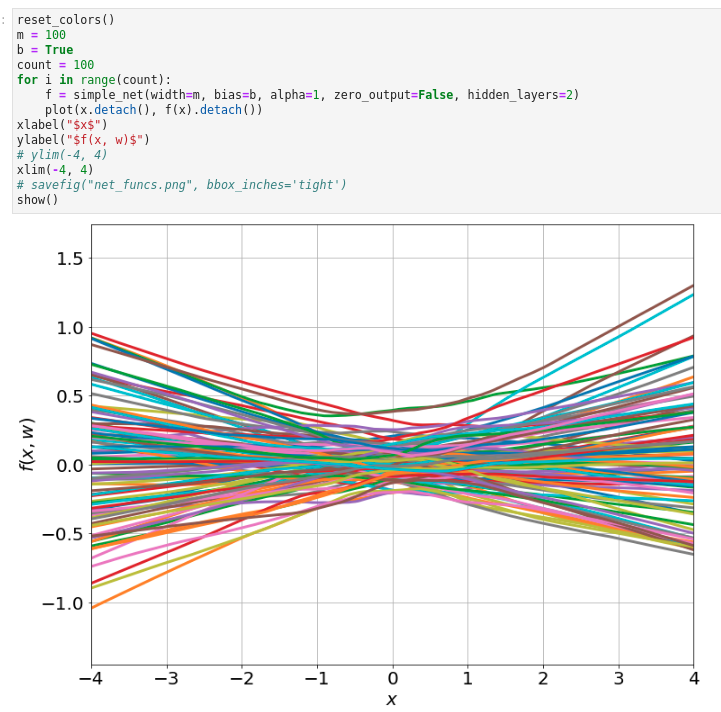
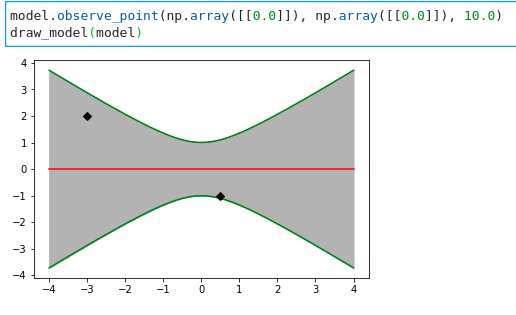
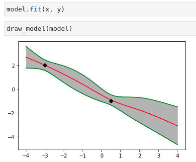
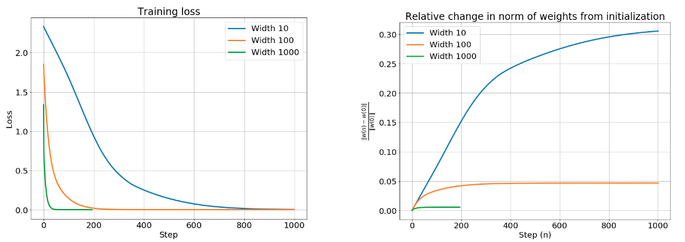

time: 20210201
pdf_source: https://arxiv.org/abs/1806.07572

# Neural Tangent Kernel: Convergence and Generalization in Neural Networks

这篇paper是 2018 NIPS一篇比较有影响力的paper

[youtube tutorial](https://www.youtube.com/watch?v=DObobAnELkU&list=PLHgjs9ncvHi80UCSlSvQe-TK_uOyDv_Jf&index=7)

[Great Code demonstration](https://rajatvd.github.io/NTK/)

## Prior Experiments

这里先根据这个code demonstration 补充说明几个重要的直觉概念.

随机初始化100个单输入单输出100个隐藏单元的两层神经网络，这些网络的输出接近于一个在0附近的高斯过程的输出分布.

对于一个只有(0, 0)数据的高斯过程

在一个小数据集上训练，训练过程

高斯过程的结果

一个比较抽象的结论就是无限宽的神经网络等价于高斯过程。

第二个结论是训练过程权重的相对变化是很小的

## NTK

对网络进行泰勒展开

$$
f(x, w) = f(x, w_0) + \nabla_w f(x, w_0)^T (w - w_0)
$$

可以证明随着网络宽度增大，

$$
\text{relative change in model Jacobian} \approx  \frac{d \cdot \text{rate of change of Jacobian}}{\text{norm of Jacobian}} = \frac{d \cdot \Vert \nabla_w^2 \boldsymbol y (\boldsymbol{w_0})\Vert}{\Vert \nabla_w \boldsymbol y(\boldsymbol{w_0})\Vert} = {\color{blue} \Vert( \boldsymbol y (\boldsymbol w_0) - \boldsymbol{\bar y})\Vert \frac{\Vert \nabla_w^2 \boldsymbol {y(w_0)} \Vert}{\Vert \nabla_w \boldsymbol {y(w_0)} \Vert^2}}{\color{red} \ll 1}
$$

网络的权重的变化为 $w_{k+1} = w_{k} - \eta \nabla_w L(w_k)$, 其关于时间的微分为

$$\dot w(t) = -\nabla L(w(t)) = - \nabla y(w)(y(w) - \bar y)$$ 

则输出值的变化率, 
$$
    \dot{\boldsymbol{y}}(\boldsymbol{w}) = \nabla \boldsymbol{y}(\boldsymbol{w})^T \boldsymbol{\dot w} = - {\color{red}\nabla \boldsymbol{y}(\boldsymbol{w})^T \nabla \boldsymbol{y}(\boldsymbol{w})} (\boldsymbol{y}(\boldsymbol{w}) - \boldsymbol{\bar y})
$$

神经网络的梯度雅克比矩阵$J = \nabla y(w)$，

NTK指的就是 $J^T J$.

可以证明过参数网络会以指数速度收敛于训练损失为零的位置。　**解释网络为什么可以训练**

同时可以发现这个NTK由于梯度下降的原因，会有一个implicit l2-norm (相当于有一个0-0的数据点). **解释网络为什么可以generalize**
