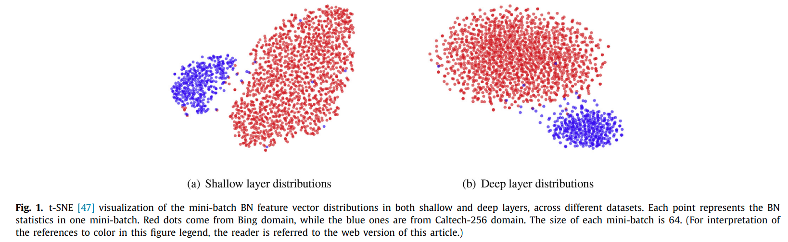
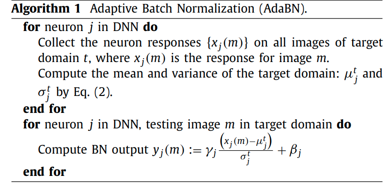
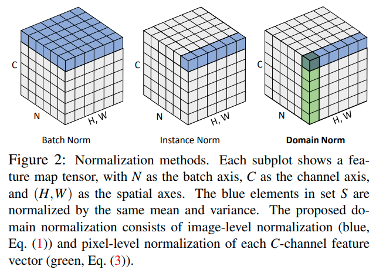

time: 20200831
pdf_source: https://arxiv.org/pdf/1911.13287.pdf
code_source: https://github.com/feihuzhang/DSMNet
short_title: Style and Normalization

# Style and Normalization

图像数据的风格常常被认为与图片数据的统计特征直接相关，对网络的generalization能力有一定关系，这里对相关的一些paper进行分析.

## Adaptive Batch Normalization for practical domain adaptation

[pdf](http://winsty.net/papers/adabn.pdf)



这篇paper观察到:

- 浅层与高层的特征都会受到domain shift的影响
- BN 层的参数包含有数据domain的特征

提出了如下的迁移算法


## Batch-Instance Normalization for Adaptively Style-Invariant Neural Networks

[pdf](https://arxiv.org/pdf/1805.07925.pdf) [code](https://github.com/hyeonseobnam/Batch-Instance-Normalization)

这篇paper指出，Instance Normalization在 style transfer和GAN 上应用比较多, 如[AdaIn](../Building_Blocks/AdaIN.md). 但是 IN却被实验证明会使分类网络性能下降,作者推测这是因为分类有时候确实需要图像的风格信息。指出不同任务可能需要BN也可能需要IN。因而提出了BN-IN Gated by parameter的设计.

其官方实现:
```python
class _BatchInstanceNorm(_BatchNorm):
    def __init__(self, num_features, eps=1e-5, momentum=0.1, affine=True):
        super(_BatchInstanceNorm, self).__init__(num_features, eps, momentum, affine)
        self.gate = Parameter(torch.Tensor(num_features))
        self.gate.data.fill_(1)
        setattr(self.gate, 'bin_gate', True)

    def forward(self, input):
        self._check_input_dim(input)

        # Batch norm
        if self.affine:
            bn_w = self.weight * self.gate
        else:
            bn_w = self.gate
        out_bn = F.batch_norm(
            input, self.running_mean, self.running_var, bn_w, self.bias,
            self.training, self.momentum, self.eps)
        
        # Instance norm
        b, c  = input.size(0), input.size(1)
        if self.affine:
            in_w = self.weight * (1 - self.gate)
        else:
            in_w = 1 - self.gate
        input = input.view(1, b * c, *input.size()[2:])
        out_in = F.batch_norm(
            input, None, None, None, None,
            True, self.momentum, self.eps)
        out_in = out_in.view(b, c, *input.size()[2:])
        out_in.mul_(in_w[None, :, None, None])

        return out_bn + out_in
```

## Two at Once: Enhancing Learning and Generalization Capacities via IBN-Net

[pdf](https://arxiv.org/pdf/1807.09441.pdf) [code](https://github.com/XingangPan/IBN-Net)

这篇paper有一句话表达一个经常被引用的意思 "IN allows to filter out instance-specific contrast information from the content".

提出了数个block综合BN与IN的使用。

## Domain-invariant Stereo Matching Networks

[pdf](https://arxiv.org/pdf/1911.13287.pdf) [code](https://github.com/feihuzhang/DSMNet)

这篇paper提出了一个两次normalize的算法，算法由两次normalization 构成



作者在论文中的图中提到，使用Domain Norm计算的特征图，在不同数据集上得到的norm distribution基本是一致的。

```python
class DomainNorm(nn.Module):
    def __init__(self, channel, l2=True):
        super(DomainNorm, self).__init__()
        self.normalize = nn.InstanceNorm2d(num_features=channel, affine=False)
        self.l2 = l2
        self.weight = nn.Parameter(torch.ones(1,channel,1,1))
        self.bias = nn.Parameter(torch.zeros(1,channel,1,1))
        self.weight.requires_grad = True
        self.bias.requires_grad = True
    def forward(self, x):
        x = self.normalize(x)
        if self.l2:
            return F.normalize(x, p=2, dim=1)
        return x * self.weight + self.bias
```
