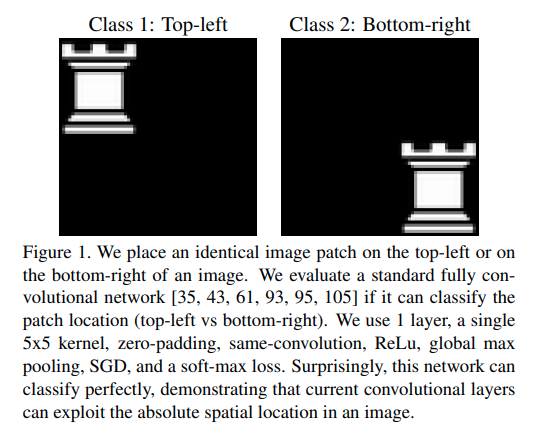
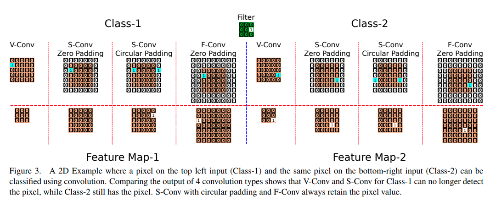
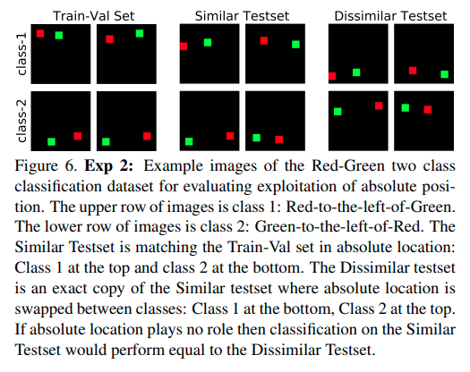

time: 20200320
pdf_source: https://arxiv.org/pdf/2003.07064.pdf
code_source: https://github.com/oskyhn/CNNs-Without-Borders
short_title: Translation invariance in CNN

# On Translation Invariance in CNNs: Convolutional Layers can Exploit Absolute Spatial Location

这不是本站第一篇讨论卷积网络的位置信息,另一篇是 *[How much Position Information Do Convolutional Neural Networks Encode?]*

这篇文章分析的角度与最后的结论在一定程度上与前文有区别，前面那篇文章的结论是多层Zero-Padding加大感受野也能得到充分的位置信息，主要在用在语义分割，而本文则有所不同，主要讨论分类问题。

## Inspiration

第一个实验讨论的是同一张图出现在不同角落，用单层CNN加global pooling就能成功区分。

## Case Study

作者同样考虑到了CNN边界处理的问题，以下面这个case讨论不同padding设置对输出的影响。

分别观察:

1. No padding.
2. same zero padding
3. same circular padding.
4. Full padding.

从全局global pool的结果来看，3与4都会输出一样的结果，而1与2输出的结果会因绝对位置而异。

## Receptive Field

这里的实验与前文同样证明了网络感受野越大，网络可以判断绝对位置的border size就越大(如果图片有效部分距离边界过远，超出感受野范围，CNN就不可能实现分类了)。

## 绝对位置与相对位置

作者进一步做了一个实验，要求网络train以上的这个数据集，分类的标准是相对位置。（应该留意到，只看training set的话，dissimilar Testset这里的结果只是一个可能的分类答案，只是作者强调相对位置才有效所以得到这个结果）

理论上来说，一个网络可以掌握红与绿的绝对位置，也就能推理其相对位置，但是这样的做法容易对绝对位置overfit,对于新的没见过的绝对位置会有性能下降。

对于本数据，1/2都能对similar testset正确判断，但是难以正确判断dissimilar testset. 而3/4对两个test set的估计准确率是一致的。

[How much Position Information Do Convolutional Neural Networks Encode?]:CNN_position_information.md