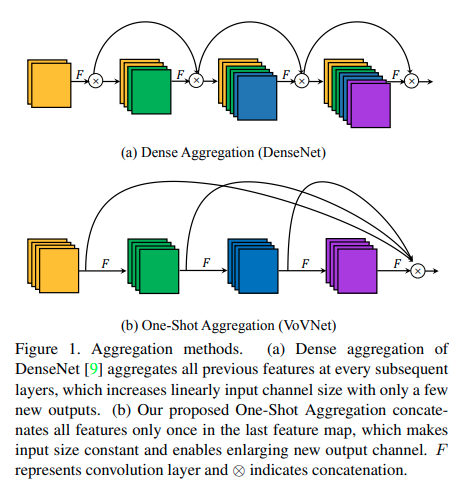
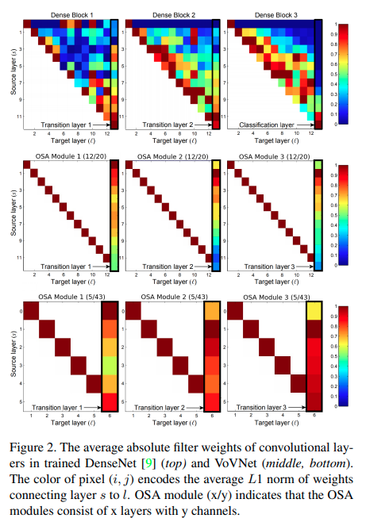

time: 20200323
pdf_source: https://arxiv.org/pdf/1904.09730.pdf
code_source: https://github.com/stigma0617/VoVNet.pytorch
short_title: VovNet
# An Energy and GPU-Computation Efficient Backbone Network for Real-Time Object Detection

这篇paper从 DenseNet出发，结合运算速率与能量效率调整更好的backbone结构。

## VovNet OSA模块结构

## 影响运算速度与能量消耗的关键因素

本文结合[ShuffleNet_V2]的结论，并继续延伸。

本文指出内存的读取使用(MAC)时间以及能量消耗往往会多于计算的花费。

对于卷积层

$$MAC = hw(c_i + c_i) + k^2 c_i c_o $$

由[ShuffleNet_V2],同样的结论，应该尽可能保证输入输出feature一样多，因而DenseNet的结构效率不够好。

## DenseNet的问题:

DenseNet的权重norm反映了它的冗余，要么Intermediate 权重很低，要么是前面的权重很低。因而用OSA替代Dense Connection.

[ShuffleNet_V2]:ShuffleNet_V2:_Practical_Guidelines_for_Efficient_CNN_Architecture_Design.md

