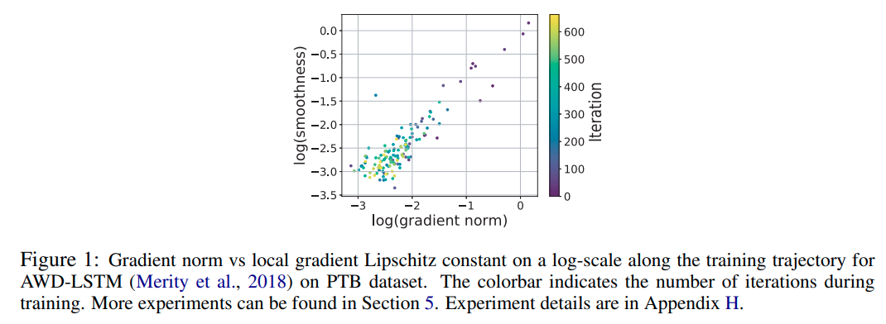

time: 20200331
pdf_source: https://openreview.net/pdf?id=BJgnXpVYwS
code_source: https://github.com/JingzhaoZhang/why-clipping-accelerates
short_topic: Why clip gradient norm?
# WHY GRADIENT CLIPPING ACCELERATES TRAINING: A THEORETICAL JUSTIFICATION FOR ADAPTIVITY

这篇paper是2020ICLR的满分论文，作者从理论与实践上去论证了为什么建议 clip gradient norm

## 梯度的李普希兹连续(Lipschitz Continuity)

[李普希兹连续](https://www.wikiwand.com/en/Lipschitz_continuity)原指梯度的绝对值有有限上限。

优化中，定义一个函数为$L$-光滑($L-smooth$)如果对任意x,y
$$\|\nabla f(x)-\nabla f(y)\| \leq L\|x-y\|$$
可以理解为函数的二阶导有限。对于这种成本函数，梯度下降中选择学习率$h = 1/L$为理论最优学习率选择。

但是一个简单的$y = x^3$函数就已经打破这个$L$-光滑的理论限制，更不用说高维的网络函数。对于这样的函数，传统的方法是设置一个定义域的输入范围，得到一个有限的$L$值,为了能满足足够多的输入范围，这个L值往往会较大，使得学习率更为保守。

另外作者在实验中发现了gradient norm与光滑度$L$之间的关系

## $(L_0-L_1)$光滑

定义

$$\left\|\nabla^{2} f(x)\right\| \leq L_{0}+L_{1}\|\nabla f(x)\|$$

即满足二阶导矩阵的模与一阶导矩阵的模的比值有限。这个是一个比较松的光滑定义，容易知道，任意高阶的多项式函数都会在整个实数集上满足这一条件

之后作者数学证明了当符合此光滑条件时，如果初始化与实际结果有一定差距，clip-GD的收敛速度会远远快于fix GD

**Remark 5**. Theorem 1 of Carmon et al. (2017) and Theorem 4 together show that gradient descent with a fixed step size cannot converge to an $\epsilon$ -stationary point faster than
$\Omega\left(\left(L_{1} M / \log (M)+L_{0}\right)\left(f\left(x_{0}\right)-f^{*}\right) \epsilon^{-2}\right) .$ Recall that clipped GD algorithm converges as
$\mathcal{O}\left(L_{0}\left(f\left(x_{0}\right)-f^{*}\right) \epsilon^{-2}+L_{1}^{2}\left(f\left(x_{0}\right)-f^{*}\right) L_{0}^{-1}\right) .$ Therefore, clipped GD can be arbitrarily faster
than GD when $L_{1} M$ is large, or in other words, when the problem has a poor initialization.

