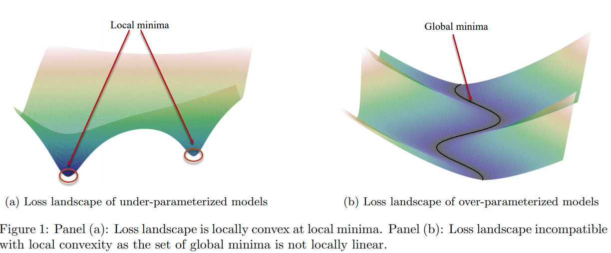
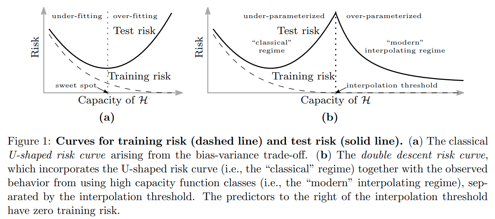
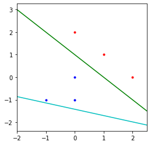

time: 20210303

# Deep Learning "Foundations"

关于神经网络为什么有强大的拟合能力，近年来有很多重要的数学paper逐渐构筑了一个具有一定解释性的分析框架，本文尝试以[Feizi](https://www.cs.umd.edu/class/fall2020/cmsc828W/)公开的[课程](https://www.youtube.com/playlist?list=PLHgjs9ncvHi80UCSlSvQe-TK_uOyDv_Jf)为基础，结合几篇paper给出一个大致的回答。

### 整体思路

对于“神经网络为什么有强大的拟合能力”这个问题，Feizi在课程设置的时候就将它拆成了两个子问题

1. 为什么神经网络能训练 (Optimization)
2. 为什么神经网络能泛化 (Generalization)

如果能回答这两个问题，也就能回答为什么神经网络能成功了。

在之前，很多人或者论文会尝试从可解释性(interpretability)等方向来考虑，比如对网络进行可视化，了解网络学习到了什么特征,然后较为抽象地用传统机器学习的特征提取加分类回归进行解释。

这里Feizi在课程中统一地使用数学范式，从以上提出的两个子问题角度进行解答。

## Deep Learning Optimization - 为什么神经网络能训练

[pdf_1]

神经网络是一个高度非线性、非凸的映射函数，但是我们很神奇地可以使用简单的梯度下降得到好的解。所以第一个问题是为什么神经网络能够在训练集上训练，为什么梯度下降可以优化一个高度非线性非凸的函数。

Feizi在第二节课上，根据这篇 [Toward a theory of optimization for over-parameterized systems of non-linear equations: the lessons of deep learning](https://arxiv.org/pdf/2003.00307.pdf),指出并论证了over-parameterization是如何帮助神经网络训练的。

### Prior 预知识 - NTK 神经正切核

论文[Neural Tangent Kernel](NTK.md)分析了无限宽全连接网络的特性，它的相关实验以及理论分析给出了以下几个关键的前置知识:

1. 在训练过程中，无限宽神经网络的权重变化率并不大，权重整体来说会很接近于初始化的情况，也就是所谓lazy-training的现象。
2. 在训练过程中，无限宽网络的雅克比矩阵几乎是一个常矩阵，其相对变化率很低，网络拟合时表现得很像一个固定的核函数在进行函数拟合,这个核函数由初始化时的权重以及其雅克比矩阵直接指定，也就是文章提出的 Neural Tangent Kernel.
3. 由上述的现象，如果我们假设上述NTK近似是正确的，就会发现网络在训练的时候表现得很接近于一个线性模型，用梯度下降能指数级地逼近label。
4. 通过对初始化时的情况分析，可以发现网络在初始化时近似有有一个L2-regularized，或者说核函数有一个微弱的在$(0,0)$位置的先验样本。这在一定程度上解释了网络的可泛化性。

NTK 本身已经近乎完整的回答了网络为什么能训练，为什么能泛化，但是NTK有比较强的近似约束，实际网络训练能发现很多网络的表现并不与NTK的说法完全一致。

### Prior 预知识 - Over-parameterization 过参数系统

[pdf_1] 从过参数系统进行分析，其中一个关键的需要提前理解的点在于过参数系统-欠定方程组的最优解的流形(manifold).

- 过参数系统可以实现完全拟合，在合适的损失函数下能做到损失为零， 所以可以理解为网络在进行插值。但是插值方程数量小于参数数量
- 关于欠定方程解的流形的直觉：若数据有一个一维点，而我们有两个参数，我们可以得到无数条线穿过这个点，在参数空间($w_1, w_2$)上会是一条直线，这条直线就是这个解的流形；若数据有两个空间点，而我们有三个参数，穿过一个点的所有平面在参数空间中都是一个平面，这个欠定方程组解的流形就是参数空间中两个流形的交线。
- 神经网络也是一个典型的过参数系统

### 为什么神经网络能训练

[pdf_1]的作者在论证过程指出以下几个结论:

1. 过参数系统，如神经网络，与欠参数系统不同，其损失**必定**是一个非凸函数，下面的图抽象地表示过参数系统的loss的图像，和前文prior中的直觉情景是相似的。

2. 神经网络满足 Polyak-Lojasiewicz (PL) 条件；神经网络系统的条件数，定义为[正切核](NTK.md)的最小、最大特征值的比值；在权重变化在一个球范围时，神经网络系统将能被梯度下降算法优化，速度由条件数决定。
3. 条件数的上界由Hession矩阵的模决定；而宽网络，过参数可以改善条件数优化效果。

具体的推理这里省略，但是提供关键的定义与推理步骤作为参考:

**PL 条件** 定义：一个损失函数$\mathcal{L}(w)$是$\mu$-PL的，如果:
$$
\frac{1}{2}\|\nabla \mathcal{L}(\mathbf{w})\|^{2} \geq \mu\left(\mathcal{L}(\mathbf{w})-\mathcal{L}\left(w^{*}\right)\right), \forall \mathbf{w} \in \mathcal{S}
$$

**Uniform Conditioning**定义: 一个映射$F(w)$是 $\mu$-uniformly conditioned, 那么其正切核$K(w)$的最小特征值满足:
$$
    \lambda_{min}(K(w)) \ge \mu, \forall w \in \mathcal{S}
$$

**Uniform Condition -> PL condition**: 可以简单证明，如果$F(w)$满足uniform conditioning，且损失是平方损失$\mathcal{L}(w) = \frac{1}{2}||F(w)- y ||^2$,则$L$满足PL条件。

**PL condition -> Solution Exist and Fast Convergence**: 这个证明难度比较大.

总结起来，就是 uniform conditioning 加上 条件数有上界，可以推导到在一定半径的球内解的存在性以及GD的快速收敛。

## Deep Learning Generalization - 为什么神经网络能泛化

这方面公认的有说服力的理论结果相对优化会少一些。核心问题在于要找到神经网络过参数、梯度下降的implicit regularization.

一个比较原始的想法是认为神经网络从一个高斯中初始化，梯度下降运行，所以有implicit regularization, 这个理由也在[NTK](NTK.md)中有体现，但是[rethinking](Understanding_Deep_Learning_Requires_Rethinking_Generalization.md)一文中指出这并不充分，甚至在实际训练时并不成立(在图片分类任务中norm最终可以变得很大)。

有一篇[paper](https://arxiv.org/pdf/1812.11118.pdf)从实验上说明了test error与模型复杂度之间的关系并不是一个简单的U型曲线，而是一个double descent 曲线：

### The Implicit Bias of Gradient Descent on Separable Data

[pdf_2](https://arxiv.org/pdf/1710.10345.pdf)

这篇paper对分类问题给出了一个很强的理论证明以及例子. 

对于线性可分的数据，用logistic回归，损失选择entropy loss或者其他指数衰减的loss，在训练损失逼近零的时候继续训练，网络最终会收敛于max-margin SVM的解。

在直觉上这个其实比较好理解，对于entropy loss这样的指数衰减的loss, 网络其实是没有最优点的(梯度为零的点)，随着激活值的持续增加，让网络对做出的prediction获得更高的置信度，损失就会持续下降。

在极限的情况下，由于损失是随着正确的置信度提升而指数衰减的，所以最终损失会由置信度最低的点dominate。所以最终结果会趋向于SVM的结果。

[pdf_1]:https://arxiv.org/pdf/2003.00307.pdf
