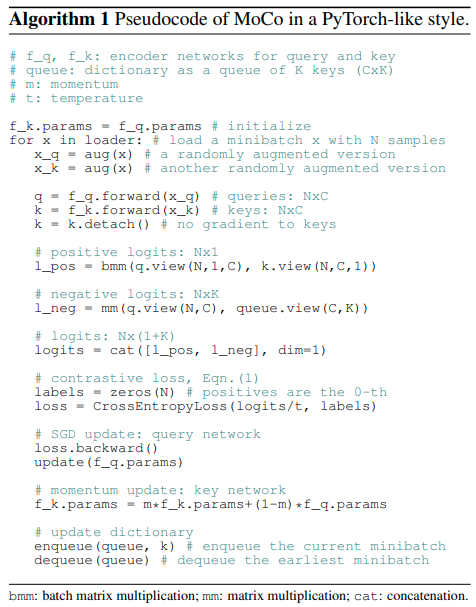
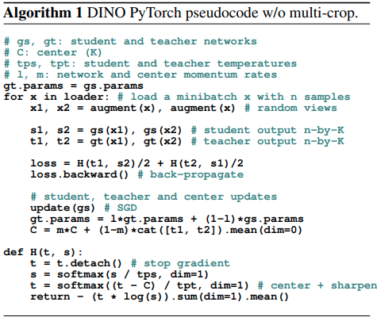
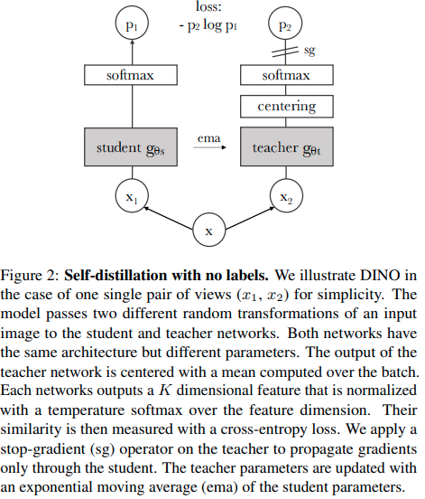

time: 20210527
pdf_source: https://arxiv.org/pdf/2104.14294.pdf
code_source: https://github.com/facebookresearch/dino

# Emerging Properties in Self-Supervised Vision Transformers

[官方博客主页](https://ai.facebook.com/blog/dino-paws-computer-vision-with-self-supervised-transformers-and-10x-more-efficient-training)

这篇paper提出了自监督训练ViT, 给出的性能很高，接近于有监督的数据，且其输出的feature map性能很高。

## Related works

### Moco 

[pdf](https://arxiv.org/pdf/1911.05722.pdf) [code](https://github.com/facebookresearch/moco)

Moco 是一个自监督学习图片分类的框架，其算法如图:

### ViT

ViT具体参考[这篇文章](../other_categories/Summaries/Summary_ICLR_2021.md)

## Method

这篇paper的方法和MoCo有一定的相似性，很受Moco的启发，但是它把他用在transformer上.作者发现其transformer里面的分类token可以直接用于前景的segmentation.

