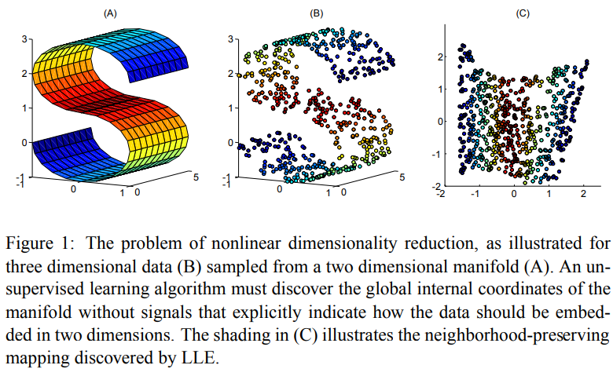
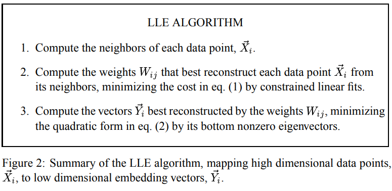

time: 20220615
pdf_source: https://cs.nyu.edu/~roweis/lle/papers/lleintro.pdf

# An Introduction to Locally Linear Embedding

近期在回顾 [PLiDAR++](../3dDetection/RecentCollectionForStereo3D.md)中使用雷达点云对双目匹配结果进行优化的方法。该作者提到，其优化方法等同于 manifold learning中的 locally linear embedding (LLE), 同时有fixed landmark作为guidance. 

首先抛开PLiDAR论文的概念，先引入以下概念:

Manifold Learning 实质上是一类高维数据降维算法。它们假设数据集中数据点的整体分布有一定的几何/统计规则 (像是上图中的一个S型流型)。[scikit-learn](https://scikit-learn.org/stable/modules/manifold.html#:~:text=Manifold%20learning%20is%20an%20approach,sets%20is%20only%20artificially%20high.)

其中Locally Linear Embedding属于Manifold learning的一种方法，它假设每一个数据点以及它的近邻会近似地存在于流型的一个局部线性面元上。

第一步，需要计算每一个数据点上的面元特征(也就是高维面元的线性方程参数)。这个问题转换为用最近邻特征线性求和重建出原特征。严谨来说是一个 仿射(affine) 转换, 也就是权重之和为1。重建的结果$W$是描述每一个数据点面元的参数矢量。 在数据降维的LLE中，最近邻点的数量$k$远远小于数据的维度。
$$
\mathcal{E}(W)=\sum_{i}\left|\vec{X}_{i}-\sum_{j} W_{i j} \vec{X}_{j}\right|^{2}
$$

第二步，需要用以个k低纬度的矢量$Y$重建数据,

$$
\Phi(Y)=\sum_{i}\left|\vec{Y}_{i}-\sum_{j} W_{i j} \vec{Y}_{j}\right|^{2}
$$

回到 PLiDAR ++, 做法有一定区别。首先在第一步面元特征计算时，每一个点的三维特征维度即为3， 而最近邻默认采取10个点。同一个点有无限多个仿射变换表示方法，所以PLiDAR++提出需要进一步约束 $L_2$norm 以找出优化问题唯一解。

$$
W=\arg \min _{W}\|Z-W Z\|_{2}^{2}, \quad \text { s.t. } W \mathbf{1}=\mathbf{1} \text { and } W_{i j}=0 \text { if } j \notin \mathcal{N}_{i}
$$

第二步重建时，利用点云点作为landmark.

$$
Z^{\prime}=\arg \min _{Z^{\prime}}\left\|Z^{\prime}-W Z^{\prime}\right\|^{2}, \quad \text { s.t. } Z_{1: n}^{\prime}=G \text {. }
$$

