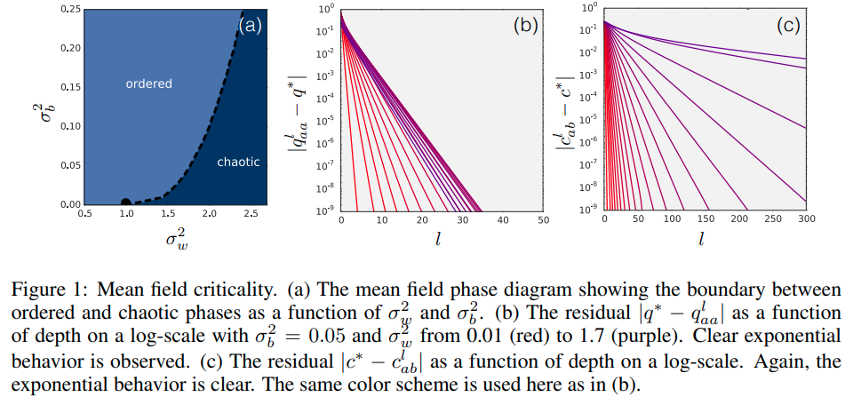

time: 20200302
pdf_source: https://arxiv.org/pdf/1611.01232.pdf

# Mean Field Theory in Deep Learning

平均场理论在深度学习中的理论分析是一个深度比较大的问题，由于个人的阅读能力问题，主要做的是一些简单的介绍与总结.

平均场理论在深度学习中实质上就是用统计方法分析网络前传与反传时的统计值动力学，然后依据此分析网络的训练能力、拟合能力，并挑选网络设计准则。

由于同样地要求网络的宽度足够宽以至于无穷宽，所以平均场理论(MFT)的分析理应与神经正切核(Neural Tangent Kernel, NTK)给出相似的结论. [NTK](NTK.md)指出神经网络在无限宽的时候会逼近一个线性模型，二阶导数除以一阶导数 (一阶导数的相对变化率)会接近于零，因而神经网络会很好训练。

## Deep Information Propagation

[pdf](https://arxiv.org/pdf/1611.01232.pdf)

[知乎参考](https://zhuanlan.zhihu.com/p/92455114)

这篇paper的假设是无穷宽全连接网络，无BN. 在初始化的时候， $W_{i j}^{l} \sim N\left(0, \sigma_{w}^{2} / N_{l}\right)$ 而 $b_i^l \sim N(0, \sigma_b^2)$. 值得注意的是目前的pytorch的线性层使用的是均匀采样而不是高斯采样，所以数值结论可能会有出入.

此时网络传递公式为:

$$
z_{i}^{l}=\sum_{j} W_{i j}^{l} y_{j}^{l}+b_{i}^{l} \quad y_{i}^{l+1}=\phi\left(z_{i}^{l}\right)
$$

从统计上可以知道 pre-activation的期望 $\mathbb{E}[z_{i;a}^l] = 0$, 而其协方差矩阵为一个对角线矩阵，作者这里用 Kronecker delta运算符 $\delta_{ij} = [i==j]$ 表达， $\mathbb{E}[z^l_{i;a} z^{l}_{j;a}] = q^l_{aa}\delta_{ij}$。

注意$z$并不符合高斯分布，原因是非线性激活改变了它的形态，因此作者强调了平均场理论的重要近似就是用一个 Gaussian whose first two moments match those of $z$ 去替代$z$.

因此主对角线上的协方差理论上需要积分迭代计算:

$$
    q_{aa}^l = \sigma^2_{w} \int{Dz\phi^2\left( \sqrt{q^{l-1}_{aa} z} \right)} + \sigma_b^2
$$

其中 $D$是标准高斯分布。

分析两个输入$x$在输入网络后它们之间相关性随着网络传播的变化，通过比较复杂的微积分运算，可以得到(参考[前一篇文章](https://arxiv.org/pdf/1606.05340.pdf)的数学推导). 得到两个输入在网络中的pre-activation之间的相关性随着网络传递的变化特征。

$$
\chi_{1}=\frac{\partial c_{a b}^{l}}{\partial c_{a b}^{l-1}}=\sigma_{w}^{2} \int \mathcal{D} z\left[\phi^{\prime}\left(\sqrt{q^{*}} z\right)\right]^{2}
$$

当$\chi_1 < 1$时所有的输入都会渐进的变成带有相关性，当$\chi_1 > 1$时所有的输入都会变成不相关，只有$\chi_1 = 1$时是稳定的，这对应了特定激活函数的特定初始化权重。

如果是$tanh$激活的话，其相图如下:

结论上来说，如果参数在这条临界线上，网络就会好训练。从表达性的角度来看，对于在临界线上的网络，两个输入信号的相关信号在网络中不容易被忘记，所以可以在网络很深的时候信息的传递也能有保证。

如果研究信号的后向传播，以平均场理论计算，可以得到与上图类似的结论，且一致的参数选择线。也就是当网络参数处在临界线上时，梯度的信号传递会比较稳定，因此更深的网络也能训练。