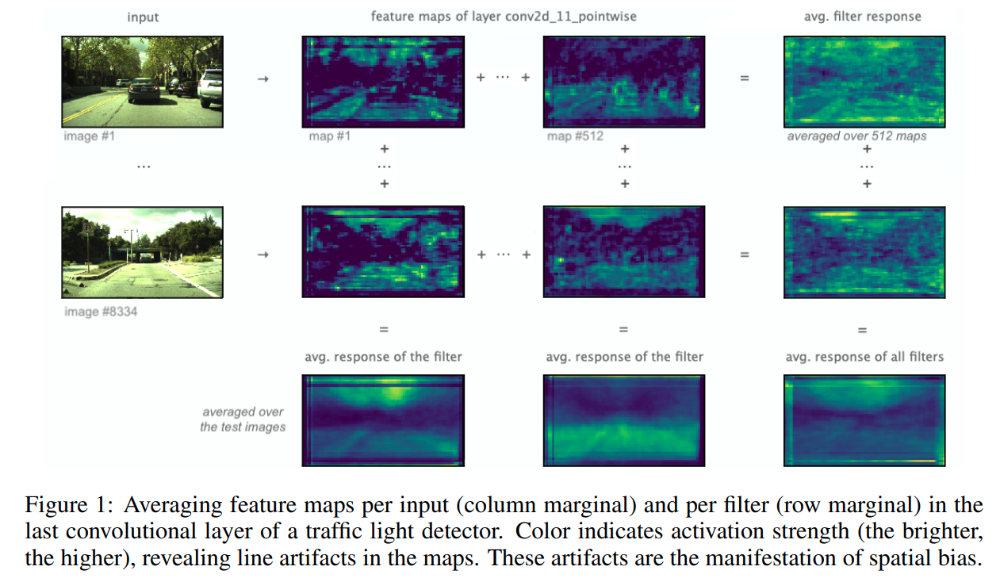
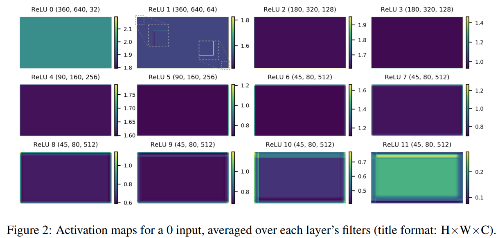
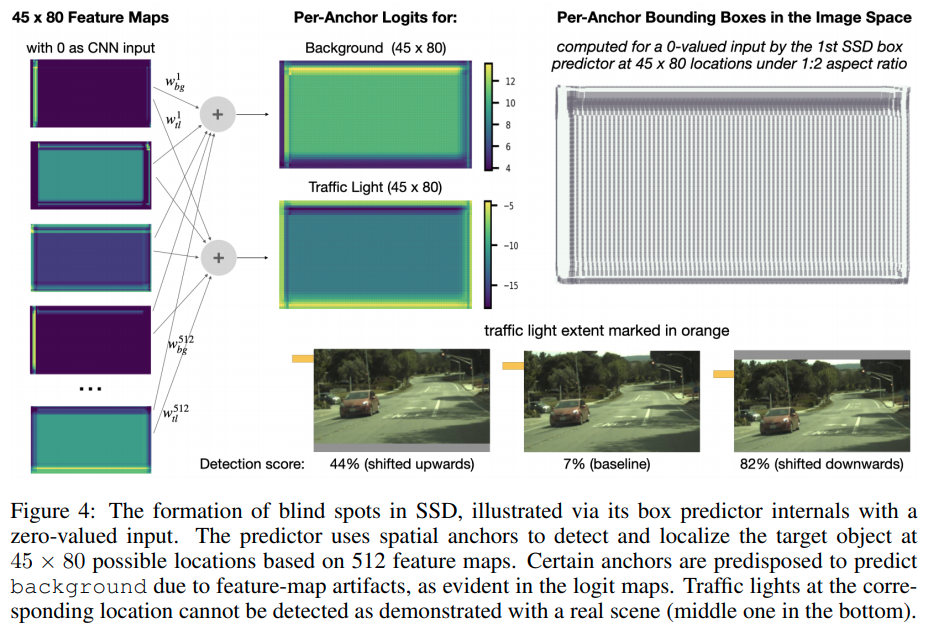
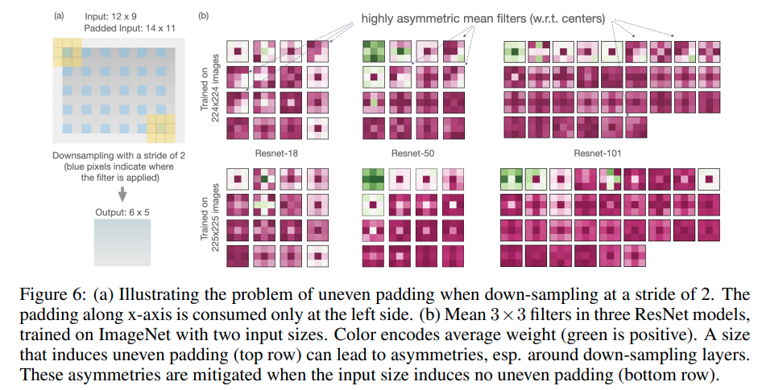
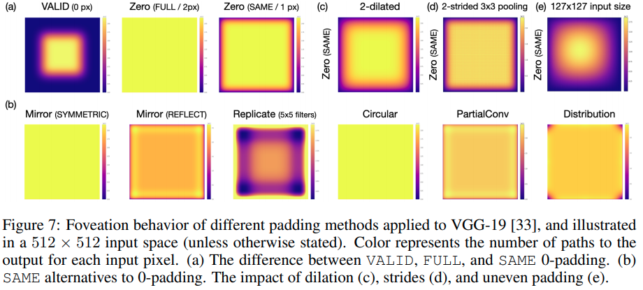

time: 20201008
pdf_source: https://arxiv.org/pdf/2010.02178.pdf

# Mind The Pad - CNNs Can Develop Blind Spots

[supplementary](https://openreview.net/attachment?id=m1CD7tPubNy&name=supplementary_material) can be downloaded and it contains codes to reproduce most of the examples.

这篇paper是讨论在CNN里面使用Zero Padding的问题的。目前(2020.Oct.08)在ICRL2021 underview.

与这篇paper相似的讨论zero padding的本站还收录了

- [How much Position Information Do Convolutional Neural Networks Encode](CNN_position_information.md)
- [On Translation Invariance in CNNs: Convolutional Layers can Exploit Absolute Spatial Location](TranslationInvarianceinCNN.md)
  
前面这两篇文章分别讨论的是语义分割中CNN如何感知到位置信息，以及分类问题中padding以及破缺的平移不变形会如何诱导神经网络关注相对位置亦或是绝对位置

这篇paper的motivation是使用object detection model检测交通灯的时候，会发现有时候前后两张图中交通灯仅仅是有微小的平移变换，预测的confidence就可能会差距很大。作者初始研究发现这和CNN输出有盲区有关。

作者从此出发进一步分享了关于 Padding 造成的影响的其他现象以及解决方案。

## Zero Padding 造成的 Spatial Bias

这张图展示了zero padding形成的feature map在边缘地带造成的横竖两个方向的特殊条纹。

作者另外做了第二个实验，输入一个由零组成的图片，可以在特征图的边缘中观察到更显著的artifacts。

这个artifacts的特点

- 第一层没有 artifacts, 第二次卷积后产生一个pixel大小的artifacts。边界上的特征问题随着层数的增多而变得更加明显.
- 四个角落的aritfacts是不一样的，这是由于卷积权重的不对称造成的\

(个人理解，个人在3D检测的特征图中也能观察到相同的特征，)

## Spatial Bias 对检测任务的影响

当交通灯在边界范围的时候，微小的平移会显著地影响分类score.

## Eliminating Uneven padding

这里插播提到了在stride=2的conv中，padding的影响。

我们已经知道padding会造成[forward checkerboard](CheckerBoardDeconv.md)。作者又提出这个padding会仅在左上方被使用，padding在后续conv上的地位会有偏差。也会引起conv kernel的不对称

作者指出需要保证图片的长宽为 $2^d + 1$才能抵抗这个padding的影响。

作者用ImageNet实验发现输入图片从$224\times 224$变为$225 \times 225$会平均带来$0.4\%$的Top-1提升

## Foveation

有效感受野分析，计算每一个输入feature会影响多少个输出像素。

在Same padding的setting下，作者发现Symmetric的padding mode可以处理有效感受野不平衡的问题(Pytorch 与之对应，在padding=1的情况下相似的替代为 ReplicationPad)

作者后面用Mirror Padding 代替Zero Padding，在SSD 路灯检测器上得到了显著的性能提升，且消除了feature map上的artifacts
