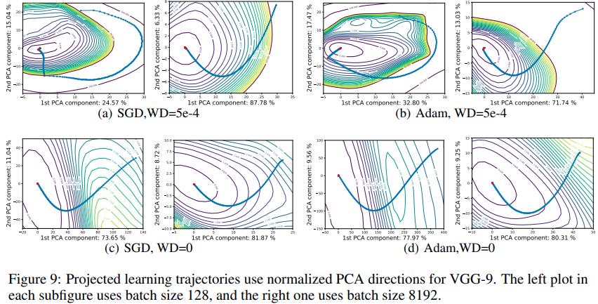

time:20200927
pdf_source: https://arxiv.org/pdf/1712.09913.pdf
code_source: https://github.com/tomgoldstein/loss-landscape

# Visualizing the Loss Landscape of Neural Nets

这篇paper引入了对神经网络损失的可视化方法，并根据其分析方案给出了一些与损失函数图像相关的结论。

## 可视化基础

本文回顾介绍了一维插值与二维绘图的方法,这些方法最早是[Ian GoodFellow](https://arxiv.org/pdf/1412.6544.pdf)提出来的,用于分析不同优化器的优化情况。

### 一维插值

设定两组网络参数，其加权平均$\theta(\alpha) = (1-\alpha)\theta + \alpha\theta_1$,然后可以画出损失函数关于$\alpha$的函数图像。其主要作用在于研究网络在不同最优点附近的平滑度与尖锐度。但是这样方案得到的图像往往两个最值中间没有其他local minimum,且没有考虑网络的一些特殊的性质.

### 二维绘图

设定中心点$\theta^*$, 两个方向矢量$\delta, \eta$，2D表面图可以表达为:

$$f(\alpha, \beta) = L(\theta^* + \alpha\delta + \beta\eta)$$

这种方法在实际使用中可以显示出一般网络损失平面的非凸性。

典型的可视化结果可以在这个[交互式网站](http://www.telesens.co/loss-landscape-viz/viewer.html)上查看


## Filter-Wise Normalization

本文中的$\delta, \eta$都是取自一定scale的随机高斯分布，作者表示这种方案由于没有考虑到网络的scale-invariance。对于一个ReLU网络，增大$i$层10倍，缩小$i+1$层10倍,输出值是不会变的。如果有normalization层，则更显然。

如果我们对网络的扰动都是一个固定的单元值，则不同scale的网络受扰动的影响会不同.

作者首先通过高斯分布得到随机矢量$d$, 然后将$d$的scale统一到$\theta$上 $d_{i,j} = \frac{d_{i,j}}{|d_{i,j}|} |\theta_{i,j}|$ 其中这表达的是第$i$层第$j$个filter

```python
for d, w in zip(direction, weights): # First channel -> output filter num
    d.mul_(w.norm()/(d.norm() + 1e-10))
```
对于只有一维的矢量则用0(default)或者复制代替。

### 实验 - 分析现有模型
作者根据以上内容做了一些实验

- 在基础的1D插值的条件下，函数的non-convexity不明显，另外发现损失表面的flatness与模型的鲁棒性关系不大。
- 使用filter-wise normalization以及单向高斯扰动，发现损失表面的flatness与模型的test error有直接相关性。
- 使用filter-wise normalization的二维图，发现resnet的损失表面在convexity上更加显著，在一定程度上表明它更好训练。

### 实验 - 分析优化轨迹
作者发现使用两个随机高斯矢量(两个高斯随机矢量的cosine相似度的期望为$\sqrt{2 / \pi n}$，因而几乎一定是垂直的)，但是在对优化轨迹进行可视化的时候，很大概率优化的方向会与随机可视化方向矢量垂直。这里提出的是使用PCA directions

对于从$\theta_0$优化$n$步到达$\theta_n$的模型，设矩阵$M = [\theta_0 - \theta_n; ...; \theta_{n-1} - \theta_n]$使用主成分分析，找出奇异值最大的两个方向，根据此方向来进行可视化。


