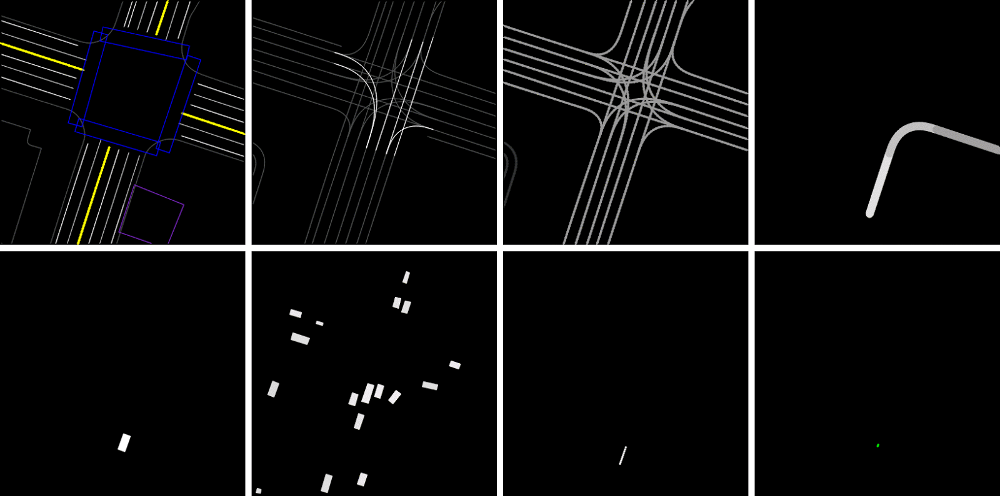
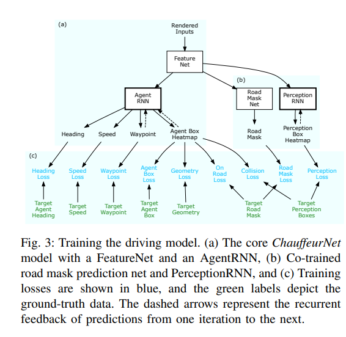
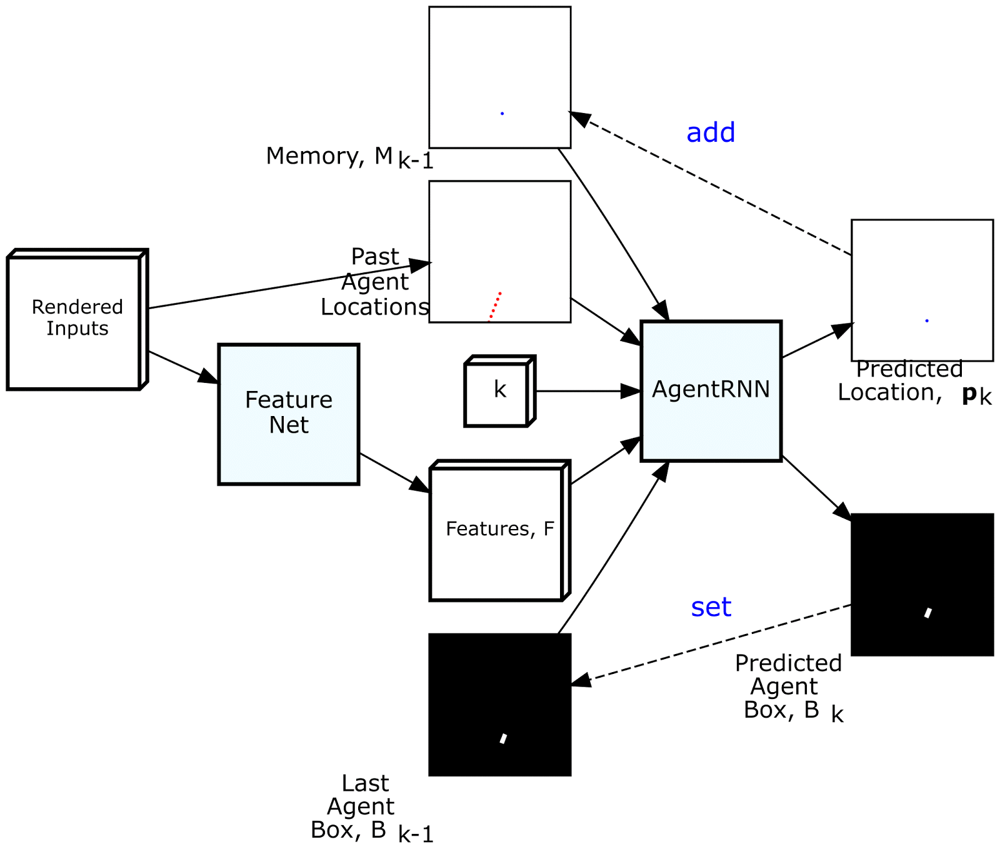
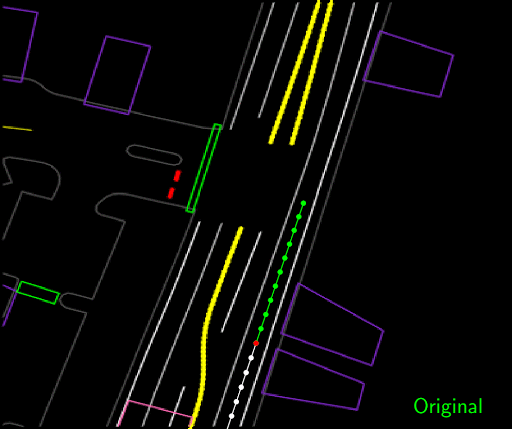

code_source: https://github.com/aidriver/ChauffeurNet
pdf_source: https://arxiv.org/pdf/1812.03079.pdf
short_title: ChauffeurNet
# ChauffeurNet: Learning to Drive by Imitating the Best and Synthesizing the Worst

这篇RSS论文来自于Waymo,英文名字的翻译意思是"司机网",给出了一个imitation learning系统，并实现了上车测试，为了保证系统的鲁棒性本文做了很多的选择与加强，值得了解。这篇论文有[来自waymo的官方medium英文解读](https://medium.com/waymo/learning-to-drive-beyond-pure-imitation-465499f8bcb2)

## Imitation Learning的常见问题

1. 从raw data到底层 control，generalization难度很大，不适用于不同的传感与底层物理模型，网络被迫开环地学习底层物理模型，浪费网络能力。
2. 即时转换为本文给出的中层输入输出(processed percepetion and planning and map information -> target poses sequences),降低了网络的仿真难度，30M的数据点仍不足以使传统的Cloning算法得到好的结果。

## 本文网络的输入输出data representation

八张图分别为:
1. 城市道路地图
2. traffic light可通行以及时间信息(实际上是给了连续几张图的)
3. 速度限制
4. 目标路径(类似地图APP的指示)
5. 当前agent位置
6. 最近一系列的动态障碍物的位置
7. 过去一段时间的agent poses
8. 未来的agent poses(输出)

所有输入图以车辆当前坐标系给出，车辆当前pose会固定在一个$(u_0, v_0)$点,训练的时候会额外对数据中的车子的heading加一个扰动，相当于训练时的这些feature map会相对有额外的旋转。

## 网络结构

整体结构如图，核心部分为"输入->特征提取->RNN->朝向、速度、未来目标点、外来heat map"。additional target 包括road mask以及一个dynamic object prediction

以下动图表达了Agent RNN的RNN特征(包括memory)

## 向专家模仿学习

几个cost是常见的，这里主要记录一个trick

### Past Motion Dropout

训练的时候，由于专家的路径太平滑，有时候只需要对先前几个时间点的路径点进行插值就能顺利得到后面的目标点，且误差很小，这里为了减轻这个问题，在训练的过程中会随机drop掉一些历史的poses，具体来说就是50%的training data里面历史poses为空，只剩下当前pose

## 提升难度

### 合成干扰

将一些平滑的专家path中间，随机选一些点水平扰动，然后用平滑的插值重新生成假的专家轨迹，

这些新的轨迹可能会碰撞，所以这类data的weight只有正确data的0.1，不过可以很好的增加正常司机不会到达的危险情景

### 辅助loss

1. 碰撞 loss，主要在于惩罚perturbation的时候的一些碰撞
2. on road loss:
3. 几何loss，加强与原轨迹的重合度
4. road masking 与 prediction

### 模仿dropout

有一定的概率不需要网络实现imitation，让imitation部分loss为0，只留下前一段写到的附加loss

