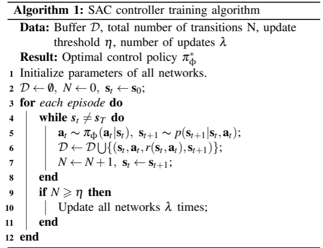

time: 20200131
pdf_source: https://www.ram-lab.com/papers/2019/ral_2019_cai.pdf
code_source: https://github.com/flying-cabbage/drift_drl
short_title: Drifting with RL (Cai, Mei)
# High-speed Autonomous Drifting with Deep Reinforcement Learning

这篇论文是实验室学长们的一篇合作论文，完成的任务是用强化学习教会车子在Carla中漂移,成果是成功让车子在Carla达到近100km/h的过弯速度。本文有一个[官方主页](https://sites.google.com/view/autonomous-drifting-with-drl)，以下为其在bilibili上发布的[视频](https://www.bilibili.com/video/av82279019/)

<iframe src="//player.bilibili.com/player.html?aid=82279019&cid=140771327&page=1" scrolling="no" frameborder="no" framespacing="0" allowfullscreen="true" height=270 width=480> </iframe>

## 强化学习定义

### 地图与目标轨迹

地图是根据某知名卡丁车游戏的地图改编的，使用RoadRunner画出来并加载到Carla中。参考轨迹由某司机在场景中模拟驾驶形成，要求是尽可能开得快并且使用漂移形成尖锐的转角。

### 状态变量与行动空间

状态变量包含:当前舵角，当前油门，正向、法向、总速度，侧偏角，朝向角。
朝向角的Ground truth由Vector Field Guidance(VFG)计算，这里建议参考原文。

状态空间为:
$$
\mathcal{S}=\left\{\delta, \tau, e_{y}, \dot{e}_{y}, e_{\psi}, \dot{e}_{\psi}, e_{\beta}, \dot{e}_{\beta}, e_{v x}, \dot{e}_{v x}, e_{v y}, \dot{e}_{v y}, \mathcal{T}\right\}
$$

其中$\mathcal{T}$包含十个未来的{$x, y, \beta$}目标。

行动空间为为归一化到[-1,1]的舵角.Carla中throttle为[0, 1],但是为了使得车子开得快，加快训练，这里有效的throttle范围为[0.6, 1].

输出值经一阶数字滤波得到实际输入到Carla的控制值。

### Reward函数

$$
\begin{array}{ll}{r_{e_{y}}=e^{-k_{1} e_{y}}} \\ {r_{e_{\psi}}, r_{e_{\beta}}=f(x)=} & {\left\{\begin{array}{cc}{e^{-k_{2}|x|}} & {|x|<90^{\circ}} \\ {-e^{-k_{2}\left(180^{\circ}-x\right)}} & {x \geq 90^{\circ}} \\ {-e^{-k_{2}\left(180^{\circ}+x\right)}} & {x \leq-90^{\circ}}\end{array}\right.}\end{array}
$$

$$
r=v\left(k_{e_{y}} r_{e_{y}}+k_{e_{\psi}} r_{e_{\psi}}+k_{e_{\beta}} r_{e_{\beta}}\right)
$$

### SAC 算法

还有一些更为具体的Trick在论文中提到，建议参考开源代码。

实验效果建议查询其[官方主页](https://sites.google.com/view/autonomous-drifting-with-drl),与[官方视频](https://www.bilibili.com/video/av82279019/)