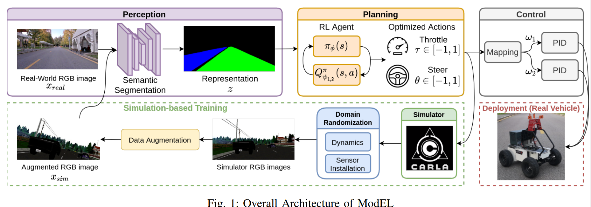

time: 20211205
pdf_source: https://arxiv.org/abs/2110.11573

# ModEL: A Modularized End-to-end Reinforcement Learning Framework for Autonomous Driving

本文的一个思路在于通过把强化学习的输入输出模块化处理,使得模型迁移性更强. 模块如图,输入通过语义分割划归为稳定的基于类别的分类模,输出则由现实中的PID控制器进行隔离.

