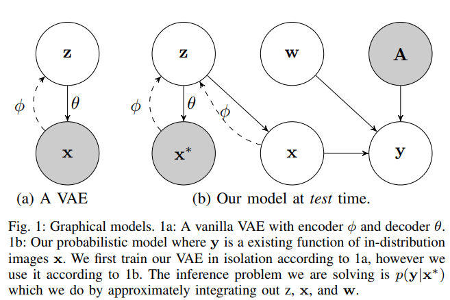

time: 20191023
pdf_source: https://arxiv.org/pdf/1812.10687.pdf
short_title: Task-Aware Generative Uncertainty
# Robustness to Out-of-Distribution Inputs via Task-Aware Generative Uncertainty

## 贝叶斯理论背景

网络训练的时候相当于寻找参数$w$满足$w_{MAP} =argmax_{w}\sum_ip(y_i|x_i,A_i,w)$其中$y,x,A,w$分别为观测值，行动序列以及参数矢量。这个方法可以估测输出结果的不确定性，但是不能估计模型本身参数选择的不确定性。

$$p(y|x,A) =  \int p(y|x,A,w)p(w|D_{train})dw$$
理论上来说这个积分是无法求解的。

尽管贝叶斯方法可以处理由于数据量不足引起的模型不确定性，但是对于与training data分布不同的输入，其估计值不够准确。这些情况记为$p(y|x^*,A)$

## 网络与实际算法

训练时：

根据输入图片，训练一个[VAE](https://arxiv.org/pdf/1312.6114.pdf)，另外正常地使用原来需要的模型(本文为一个卷积+LSTM模型)得到$p(y|x,A)$

测试时:

将测试输入放到VAE中，在中间隐层中多次采样得到多个输出图片，正常地使用原来的模型得到多个输出结果，对其求均值与方差得到对模型不确定性的估计

## 背后的一些分析

本文一个与其他文章不同的理由是，不应该单纯地因为测试时输入图片与训练时不同就判断结果会有很大的不确定性。简单的例子比如说天花板的颜色，如果测试时与训练时不同，一个正常好的机器人深度学习模型不会因此得到不同的行动输出，"输出结果的不确定性不会因无关部分的区别而提升"。这个情况在本文的模型中也有所体现，作者实验室能发现VAE测试时输出的图片的天花板颜色与实际的输入不符合，但是最终输出的行动差别不大，也就不会提升对应的不确定性。这也是作者在估计不确定性的时候，坚持要去到最后行动输出时再估计不确定性，而不是从图像的输入就开始估计。

