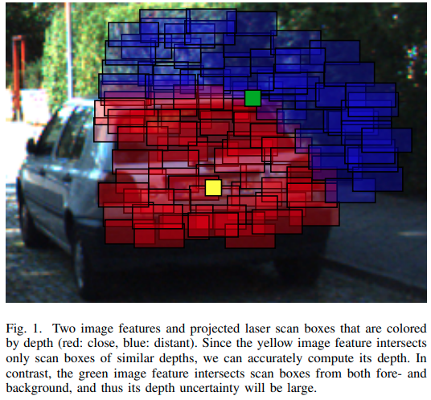
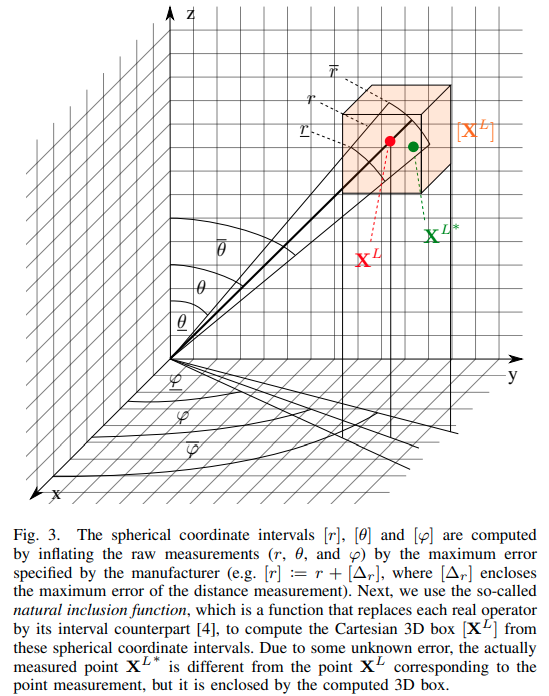
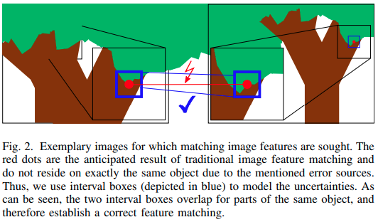

time: 20210611
pdf_source:https://raphael-voges.de/publication/voges-2021/voges-2021.pdf

# Interval-Based Visual-LiDAR Sensor Fusion

这篇paper是2021 ICRA Best Paper Award in Robot Vision.

### Visual-Lidar Fusion Motivation

视觉的特征好处是容易重识别，所以可以在sequence上对同一点简单的重识别与匹配(点云的匹配比较困难).而点云的好处是可以给深度。如果是将深度assocciate到可以被重识别的feature上，做VO就可以有scale了.

### Interval Analysis

这篇paper提出一个新的误差分析，以前是用高斯去建模的，现在用boundary来分析，指真值应当是在一个区间内. 而区间之间的合并运算需要interval analysis

$$
[-4,3]-[1,5]=[-4-5,3-1]=[-9,2]
$$

### Sensor Error Model

LiDAR的点误差可能有两个角度误差以及距离测量误差.我们可以算出在欧几里得的坐标系下的一个立方体bounding box,

Camera的误差来自于像素匹配的时候的距离，这里用一个方形的bounding box建模

