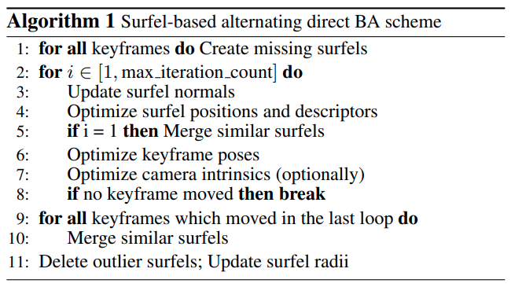

time: 20210903
pdf_source: https://openaccess.thecvf.com/content_CVPR_2019/papers/Schops_BAD_SLAM_Bundle_Adjusted_Direct_RGB-D_SLAM_CVPR_2019_paper.pdf
code_source: https://github.com/ETH3D/badslam

# BAD SLAM: Bundle Adjusted Direct RGB-D SLAM

[知乎解读](https://zhuanlan.zhihu.com/p/338839273) [CSDN解读](https://blog.csdn.net/wujianing_110117/article/details/106332195)

这篇paper把bundle adjustment用在稠密的RGBD预测之中，在后端同时优化重建的模型和相机的所有参数(GPU版本)。

## Front end

前端不是本文章的主要内容，只有简单的介绍

- 预处理，使用双边滤波
- keyframe的选择，每十帧选择一帧作为keyframe.每一帧会估计相对上一个关键帧的位姿，alignment比对时采用的是RGB的梯度而不是RGB数值(相当于是edge的对齐)。
- 回环检测,采用bag-of-words的[方法](https://ieeexplore.ieee.org/document/6202705), [code](https://github.com/dorian3d/DBoW2) [code2](https://github.com/dorian3d/DLoopDetector)

## Back end

### Surfel

surfel 本文的定义来说，实质上是有方向的圆盘.

- 首先把keyframe分成一个4x4的单元，如果单元格中没有像素对应现有的surfel。surfel 由3D中心点$p_s$ (选中点投影到转换到世界坐标)，表面法向量 $(n_s)$(深度图的附近的有限差分)，半径$r_s$(当前点与四个邻域像素的3D点之间的最小距离)，标量视觉描述子构成$d_s$。构成
- surfel的位置点在后端优化的时候只可以沿着法向量更新。因此相当于只优化一个参数 $p_s + t * n_s$里面的t. 描述子随着优化正常优化。
- surfel合并，在每一次迭代优化之后，需要将相似的surfel合并。将surfel投影到所有关键帧中，投影到同一个单元格的surfel进行合并。半径为相应测量值的最小半径。过滤异常半径。

### Back-end Cost Function

$$
C(K, S)=\sum_{k \in K} \sum_{s \in S_{k}}\left(\rho_{\text {Tukey }}(\sigma_{D}^{-1} r_{\text {geom }}(s, k)\right)+ w_{photo} \rho_{Huber}(\sigma^{-1}_p r_{photo}(s,k))
$$

$r_{geom}$几何结构计算的是测量与surfel法向的距离。
$$
r_{\text {geom }}(s, k)=\left(\mathbf{T}_{G}^{k} \mathbf{n}_{s}\right)^{T}\left(\pi_{D, k}^{-1}\left(\hat{\pi}_{D, k}\left(\mathbf{T}_{G}^{k} \mathbf{p}_{s}\right)\right)-\mathbf{T}_{G}^{k} \mathbf{p}_{s}\right)
$$

$r_{photo}$计算描述子的差距。
$$
r_{\text {photo }}(s, k)=\left\|\left(\begin{array}{l}
I\left(\pi_{I, k}\left(\mathbf{s}_{1}\right)\right)-I\left(\pi_{I, k}\left(\mathbf{p}_{s}\right)\right) \\
I\left(\pi_{I, k}\left(\mathbf{s}_{2}\right)\right)-I\left(\pi_{I, k}\left(\mathbf{p}_{s}\right)\right)
\end{array}\right)\right\|_{2}-d_{s}
$$

