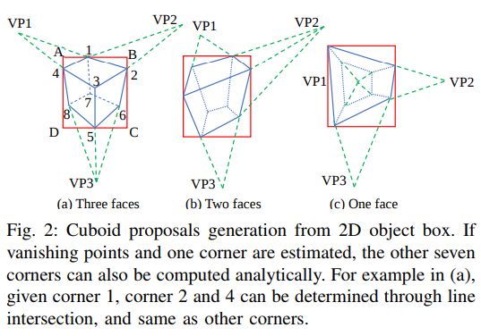
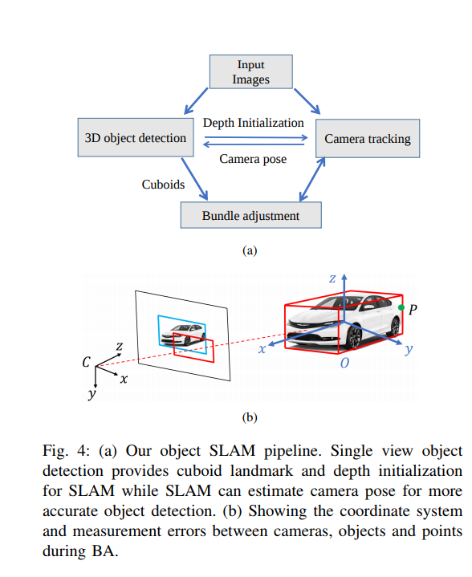

time: 20191126
pdf_source: https://arxiv.org/pdf/1809.03415.pdf
code_source: https://github.com/shichaoy/cube_slam
short_title: CubeSLAM
# CubeSLAM: Monocular 3D Object SLAM

这篇文章将单目3D物体检测以及单目SLAM放在同一个框架里面优化，得到的结果是同时更优化的SLAM结果以及检测结果。这篇文章属于所谓物体级的SLAM。

## 单目图片理解
###　单目3D proposal生成

本文的思路是通过一个角点加上消失点&旋转矩阵以及2D 检测框还原三维结果。

由旋转矩阵得到长方形框三个消失点的公式为:

$$
    VP_i = KR_{col(i)}, i\in \{1,2,3\}
$$

由上图可知,以a小图为例,在已知消失点以及$p_1$的情况下,其余的点可以用求交点的方式得到$p_2 = (VP_1, p1) \times (B, C), p_4 = (VP_2, p1) \times (A, D), p_3 = (VP_1, p_4)\times(VP_2, p_2), p_5 = (VP_3, p_3) \times (C, D), p_6 = (VP_2, p_5) \times(VP_2, p_5), p_7=(VP_3, p_1)\times(VP_1, p_6), p_8 = (VP_3, p_4)\times(VP_2, p_7)$事实上后面的点选择空间很大.

得到角点后进一步收缩自由度
对于任意姿态的物体，选取不共面的四个角点如1,2,4,7进行PnP求解

对于地面上的物体，假设其roll,pitch角度都为0度，就可以不使用PnP求解了，可以根据相机高度将底面的角点直接投影到世界坐标中

一般来说，我们可以用神经网络直接输出角度，但是这里为了提高泛化性能，选择采样并各自评分以计算旋转矩阵。

###  Proposal 评分

总体损失函数为:

$$
E(O|I) = \phi_{dist}(O, I) + w_1\phi_{angle}(O,I) + w_2 \phi_{shape}(O)
$$
其中$O$为损失函数,$w$为权重超参数

1. $\phi_{dist}$,对图片运行canny edge，基于此建立distance map，对每一个竖线，采样10个点，计算距离图中的距离值总和，最后得分除以2D框的对角线长度
2. $\phi_{angle}$前一个函数对false positive的小直线段非常敏感，首先找出上下面的长边，找出相对消失点倾斜角最大与最小的.$\left\langle a, b \right\rangle$为点$a,b$直线的倾斜角，
$$
\begin{aligned} \phi_{\text {angle}}(O, I)=& \sum_{i=1: 3}\left\|\left\langle l_{i_{-} m s}, l_{i_{-} m t}\right\rangle-\left\langle\mathrm{VP}_{i}, l_{i_{-} m t}\right\rangle\right\|+\\ &\left\|\left\langle l_{i_{-} n s}, l_{i_{-} n t}\right\rangle-\left\langle\mathrm{VP}_{i}, l_{i_{-} n t}\right\rangle\right\| \end{aligned}
$$
本质上是要求长边经过消失点

3. $\phi_{shape}$如果长宽比很大的，给予一个惩罚。

## SLAM

### bundle adjustment问题

记相机姿态、3D物体、特征点分别为$C = \{C_i\}, O = \{O_j\}, P = \{P_k\}$, BA就描述为以下的最小二乘问题

$$
\begin{aligned} C^{*}, O^{*}, P^{*}=& \underset{\{C, O, P\}}{\arg \min } \sum_{C_{i}, O_{j}, P_{k}}\left\|\mathbf{e}\left(c_{i}, o_{j}\right)\right\|_{\Sigma_{i j}}^{2}+\\ &\left\|\mathbf{e}\left(c_{i}, p_{k}\right)\right\|_{\Sigma_{i k}}^{2}+\left\|\mathbf{e}\left(o_{j}, p_{k}\right)\right\|_{\Sigma_{j k}}^{2} \end{aligned}
$$
右下角的$\sum$表达的是不同误差之间的协方差

## 误差项

1. 相机、物体与世界坐标系的转换应与相机中物体的相对转换有对应

$$
e_{c o_{-} 3 D}=\left[\log \left(\left(T_{c}^{-1} T_{o}\right) T_{o m}^{-1}\right)_{\mathrm{se}_{3}}^{\vee} \quad \mathbf{d}-\mathbf{d}_{m}\right]
$$
其中$T = \{R |t\}, d$为dimension
2. 3D物体在投影到相机中，与2D框的中心、长宽的误差 $e_{co\_2D} = [c, s] - [c_m, s_m]$
3. 物体与点的对应，已知点P在物体O中,那么如果点P不在这个3D框里面就给予惩罚.$e_{op} = max(|T_o^{-1}P| - d_m, 0)$
4. 点与相机的对应，与传统的feature-based SLAM一致。$e_{cp} = \pi(T_c^{-1}P) - z_m$其中$z_m$为点P原本被观察到的相机坐标。

作者进一步讨论了动态场景中的SLAM,这里省略