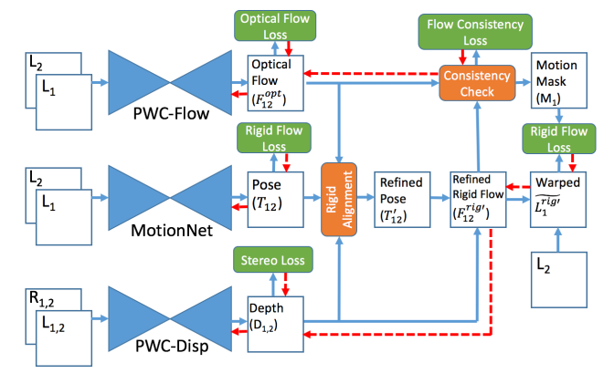
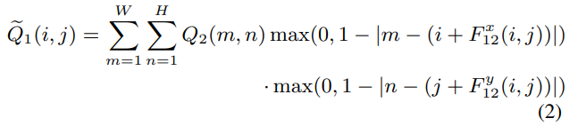
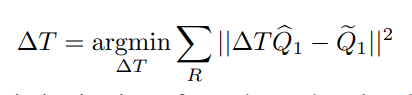

code_source: https://github.com/baidu-research/UnDepthflow
short_title: UnDepthFlow
pdf_source: https://arxiv.org/pdf/1810.03654.pdf
# Joint Unsupervised Learning of Optical Flow and Depth by Watching Stereo Videos

正如题目表示，本文的目标是使用连续的双目视频，同时预测光流、深度以及相机运动。大幅度重用前人的研究，特点是注重对运动以及遮挡物体的去除

# 主体流程图

这个pipeline分为好几个stages

首先，用PWC-Flow预测左目相机的两张图之间的光流$F_{12}^{opt}$，用MotionNet预测左目相机两张图之间的运动 $T_{12}$, 用PWD-Disp估计双目相机之间的视差，用视差可以转换为深度$D = B f_x / d$。

第二，结合$D_1, T_{12}$，我们可以计算出因相机刚体运动而产生的光流，记为$F^{rig}_{12}$，图中未呈现。然后rigid-alignment module将相机运动从$T_{12}$精修为$T_{12}'$,并进一步得到精修的$F^{rig'}_{12}$

第三，Consistency check去除运动区域。

## 第一、网络结构

PWC-Flow按照[这篇文章](https://arxiv.org/pdf/1709.02371.pdf)的[介绍](PWC-Net_CNNs_for_Optical_Flow_Using_Pyramid_Warping_and_Cost_Volume.md)

MotionNet按照[这篇文章](https://people.eecs.berkeley.edu/~tinghuiz/projects/SfMLearner/cvpr17_sfm_final.pdf)的[介绍](Unsupervised_Learning_of_Depth_and_Ego-Motion_from_Video.md)

PWC-Disp从PWC-Flow更改，在Cost volumn计算的时候强迫它只在水平方向上搜索，输出形状自然变成了 $d\times H \times W$

## 第二、Rigid Alighment Module

这个模块目标是第一步精修

首先通过$Q_t(i,j) = D_t(i,j) K^{-1P_t(i,j)}$将当前图像转换为相机坐标系，3D空间中的点，然后使用$T_{12}$转换，得到对应点在第二时刻相机坐标系中的点$\hat Q_1$。$\widetilde Q_1$则表示$Q_2$通过光流$F^{opt}_{12}$回到第一时刻的坐标，

通过求解以上两个步骤，可以得到精修的T

## 第三、Consistent Check

精修的rigid光流与网络光流的差中，值过大或者被遮挡的部分会被过滤掉，使用thresholding给出一个mask，只有mask中认为是静止物体的才会进行loss计算。

