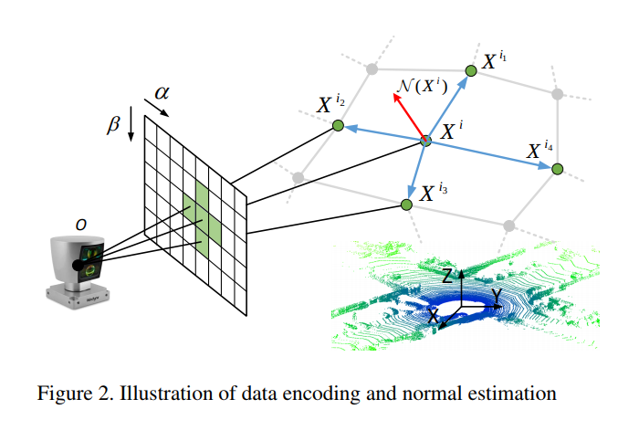
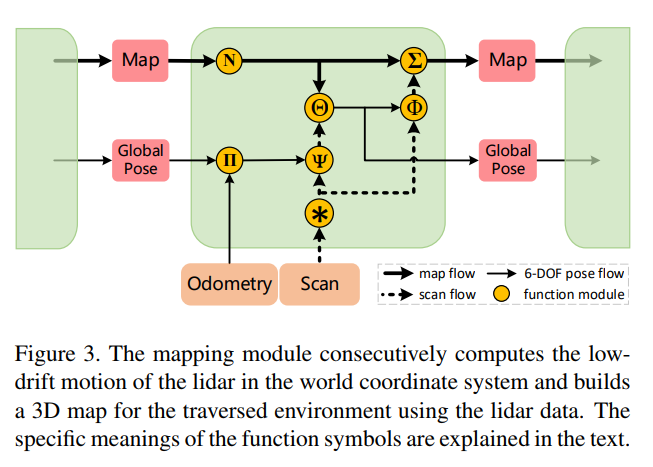

time: 20191010
pdf_source:https://arxiv.org/pdf/1904.08242.pdf
code_source: https://github.com/PythonLidar/pytorch-LONet
short_title: LO-Net
# LO-Net: Deep Real-time Lidar Odometry

这篇文章主要有三个贡献，第一提出了scan-to-scan lidar odometry网络，同时估计面的法向以及mask for dynamic regions。第二融合相邻两帧网络进行估计，第三，融合一个mapping module. 注意Github 链接代码尚未公布。

## 网络主要结构

整体来说，网络由三个网络构成，分别是法向估计网络(point wise)，mask 估计网络以及一个共用参数的双生姿态回归主网路。它以两个相邻的lidar点作为输入，估计出6自由度的相对运动、点云各点的面法向以及动态区域mask。odometry的输出会通过mapping模块进一步提高，最终的输出会是相对于初始位置的偏移

## 输入编码

为了让网络的数据编排变得紧凑，这里使用圆柱坐标系

$$\alpha = arctan(y/x)/\Delta \alpha$$
$$\beta = arcsin(z/\sqrt{x^2+y^2 + z^2} / Δβ)$$

如果同一个$\alpha, \beta$坐标有不止一个点，则以最近的点为准，每一个点的特征包括强度值以及距离值。

## 几何约束

### 法向估计

严谨来说，以上图为例子，点云的法向应该由点$X^i$以及其$k$个相邻的点，由下式定义

$$\argmin_{\mathcal{N}(X^i)} ||[w_{i1}(X^{i_1}-X^i),...]^T\mathcal{N}(X^i)||_2$$

也就是寻找一个矢量，使得这个矢量与k个相邻点矢量的点乘的加权求和值(或者是加权范数)最小.一般来说距离越近权重越大，距离越远权重越小。

本文为了简化这一计算，使用以下方程

$$\mathcal{N}(X^i) = \sum_{X^{i_k}, X^{i_j} in \mathcal{P}} (w_{ik}(X^{i_k} - X^i) \times w_{ij}(X^{i_j} - X^i))$$

其中$\mathcal{P}$为当前点的临近点。

相邻两簇点云之间有一定的对应关系，令$P$为投影过程而$T_t$为相对位移，可以找到点$X^{\alpha \beta}_{t-1}$的对应点

$$\hat X^{\alpha \beta}_t = P T_t P^{-1} X^{\alpha\beta}_{t-1}$$

由于相对应的点法向估计理应比较相似，所以一个约束是

$$\mathcal{L}_n = \sum_{\alpha \beta}||\mathcal{N}(\hat X^{\alpha\beta}_t) - \mathcal{N}(X^{\alpha\beta}_t) ||_1 \dot e^{|\nabla_r(\hat X^{\alpha \beta}_t)|}$$

其中 $\nabla_r(\hat X^{\alpha \beta}_t)$是距离关于$\alpha \beta$的微分，意思是变化越剧烈的地方越重要

## 里程回归

这里让网络在完全连接层输出7个数值，前三个是平移向量，后面四个是四元数。大部分网络层使用的是[fireConv](../../Building_Blocks/SQUEEZENET_ALEXNET-LEVEL_ACCURACY_WITH_50X_FEWER_PARAMETERS_AND_0.5MB_MODEL_SIZE.md)

由于点云的特性，feature map的高度远小于宽度(360°点云)，所以在下采样的时候只对宽度进行max pooling

在学习时由于旋转与平移的单位不同，同时为了避免调节超参，使用自动学习的参数(个人注解:尽管公式不同，引用的文章也不一致，但是基本可以确认理论本质来自于[multi-loss](http://openaccess.thecvf.com/content_cvpr_2018/papers/Kendall_Multi-Task_Learning_Using_CVPR_2018_paper.pdf))

$$
\begin{aligned} \mathcal{L}_{o} &=\mathcal{L}_{x}\left(S_{t-1} ; S_{t}\right) \exp \left(-s_{x}\right)+s_{x} \\ &+\mathcal{L}_{q}\left(S_{t-1} ; S_{t}\right) \exp \left(-s_{q}\right)+s_{q} \end{aligned}
$$

## Mask估计

输出的mask会影响到几何约束的cost function，被改造为

$$
\mathcal{L}_{n}=\sum_{\alpha \beta} \mathcal{M}\left(X_{t}^{\alpha \beta}\right)\left\|\mathcal{N}\left(\hat{X}_{t}^{\alpha \beta}\right)-\mathcal{N}\left(X_{t}^{\alpha \beta}\right)\right\|_{1} \cdot e^{\left|\nabla r\left(\hat{X}_{t}^{\alpha \beta}\right)\right|}
$$

注意到由于mask prediction没有ground truth 所以将所有mask设置为0可以让cost变得最小，所以附加以下的cost，目标是让网络能够权衡。
$$
\mathcal{L}_{r}=-\sum_{\alpha \beta} \log P\left(\mathcal{M}\left(X_{t}^{\alpha \beta}\right)=1\right)
$$

## Mapping refinement

$*$表示的是对法向估计的一个预设的$3\times 5$卷积，中央为-14.其他值为1，是一个高通滤波器。feature map上值最小的$n_c$个mask外的点选出来，认为是平面区域。

$\mathbf{\Pi}$指的是计算lidar pose的先验计算(假设上一时刻转换矩阵不变) $M_{init} = M_{t-1}M^{-1}_{t-2}M_{t-1}$

$\mathbf{\Psi}$ 首先利用网络预测的两帧间位移线性插值补偿运动畸变，然后用$M_{init}$将新的点云转移到世界坐标系下。

假设$p_i$是当前scan的点，$m_i$是对应点，而$n_i$是对应点的法向。全局mapping的目标就是要找到一个最优的$M$使得
$$
\hat{\mathbf{M}}_{o p t}=\underset{\hat{\mathbf{M}}}{\arg \min } \sum_{i}\left(\left(\hat{\mathbf{M}} \cdot \boldsymbol{p}_{i}-\boldsymbol{m}_{i}\right) \cdot \boldsymbol{n}_{i}\right)^{2}
$$

$\Theta$:迭代地求解上文提到的方程，
$$
\mathbf{M}_{t}=\prod_{k=1}^{n_{i t e r}} \hat{\mathbf{M}}_{k} \mathbf{M}_{i n i t}
$$

$\Phi$根据优化后的位移结果生成最终的点云结果。

$\sum,N$将新的点云加到地图中，然后清除最旧的点云，只保存最旧的$n_m$个点云

