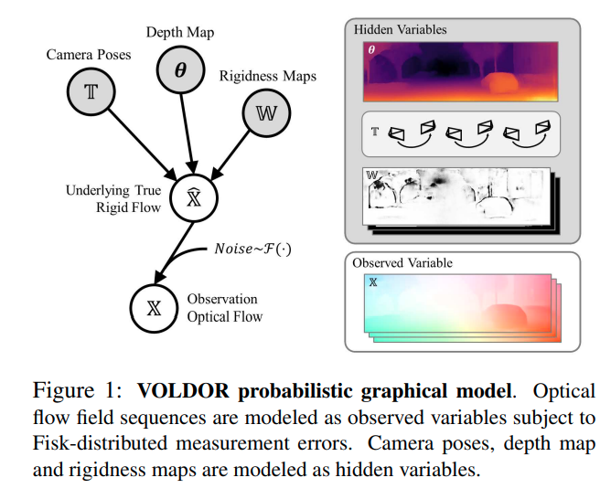
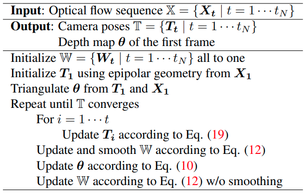
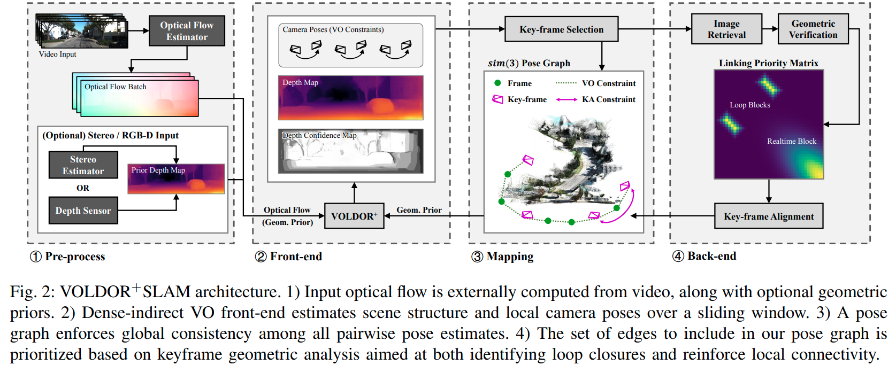

time: 20210719
pdf_source: https://openaccess.thecvf.com/content_CVPR_2020/papers/Min_VOLDOR_Visual_Odometry_From_Log-Logistic_Dense_Optical_Flow_Residuals_CVPR_2020_paper.pdf
code_source: https://github.com/htkseason/VOLDOR
# VOLDOR: Visual Odometry from Log-logistic Dense Optical flow Residuals

这篇paper讨论的是视觉SLAM问题的解决，重点区别点:

- 稠密光流替代稀疏特征点匹配
- 把rigidness map作为概率推理的一部分，用于区分出运动中的物体像素
- 提出了新的概率分布拟合以及推理方法.
- 整个框架高度并行化，适合在GPU上直接完成SLAM任务

## 方法

### Notations

- $\mathcal{I}$: 图片
- $\mathcal{X}$: 观测到的光流场
- $\mathcal{T}$: 相机姿态.
- $\mathcal{\theta}$: 深度图
- $\mathcal{W}$: Rigidness 概率图，若$W(i,j)==0$说明是动态物体像素.
- $\boldsymbol{\pi}$: 投影点的坐标，已知深度，相机姿态以及相机内参，可以得到静态点的投影关系 $\boldsymbol{\pi}_{\boldsymbol{t}}\left(\theta^{j}\right)=\boldsymbol{K}\left(\prod_{i=0}^{t} \boldsymbol{T}_{\boldsymbol{i}}\right) \theta^{j} \boldsymbol{K}^{-1}\left[x_{j} y_{j} 1\right]^{T}$
- $\boldsymbol{\xi}$: 由运动产生的光流
$\boldsymbol{\xi}_{\boldsymbol{t}}\left(\theta^{j}\right)=\boldsymbol{\pi}_{\boldsymbol{t}}\left(\theta^{j}\right)-\boldsymbol{\pi}_{\boldsymbol{t - 1}}\left(\theta^{j}\right)$

对图片观测到的光流场，我们可以表达其概率分布, 其中分为两部分。
- 对于静态像素，其概率与运动/深度得到的光流之间的残差有关
- 对于动态像素，本文假设其为一个均匀分布.

$$
\begin{aligned}
P\left(\boldsymbol{X}_{t}^{\boldsymbol{\pi}_{t-1}\left(\theta^{j}\right)}\right.&\left.\mid \theta^{j}, \boldsymbol{T}_{\boldsymbol{t}}, W_{t}^{j} ; \boldsymbol{T}_{\mathbf{1}} \cdots \boldsymbol{T}_{\boldsymbol{t - 1}}\right) \\
&=\left\{\begin{array}{ll}
\rho\left(\boldsymbol{\xi}_{\boldsymbol{t}}\left(\theta^{j}\right) \| \boldsymbol{X}_{t}^{\boldsymbol{\pi}_{t-1}\left(\theta^{j}\right)}\right) & \text { if } W_{t}^{j}=1 \\
\mu\left(\boldsymbol{X}_{t}^{\boldsymbol{\pi}_{t-1}\left(\theta^{j}\right)}\right) & \text { if } W_{t}^{j}=0
\end{array}\right.
\end{aligned}
$$

VO问题就被建模成最大化以上likelihood的求解问题.
$$
\begin{array}{c}
\underset{\boldsymbol{\theta}, \mathbb{T}, \mathrm{W}}{\operatorname{argmax}} P(\mathbb{X} \mid \boldsymbol{\theta}, \mathbb{T}, \mathbb{W}) \\
=\underset{\boldsymbol{\theta}, \mathrm{T}, \mathrm{W}}{\operatorname{argmax}} \prod_{t} \prod_{j} P\left(\boldsymbol{X}_{t}^{\boldsymbol{\pi}_{t-1}\left(\theta^{j}\right)} \mid \theta^{j}, \boldsymbol{T}_{t}, W_{t}^{j}\right)
\end{array}
$$

### Fisk Residual Model

用什么概率模型对残差进行建模是本文中一个很重要的选择项.本文做了以下的观察

- hierarchical的光流方法，光流估计的误差会与光流本身的值成正比(光流像素值越大, 绝对误差值就越大).
- 作者尝试对现有的多个光流模型的误差特性进行概率拟合，发现是[fisk distribution](https://www.wikiwand.com/en/Log-logistic_distribution)是最好的.

#### Fisk distribution:

也称为Log-logistic distribution, 指的是一个随机变量的对数值服从[logistic distribution](https://www.wikiwand.com/en/Logistic_distribution). logistic distribution在默认的参数下的累积函数就是我们常用的sigmoid.

而 fisk的概率密度函数为:

$$
f(x ; \alpha, \beta)=\frac{(\beta / \alpha)(x / \alpha)^{\beta-1}}{\left(1+(x / \alpha)^{\beta}\right)^{2}}
$$

### 推理方法

#### 深度与rigidness的更新

$$
\theta_{\mathrm{MIE}}^{j}=\operatorname{argmax}_{\theta^{j *}} \sum_{t} q\left(W_{t}^{j}=1\right) \log \frac{P\left(\boldsymbol{X}_{t}^{\pi_{t-1}\left(\theta^{j}\right)} \mid \theta^{j}=\theta^{j *}, W_{t}^{j}=1\right)}{\sum_{W_{t}^{j}} P\left(\boldsymbol{X}_{t}^{\left.\pi_{t-1}^{(\theta j}\right)} \mid \theta^{\left.j=\theta^{j *}, W_{t}^{j}\right)}\right.}
$$

算法上首先将$W$初始化为1, $T$与$\theta$由稠密光流最小二乘法得到初始解. 然后循环地优化相机姿态、深度以及刚度图.

# VOLDOR+SLAM: For the times when feature-based or direct methods are not good enough

[pdf](https://arxiv.org/pdf/2104.06800.pdf)

这篇paper将前面的VOLDOR扩展为了一个完整的SLAM系统, 

