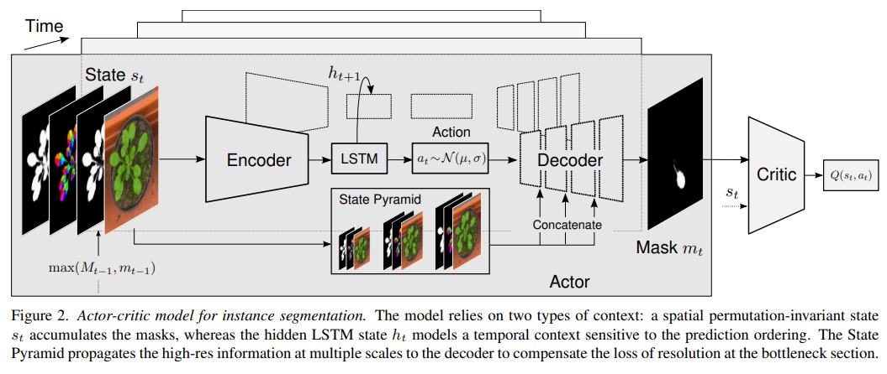
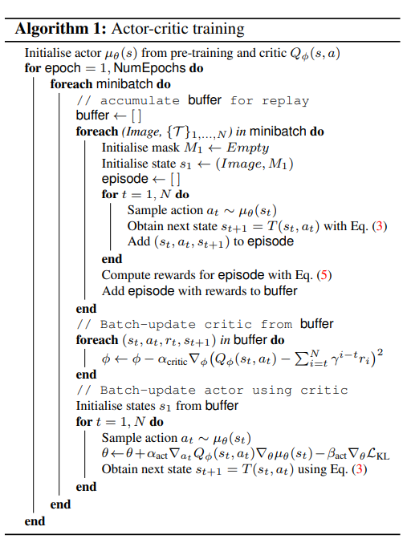

pdf_source: https://arxiv.org/pdf/1904.05126.pdf
code_source: https://github.com/visinf/acis
# Actor-Critic Instance Segmentation

这篇论文使用actor critic 强化学习，便于预测一系列的segmentation result

## 整体结构

## 强化学习定义

状态空间$s_t = (I, M_t)$ 其中$I$为输入图片， $M_t$为第$t$时刻的综合mask

行动 $a_t$是decoder的输入，是一个较为低维的连续矢量

状态转移$T = (I, max(M_t, D(a_t)))$，相当于将新decode的mask加和在原来的累加mask上

reward，先定义$\phi_t = max(\sum_{i=1}^t F(S_i, T_{ki}))$意思是寻找最优的predicted instance-ground truth搭配，得到的最大奖励，然后reward就是$r_t = \phi(s_{t+1}) - \phi(s_t)$

使用重点：
1. decoder需要提前train好，最好不要改变,需要的是一个conditional variational encoder(cVAE)
2. 需要允许critics warm-up

AC training

