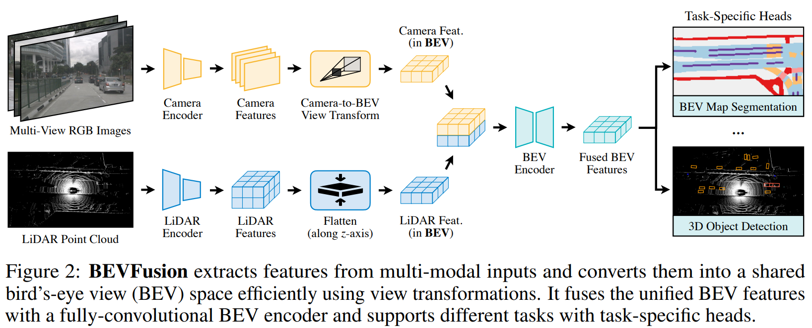
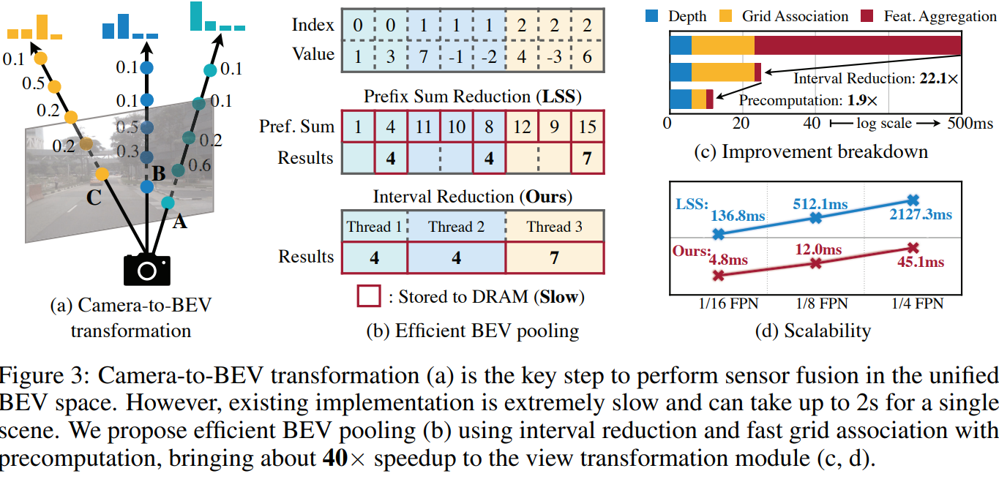
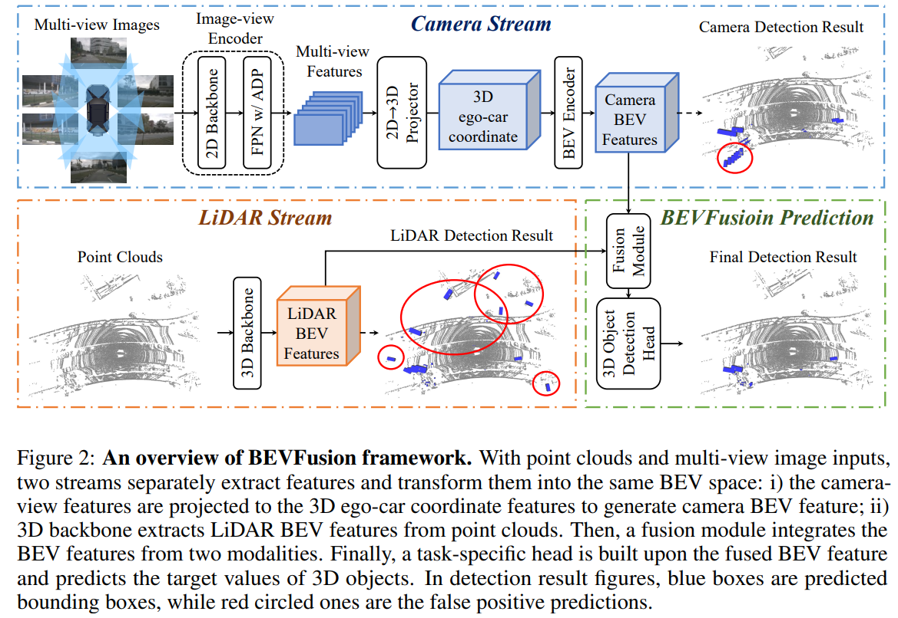

time: 20220531

# Summary of Multiple Papers on BEV Fusion

在特斯拉公开日宣传了环视摄像头到BEV语义分割的直接预测方案前后(很多研究在Tesla前已经有在做)，出现了大量的论文实现相关的功能方案。很多的工作也与BEV Fusion的实现有关。其核心的观点与相关技术要素可以总结如下：

- 以俯视图，BEV的稠密特征图作为多相机/多传感器的融合位点，且BEV直接进行稠密输出(如语义分割以及物体检测)。
- 把相机特征转换到BEV稠密特征图中，里面可能牵涉到相机的投影几何、外参、像素深度等问题。目前也有多种实现方案。
- 把点云特征转换到BEV稠密特征图中，目前常见的方案是Voxelization以及PointPillar方案, 其中PointPillar方案，最终输出直接是BEV 2D特征图，受到的关注比较多。
- 输出的内容可以非常丰富，现有已经有大量的利用稠密的BEV特征进行输出的各种工作，且Nuscenes等数据集提供大量的标注数据。物体检测、车道检测、高精地图建造、甚至轨迹预测、路径规划。
- 关于BEV内的目标检测，由CenterNet, CenterPoint相关的工作结构简单而且可以轻松扩展出复杂的输出头，AnchorLess的设计在BEV检测也比较吃香，因而是多任务方案中的常用选择。

关于相机特征到BEV稠密特征图的转换，目前观察到的几种方案:

- 使用单目深度，预测每一个像素的深度值/深度分布，把图像特征转换为离散的点云特征/稠密的Voxelized 3D特征， 再转换到BEV 2D.
- 使用Inverse Perspective Mapping, 假设图片所有的点都在地面(可以理解为同一个平面的点在相机平面的投影)，BEV特征图可以理解是地面特征在一个俯瞰相机中的投影，同一个平面在不同相机中的投影的各点坐标可以由[Homography Matrix](https://docs.opencv.org/4.x/d9/dab/tutorial_homography.html) 联系起来， 这个矩阵可以用地面上一个方形四个顶点在两个相机中的坐标求解，也可以用相机的内外参直接计算获得。
- 使用全连接层，让网络决定BEV中的每一个像素是由前置特征的哪些位置的像素点加权计算的。这种做法常常要为不同的相机做不同的全连接层，且前置图中点的语义信息不影响其与BEV的连接;也就是无法通过判断图片点是不是地面点，把它的特征加到BEV的不同位置上。
- 使用Attention层，让网络根据学习到的内容以及图片的语义信息，判断BEV上的每一个特征应该如何由前置相机的特征构成。在数据量极大的情况下，可能可以让网络学习到如何实现根据语义以及位置分配求和权重。

本站此前也有一定的收集:

### [Lift-Splat-Shoot]:
  - 任务: BEV预测车辆语义分割，路径规划
  - 相机: 预测深度的分布，根据分布将前景图投射到相机坐标系下的一个Voxel中。再根据相机的外参，把全局用的BEV平面范围内的Voxel点留下，集合这些点使用PointPillar处理并压到BEV 2D.中. 

### [PanopticBEV]:
  - 任务: 前向摄像头的全景分割
  - 相机转换方案: 融合了两个做法，一个分支采用IPM转换，另一个分支对每一个像素点预测其深度，使用相机内参扩展成相机坐标系的3D特征图， 3D grid_sample转到BEV上。
  

### [HDMapNet]:
  - 任务: BEV预测高精地图/地图元素语义分割.
  - 相机转换方案: Neural View Transformer $\rightarrow$ 不同相机不同全连接层先转到各自的前向BEV中，再根据外参转到全局BEV
  - 点云使用: PointPillar

## BEVFusion: Multi-Task Multi-Sensor Fusion with Unified Bird’s-Eye View Representation
[pdf](https://arxiv.org/pdf/2205.13542.pdf) [code](https://github.com/mit-han-lab/bevfusion)

任务: 三维目标检测 & 地图分割。

相机转换方案: 预测深度分布，将图像特征扩展为 $(N, H, W, D)$的点云，本文提出了加速的BEV Pooling 模块，快速将落在BEV上每个bin的点融合起来(mean/max)。

### BEV Pooling 方案:
1. 在内参外参固定的情况下，每个相机预测的点云方阵，在车身坐标上都是固定的。记录点云方阵每一个点会落到BEV上的哪一个点，并根据落点在BEV图中的index进行排序 (这些都可以提前计算)。
2. 计算时，根据已经提前计算好的排序对点云方阵进行重排，可以得到上图(b).i 的形态。每一个BEV点对应的所有cam features会在内存上连续，并且我们预计算时，也可以缓存每一个BEV点对应的数组的起始与终止坐标。
3. 作者实现了一个专用的GPU核，让GPU的每一个线程分别负责一个BEV点内所有点的累加计算。

极大地加速了BEV pooling这一步的运算速度。使得直接预测深度分布变成一个运算压力尚可的模块。

## BEVFusion: A Simple and Robust LiDAR-Camera Fusion Framework
[pdf](https://arxiv.org/pdf/2205.13790.pdf) [code](https://github.com/ADLab-AutoDrive/BEVFusion)

任务: 三维目标检测

相机转换方案: 与LSS一致。
加入了LiDAR.

## 相机与BEV特征输出之间的转换的进一步数学化整理:

目前的方案来说，都是对BEV上每一个像素点，去"寻找"，或者融合相机图像上的特征。同一数学符号，BEV上第$i$个点的特征为$F_{BEV}(x_i, z_i)$, 图片上第$j$个点的坐标是 $F_{IMG}(Cx_j, Cy_j)$, 扩展起见，如果$Cx_j, Cy_j$是小数，则代表我们使用插值得到的特征值。这里着重考虑的输出是在相机坐标系下的BEV特征，环视系统的转换的额外的外参不考虑。

基于传统CV的 IPM(Inverse Perspective Mapping), 对地面高度的BEV上的每一个点根据坐标找到对应图片上的那个点的特征，这里举无人车中常见的已知距离地面高度$L$的平视(俯仰角为0)相机为例，把坐标$(x_i, L, z_i)$投影到相机中，我们可以得到以下关系:

$$F_{BEV}(x_i, z_i) = F_{img}(\frac{f_x x_i}{z_i} + cx, \frac{f_y L}{z_i} + cy)$$

Neural Transformer (HDMapNet): 对输入图片使用全连接层输出直接是BEV，尽管实际操作上是多层线性网络，我们观察到实质上图片每个像素点与输出特征之间的连接都是学习后固定下来的参数。

$$F_{BEV}(x_i, z_i) = MLP[F_{IMG}(Cx_j, Cy_j)] = \sum_j W_{ij} F_{img}(Cx_j, Cy_j)$$

Lift-Splat-Shoot (LSS): 让输入图片输出一个完整的深度概率分布，然后投射到BEV上，由于默认方案是没有监督的，所以这个深度概率本质上就是一个由CNN从语义中提取出来的一个权重. 而且特征的融合都在图片的一个竖线上$CX_i = \frac{f_x x_i}{z_i} + cx$

$$F_{BEV}(x_i, z_i) = \sum_{j}F_{IMG}(CX_i, Cy_i) *P(Z(CX_i, Cy_i) == z_i)$$
$$F_{BEV}(x_i, z_i) = \sum_{j}F_{IMG}(CX_i, Cy_i) *CNN(F_{IMG}(CX_i, Cy_j))$$

本质上就是一个[dynamic kernel](../../Building_Blocks/DynamicFilteringNetwork_Fewshot.md)

Cross View Transformer实质上是一个BEV固定embedding $Q$, 与image feature+image embedding产生的K,V之间的Cross-attention

$$
F_{BEV}(x_i, z_i) = \sum_jw_{i,j} V(Cx_j, Cy_j) = \sum_{j}[K(Cx_j, Cy_j), Q(x_i, z_i)]V(Cx_j, Cy_j)
$$

主要的难点在于QKV同时需要学习，Q甚至是从零开始学习，重要的image embedding也是从零开始学习。在数据量有限的情况下性能不一定是最佳的。

[HDMapNet]:hdmapnet.md
[Lift-Splat-Shoot]:lift_splat_shoot.md
[PanopticBEV]:panopticBEV.md

