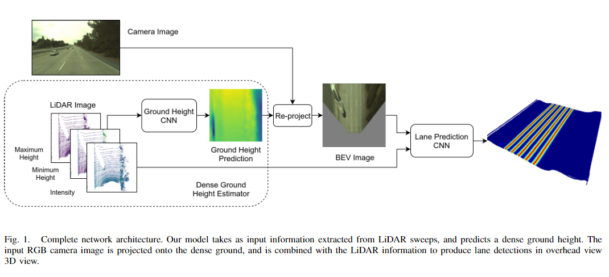

pdf_source: https://arxiv.org/pdf/1905.01555.pdf
# Deep Multi-Sensor Lane Detection

这篇论文给出用lidar和图片两者共同进行学习侦测道路线的算法

关键点：

1. 作者用图片示例说明，即使在相机坐标系(图片)中实现了近乎完美精确的road-segmentation,转换到俯视图的时候精确度仍然很低，所以需要用俯视图直接处理。
2. 输出的俯视图中每一个像素代表的是该点距离最近道路线的距离。与直接segmentation相比，可以缓解输出结果仅与结果稍稍offset时的loss过大等的问题。
3. 点云识别路径时，地面点过于稀疏，所以需要数个点云测量结果合并一起使用，然后压在平面图中输入CNN。