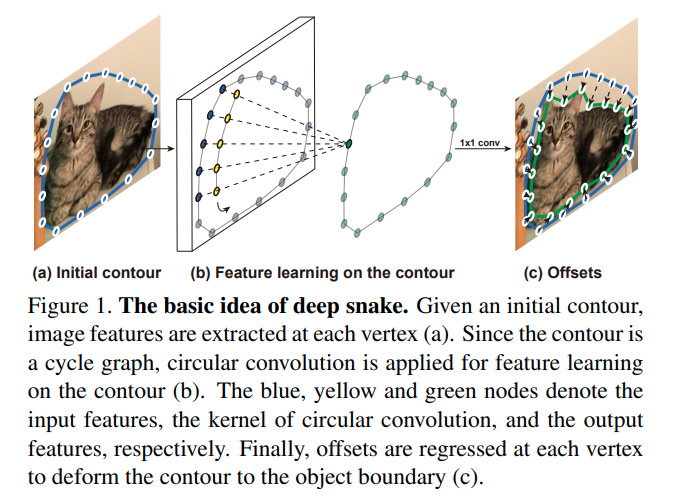
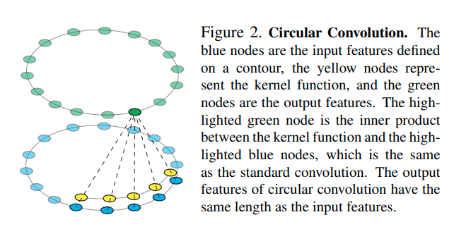
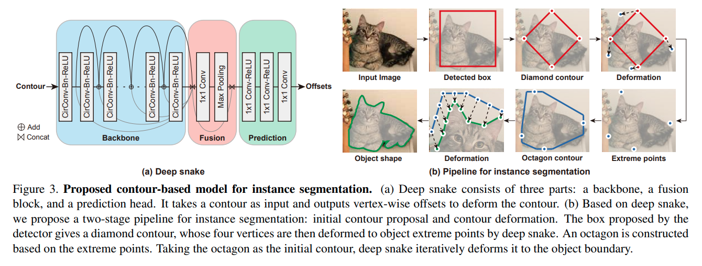

time: 20200314
pdf_source: https://arxiv.org/pdf/2001.01629.pdf
code_source: https://github.com/zju3dv/snake
short_title: Deep Snake
# Deep Snake for Real-Time Instance Segmentation

这篇paper引入了深度学习化的snake算法。snake算法的思路是给定一个初始的回环contour, 每一个边缘点根据自己附近图片性质的energy function以及其他信息，逐步坍缩到所关注的物体的边缘上，特点在于对成功辨识的物体这个算法边缘上的精确度相对有保证。

## Deep snake intuition

初始contour$\rightarrow$circular conv $\rightarrow$ conv $\rightarrow$ 每一个点的偏移。

## Circular Conv

本文代码里面使用一个二维tensor按圆周顺序存储contour点，并没有使用过度的技巧。

## 总体结构

图b说明整个图的结构，首先使用2D detector得到基础bounding box，然后转化为coutour, 然后使用第一层deep snake(大感受野) 计算offset$\rightarrow$upsampling到40个点，再经过deep snake(小感受野)得到最后的deformation output。

