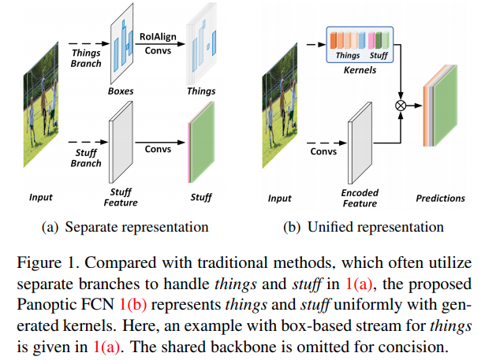
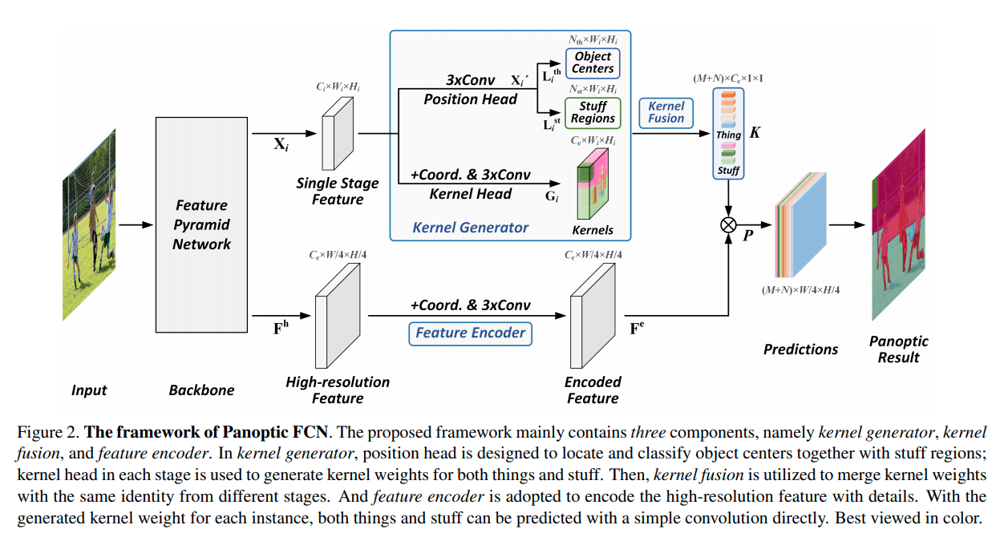

time: 20210301
pdf_source: https://arxiv.org/pdf/2012.00720.pdf
code_source: https://github.com/yanwei-li/PanopticFCN

# Fully Convolutional Networks for Panoptic Segmentation (Panoptic FCN)

这篇paper主要idea是目标是使用FCN的结构统一地表达全景分割里面的前景物体以及背景。

## Structures

整体结构如图，

**Position Head**: 分别用卷积输出前景中心的热图(高斯权重)以及背景的热图， 可以用Ground truth进行监督。推理的时候，从中选择最高的$k$个中心点(对于背景类别，则$k=1$), 得到中心点集合$D^{st}, D^{th}$. 

**Kernel Head**: 用coordConv(与[SOLO](SOLO.md)一致)以及普通Conv输出 $G_{in}\in\mathbb{R}^{C_{\mathrm{e}} \times W_{i} \times H_{i}}$. 在推理的时候，对每一个前文得到的中心点,如$(x_c, y_c)$， 取对应坐标的特征 $G_{i,:,x_c, y_c} \in \mathbb{R}^{C_e \times 1 \times 1}$ 相当于每一个中心点会有一个kernel ($3\times 3$)表达它的特征.

**Kernel Fusion**: 如果两个同类别的特征余弦相似度超过一个阈值，则会被理解为具有同一个ID. $K$中拥有相同ID的核特征会取均值。数学了来说 $K_j = \text{AvgPool}(G'_{j})$. $G'j = \{G_m : \text{ID}(G_m) = \text{ID}(G_j) \}$. 这样得到的相当于每一个ID有一个自己的kernel.

**Feature Encoder**: 用 CoordConv和一般卷积在高分辨率直接处理特征，然后每一个ID的输出就用前面不同的卷积核分别对feature进行卷积输出。