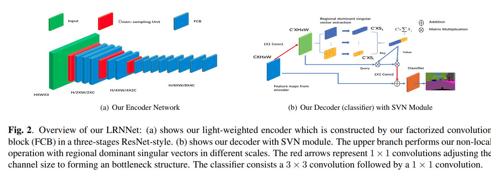
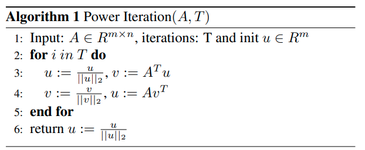

time:20200609
pdf_source: https://arxiv.org/pdf/2006.02706.pdf
short_title: LRNNet
# LRNNET: A LIGHT-WEIGHTED NETWORK WITH EFFICIENT REDUCED NON-LOCAL OPERATION FOR REAL-TIME SEMANTIC SEGMENTATION

这篇paper的主要贡献在于提出了一个简化版的non-local算法。

具体的做法是把$C\times H \times W$的张量以$S$为量化单位，分割为$S=\frac{H\times W}{H'\times W'}$个超像素，non-local的面积大小变为$H', W'$，大幅度降低运算量。

对于各个方块，$C \times H' \times W'$, 本文提出了使用normalized左奇异主向量作为对整个超像素的替代，将它平整为$C\times (H'\times W')$矩阵，然后使用power iteration算法计算左主奇异矢量$C'\times 1$.