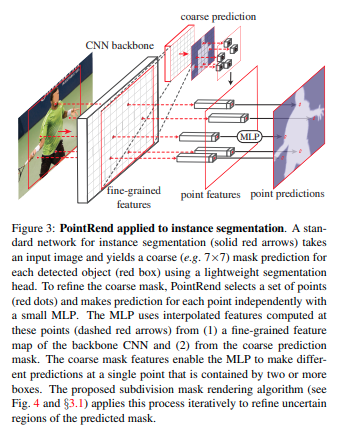
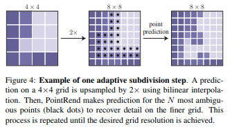
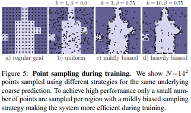
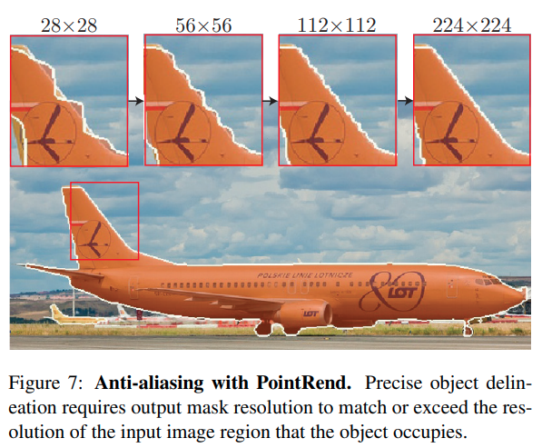

time: 20191224
pdf_source: https://arxiv.org/pdf/1912.08193.pdf
short_title: PointRend

# PointRend: Image Segmentation as Rendering

这篇来自FAIR的论文将语义分割的后处理理解为计算机图形学的渲染问题，目标就是要提升语义分割在物体边缘的性能，同时控制运算量。采取的方法是先输出一个低分辨率的分割图，再逐步上采样，在上采样的过程中对边缘进行处理，效果像是渲染中逐步精修边缘的视觉效果。

## PointRend图示

对于instance segmentation，先输出一个粗糙的语义分割结果($7\times 7$)，然后迭代上采样过程，每一个上采样过程包含

* 双线性插值上采样
* 执行PointRend模块，选取不确定性高的点，提取出其特征矢量，用一个shared的MLP得到其输出结果。

## 点的选择, 推理时

选择的要求是寻找probability最接近0.5的点进行处理。

对于一个目标为$M\times M$的分割图，PointRend只需要$N log_2\frac{M}{M_0}$次输出.
对于$M = 224, M_0 = 7$本文选择$N = 28^2$,是原来的$1/16$.

## 点的选择，训练时

本文采用的是一个带偏见的随机采样，算法如下：

* 过采样，总共会随机采$kN (k > 1)$个点
* 从这$kN$个点中选择$(\beta N)$个最不确定的点
* 从剩下点中完全随机采样$(1-\beta) N$个点,

训练过程与粗糙的语义分割初始估计是平行的、分离的

抗锯齿效果图:

