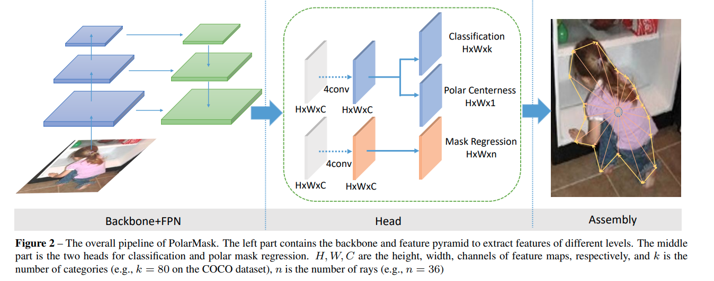
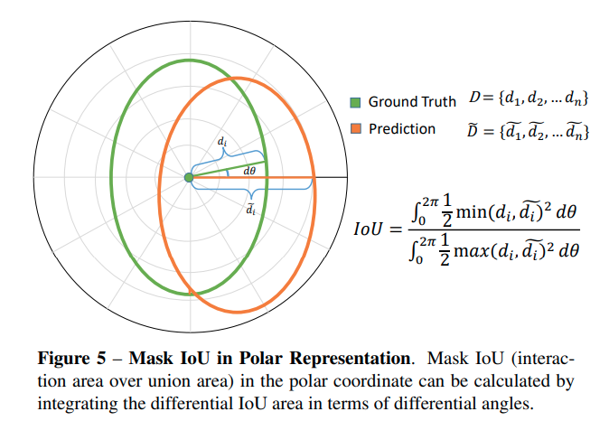
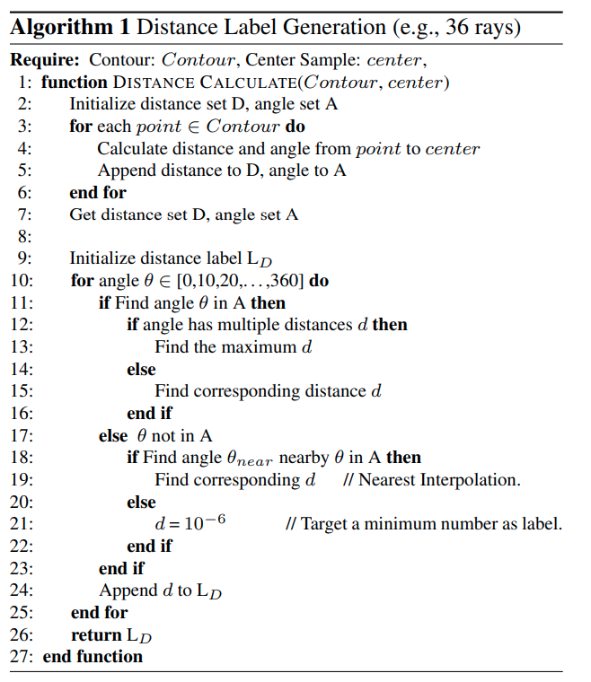

time: 20200309
pdf_source: https://arxiv.org/pdf/1909.13226.pdf
code_source: https://github.com/xieenze/PolarMask
short_title: PolarMask

# PolarMask: Single Shot Instance Segmentation with Polar Representation

这篇paper受启发于[FCOS]，使用新的数据表达方式，将Instance Segmentation在network inference上划归为与2D detection完全一致的复杂度。有机会与[YOLOACT]竞争成为Instance Seg工业使用的标准。

# 总体结构



在网络结构上面这篇paper选择的是与[FCOS]一致的结构，仅仅在 regression分支上改为对$n=36$个射线方向的距离进行回归。

每一个instance被建模为中心点+密集的从中心点往外的射线形成的contour.

## "中心"定义

与[FCOS]类似，这里需要定义一个中心点，同时需要定义一个中心度。作者比较过使用bounding box的中点与质心，发现使用质心理论性能上限更好，所以本文的ground truth center的位置中心在质心上，作者允许几个pixel级别的扰动，增加正样本数量。

而中心度与[FCOS]的centerness有一定区别，但是思路一致，公式如下：

$$
\text { Polar Centerness }=\sqrt{\frac{\min \left(\left\{d_{1}, d_{2}, \ldots, d_{n}\right\}\right)}{\max \left(\left\{d_{1}, d_{2}, \ldots, d_{n}\right\}\right)}}
$$

这个数值需要 polar centerness分支进行监督学习，在inference的时候会与classification score相乘作为NMS的判据。

## Polar IoU Loss

作者认为直接用SmoothL1 Loss训练是单独地训练方式，作者认为应当n个射线距离一起train。并提出了Polar IoU Loss



假设中心点正确，IoU即是如图(这个图片可视化瞬间将看似比较复杂的问题解释得很好)，显然我们会用离散化表达替代积分，公式如下：

$$
\text{IoU} =  \lim_{N\rightarrow\infty}\frac{\sum^N_{i=1} \frac{1}{2} d^2_{min} \Delta \theta_i}{\sum^N_{i=1} \frac{1}{2} d^2_{max} \Delta \theta_i}
$$

作者发现平方对性能提升有限，选择了直接使用一次方近似代替，并取log得到loss

$$
\text { Polar IoU }=\frac{\sum_{i=1}^{n} d_{\min }}{\sum_{i=1}^{n} d_{\max }}
$$


$$
\text { Polar IoU Loss}= -\text{log} (\text{Polar IoU})
$$


## distance labeling

最后一个问题就是如何获得每一个instance中每一个center point的射线ground truth.

第一步是预处理的时候使用 
```python
cv2.findCoutours
```
得到一系列边缘点。然后对每一个需要计算distance groud truth的center点运行：



翻译解释

1. 计算每一个边缘点到"center"点的距离与相对夹角。
2. 对每一个需要ground truth的夹角：
3. 如果在1中有计算到，则对应最大的d(可能一个角度不止一个最远点，要稍微考虑凹形状，这种数量不多)。
4. 如果没有，则取最邻近的已有的theta对应的距离最为ground truth，否则取一个极小值。


[FCOS]:../object_detection_2D/FCOS.md
[YOLOACT]:YOLACT.md
