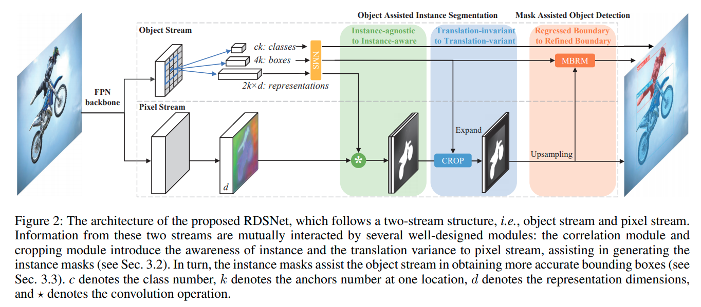

time: 20200618
pdf_source: https://arxiv.org/pdf/1912.05070.pdf
code_source: https://github.com/wangsr126/RDSNet
short_title: RDSNet

# RDSNet: A New Deep Architecture for Reciprocal Object Detection and Instance Segmentation

这篇paper提出的RDSNet,核心的思想在于让2D object detection与instance segmentation相互帮助,开源的代码基于mmdetection.

## 结构与方法

object stream与pixel stream分别与[YOLOACT](YOLACT.md)相似，不同的地方在于RDSNet会额外对每一个anchor预测一个$2\times d$维的representation.

### Instance Aware Pixel Stream

这一步的考虑是让pixel stream得到object 特征信息。

对于每一个object $o$, 有它的$2\times d\times 1\times 1$的representation $\phi(v_o)$。整张图在pixel stream会形成一个$1\times d\times h_f\times w_f$的特征，抽出与目标object相似的features

$$M_{o}=\operatorname{softmax}\left(\Psi(U) \star \phi\left(v_{o}\right)\right)$$

其中$M_o$的维度是$2\times 1\times h_f\times w_f$,使用cross-entropy来训练。有点像是metric learning

### Cropping to Translation-variant

前一步的一个关键问题在于同类object 不同instance在上一步还是会得到高的相关性，在cropping这一步需要打破这个相关性。作者的做法比较直白，将现有的object 边缘expand一个预设的比例之后(expand的原因是避免因为估计的不准确度)，将对应pixel stream中在边缘外的点设为背景。

### MBRM mask assisted detection

这一步的考虑是让instance segmentation去提升object detection的准确度,个人的感觉与直觉并不太相符合,[代码](https://github.com/wangsr126/RDSNet/blob/master/mmdet/models/detectors/rdsnet.py)

