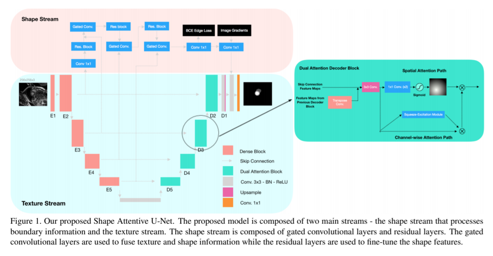

time: 20200126
pdf_source: https://arxiv.org/pdf/2001.07645v1.pdf
code_source: https://github.com/sunjesse/shape-attentive-unet
short_title: SAUNet
# SAUNet: Shape Attentive U-Net for Interpretable Medical Image Segmentation

## Structure

本文将网络分为texture branch与shape branch。注重使用Attention形成可解释性。Loss使用基本的CE loss以及[Dice Loss](SOLO.md)