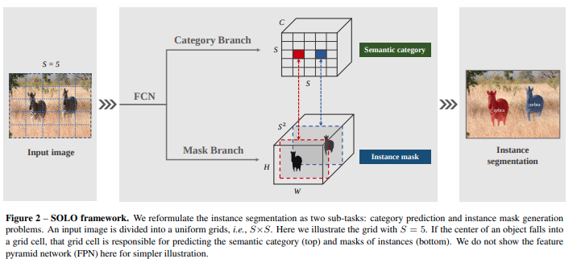
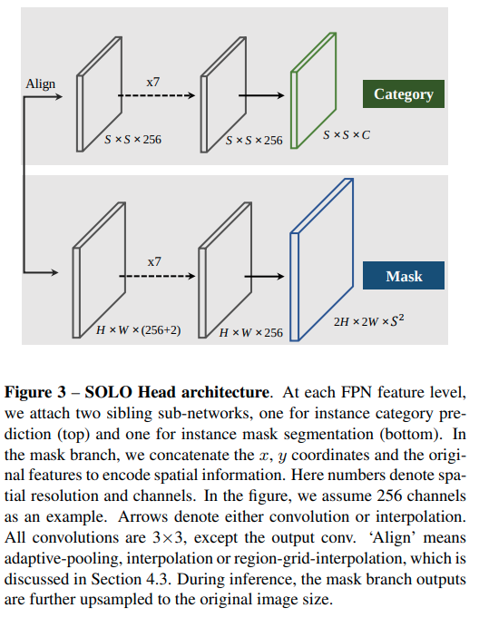
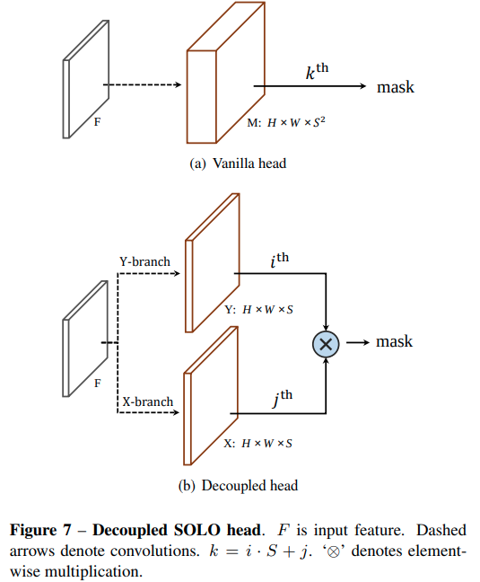
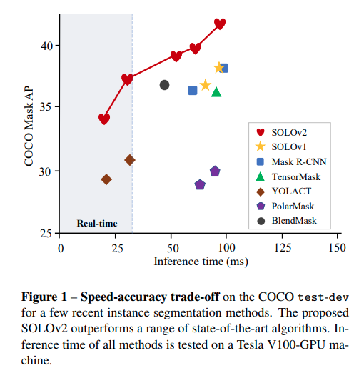
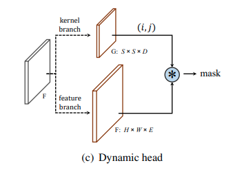
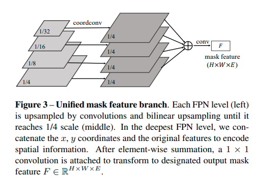
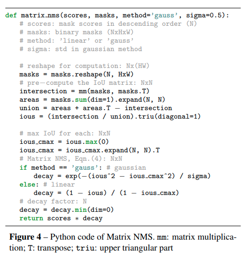

time:20200326
pdf_source: https://arxiv.org/pdf/1912.04488.pdf
code_source: https://github.com/aim-uofa/AdelaiDet
short_title: SOLO for instance Seg
# SOLO: Segmenting Objects by Locations

这篇文章用一个比较简单的方法实现instance segmentation，思路在于将图片分为$S\times S$个小grid，然后假设每一个grid里面同类物体只有一个instance，然后要求分类任务输出的结果里面带有"位置类".从而将不同位置的结果分离出来

Update: 2020/03/26:

作者组推出[SOLOv2](#solov2):
[pdf](https://arxiv.org/pdf/2003.10152v1.pdf)

## Framework

本文使用retinanet的思路，使用multi-scale输出，不同的scale分解的图像区块$S$数目是不同的

## Breaking Translational Invariance
但是网络中需要注意的地方在于一般的完全卷积网络是平移不变的，也就是在不同位置的相似的物体，在网络中形成的feature应该是相似的，但是在本文中这是不被允许的，因为输出的mask branch中,我们希望同样的画面内容，在不同位置输出的feature完全不同，因而在mask branch中使用[Coord Conv]而不是不同普通的卷积核，作者中间提到了[Semi Conv]这也是一种选择，不过最终选择的是[Coord Conv]

## Loss Function

作者面对class imbalance problem,选择了[Dice Loss]而不是focal loss.

其公式为:

$$
\begin{aligned}
    L_{\text {Dice}}&=1-D(\mathbf{p}, \mathbf{q})\\
D(\mathbf{p}, \mathbf{q})&=\frac{2 \sum_{x, y}\left(\mathbf{p}_{x, y} \cdot \mathbf{q}_{x, y}\right)}{\sum_{x, y} \mathbf{p}_{x, y}^{2}+\sum_{x, y} \mathbf{q}_{x, y}^{2}}
\end{aligned}
$$

仔细观察$D(p, q)$的公式，可以了解到这是一个类似于IoU的metric,

## Decoupled SOLO

由于要分类$S^2$，这个channel数太大了，同时有很大冗余，因而转而让网络将$X, Y$上的bin分别分类，inference的时候让对应行列的sigmoid相乘

# SOLOv2

performance:

提升在于三个问题

1. 对稀疏的Mask prediction 使用dynamic head进行优化
2. 充分利用FPN融合多尺度
3. Matrix NMS

## Dynamic head

Dynamic head的算法来说，就是让网络单独训练一个卷积核用于最后一步的 $1\times 1$卷积。

直觉如此：观察原来的SOLO，$S\times S$个Mask这样的预测是很稀疏的，只有部分有用，不如train一个动态的$1\times 1$ or $3\times 3$卷积核学会从里面网络中分开不同位置的结果(注意这个卷积核的生成过程的感受野是全图)。(稍稍有一点诡异不过可以接受)。

## Mask Feature prediction

简单来说就是用[Coord Conv]计算后上采样所有scale的特征，求和，然后$1\times 1$卷积得到最终输出

## Matrix NMS

采用的概念是 SoftNMS的概念，也就是根据重合的框的IOU与概率 进一步降低 低score box的score的做法。这里在后面NMS时，用IoU的函数替代概率值，因而decay scale只与IoU有关

[Dice Loss]:https://github.com/hubutui/DiceLoss-PyTorch
[Semi Conv]:https://github.com/christianlandgraf/keras_semiconv
[Coord Conv]:https://github.com/mkocabas/CoordConv-pytorch