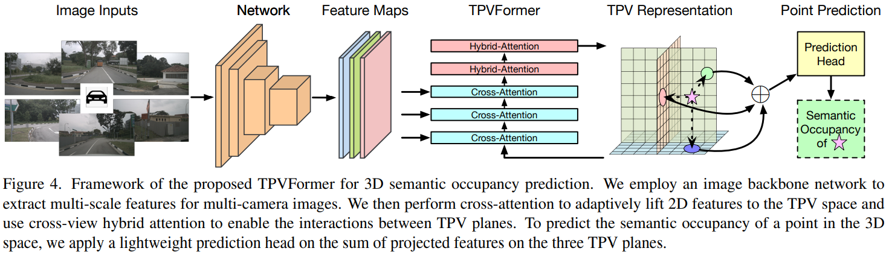

time: 20230220
pdf_source: https://arxiv.org/pdf/2302.07817.pdf
code_source: https://github.com/wzzheng/TPVFormer

# Tri-Perspective View for Vision-Based 3D Semantic Occupancy Prediction

这篇paper尝试解决tesla在AI day上描述的一个3D semantic occupancy map prediction. 在学界已经铺开BEV方案的今天，这个任务的难点在于3D voxelized prediction与 image frames之间的attention或者feature transformation占据的显存与运算空间过大。本文尝试利用3D信息的冗余，从预测三维立体feature降维至预测三个相互垂直的三视图Features以控制模型复杂度。

## Basic Framework

基本模型描述:

1. 网络输入六张图，使用cnn backbone进行处理。
2. 三个TPV 平面的 query(embedding) 作为起始输入，经过三层 TPV平面与Images的cross attention, 再经过两层 TPV平面之间的cross attention。形成对环境场景的三视图特征描述。
3. 与图片的cross attention。模块整体是deformable attention. 对于一个plane query上的每一个点，在垂直于平面方向采样数个三维点，投影到六个相机上，找到相机上的base reference points. 然后根据plane query -> MLP mapping 输出每个点的偏移值。在图片上采样，并使用attention求和。
4. 平面之间的hybrid attention. 模块整体式Deformable attention. 对于一个plane query上的每一个点，在垂直于平面方向采样数个点，然后投影到其他两个平面特征上，其他与图片的相似。
5. 网络输出的形态，如果要查询单个点的结果，就把单个点投影到三个TPV平面上，取特征，累加之后MLP mapping到语义分割输出。如果要同时输出网格中每一个点，则可以把三个平面broadcast到voxel形态，然后整体MLP mapping同时输出（一般用于可视化）。
6. 对于Lidar Segmentation works,对每一个有标注的雷达点，单独采样其语义分割结果进行监督训练。
